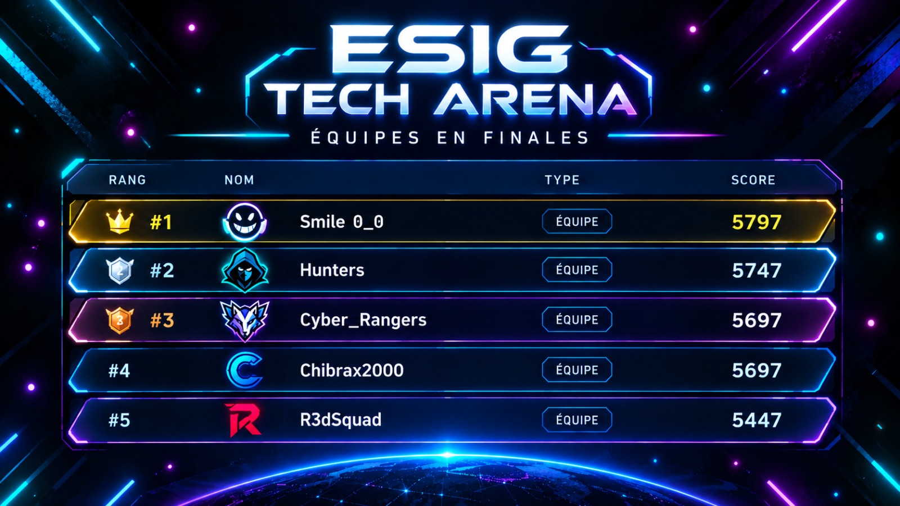

Team **Smile 0_0** finished **1st in the qualification stage** of ESIG Tech Arena 2026 with **5797 points**, ahead of the four other teams qualified for the final. I played under the handle **r0r0**.

The final has not taken place yet — this page will be updated with the final result.
