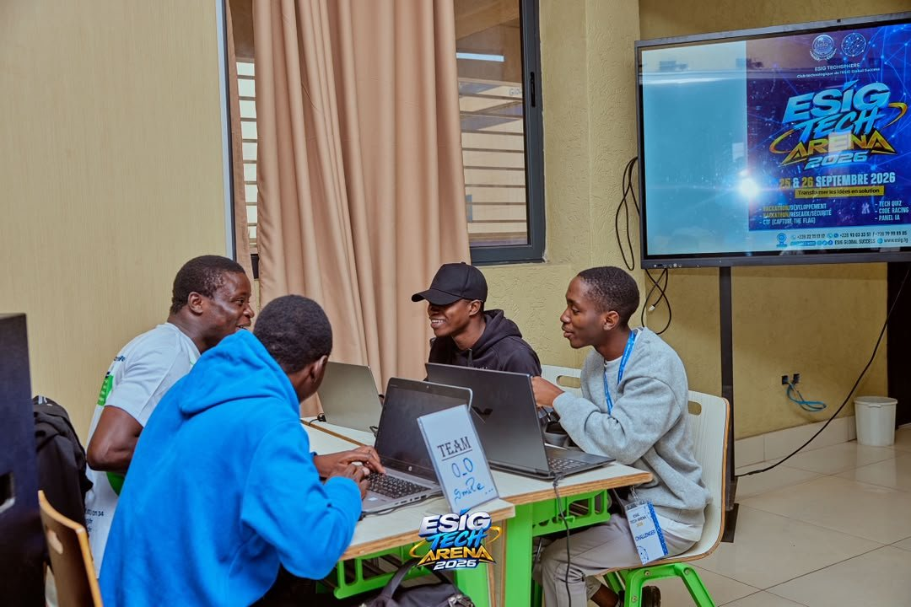
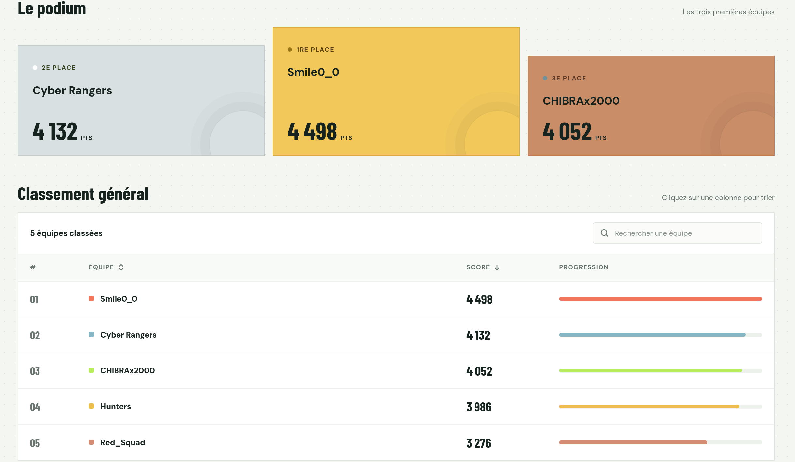

Team **Smile 0_0** finished **1st in the qualification stage** with 5797 points, then went on to **win the 24-hour final**, held on 25–26 September 2026, with 4498 points — 1st out of the 5 teams that qualified. I played under the handle **r0r0** throughout.

The final mixed Jeopardy-style challenges with a Code Review track and a "Bypass AV" track — a broader format than the qualification stage.
