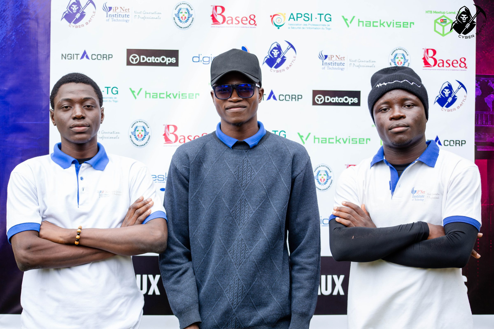
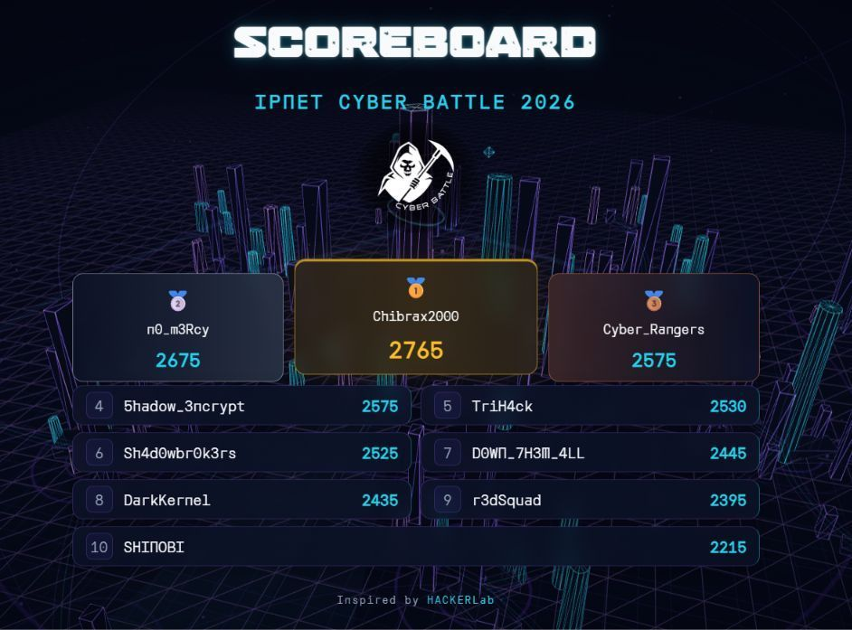

A 24-hour CTF. I represented team **n0_m3rcy**, which finished in **2nd place** with **2675 points**, 90 points behind the winning team.

The challenge set was broad: web exploitation, steganography, forensics, Boot2Root machines, code review, a "Virtuoso" track and even a physical lockpicking category — a good test of endurance and of how well a team splits the work over 24 hours.
