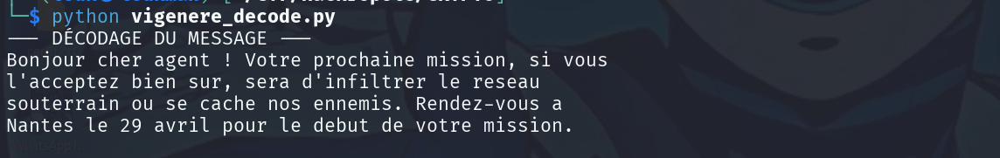
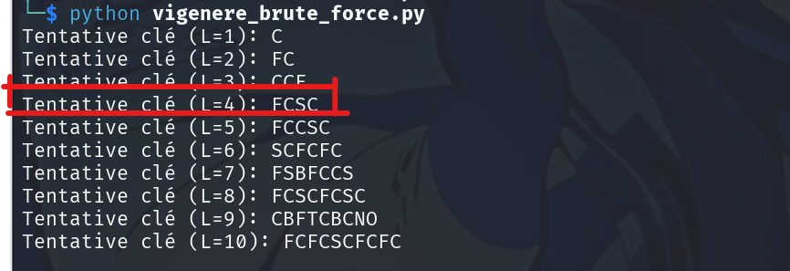

#### Description 
Ce  challenge nous présente un message chiffré et le but est de le decoder a l'aide d'une clé qu'ils nous ont fourni. 
Le CTF nous indique également que la méthode utilisée pour chiffrer est le chiffrément de Vigenere

### Note : 
Contrairement au César classique qui décale tout l'alphabet d'un nombre fixe (ex: +3), Vigenère utilise une **clé** qui change le décalage à chaque lettre.

---

#### 1. Le mécanisme : La Table de Vigenère

Le principe repose sur une grille appelée **Carré de Vigenère**. C'est un tableau de 26 alphabets décalés.

- **L'axe horizontal** (en haut) représente les lettres du message clair.
    
- **L'axe vertical** (à gauche) représente les lettres de la clé.
    
#### 2. Comment on chiffre ? (L'addition)

Imaginons que le message est `HELLO` et la clé est `CLE`.

1. **On répète la clé** pour qu'elle ait la même longueur que le message :
    
    - Message : `H E L L O`
        
    - Clé : `C L E C L`
        
2. **On cherche l'intersection** dans la table :
    
    - Ligne `C` (clé) + Colonne `H` (message) → Résultat : **J**
        
    - Ligne `L` (clé) + Colonne `E` (message) → Résultat : **P**
        
3. **Mathématiquement**, si A=0,B=1,...,Z=25 :
    
```
    Chiffre=(Message+Cle)(mod26)
```
    

### 3. Comment on déchiffre ? (La soustraction)

C'est l'opération inverse. Pour retrouver `H` à partir de `J` avec la clé `C` :

1. On prend la ligne de la clé (**C**).
    
2. On cherche la lettre chiffrée (**J**) dans cette ligne.
    
3. On regarde quelle est la lettre en haut de la colonne → C'est le **H**.
    
4. **Mathématiquement** :
    
```
    Clair=(Chiffre−Cle)(mod26)
```
    

---

#### 4. Pourquoi est-ce plus solide que César ?

Dans un code César, la lettre "E" est toujours remplacée par la même lettre (disons "H"). Un expert en CTF repère tout de suite le "H" comme étant la lettre la plus fréquente.

Dans **Vigenère**, la lettre "E" peut devenir un "P", puis un "R", puis un "A" selon la lettre de la clé qui tombe dessus au moment donné. Cela "casse" l'analyse de fréquence simple.

#### Résolution 

message chiffré : 
```
Gqfltwj emgj clgfv ! Aqltj rjqhjsksg ekxuaqs, ua xtwk
n'feuguvwb gkwp xwj, ujts f'npxkqvjgw nw tjuwcz
ugwygjtfkf qz uw efezg sqk gspwonu. Jgsfwb-aqmu f
Pspygk nj 29 cntnn hqzt dg igtwy fw xtvjg rkkunqf.
```

La clé :  `FCSC` 

##### Code python pour décoder vigenere : 

```
import string

def vigenere(texte, cle, decode=False):
    """
    Chiffre ou déchiffre un texte avec la méthode de Vigenère.
    Préserve la ponctuation, les espaces et la casse.
    """
    alphabet = string.ascii_uppercase
    resultat = []
    cle = cle.upper()
    index_cle = 0  # On suit l'index de la clé séparément pour ignorer les espaces

    for char in texte:
        if char.upper() in alphabet:
            # Récupérer les positions
            idx_p = alphabet.index(char.upper())
            idx_k = alphabet.index(cle[index_cle % len(cle)])
            
            # Calcul du nouvel index (Addition pour chiffrer, Soustraction pour déchiffrer)
            if decode:
                nouvel_idx = (idx_p - idx_k) % 26
            else:
                nouvel_idx = (idx_p + idx_k) % 26
            
            # Gestion de la casse
            char_final = alphabet[nouvel_idx]
            resultat.append(char_final if char.isupper() else char_final.lower())
            
            index_cle += 1 # On n'avance dans la clé que si on a traité une lettre
        else:
            # Si c'est un espace ou une ponctuation, on l'ajoute tel quel
            resultat.append(char)
            
    return "".join(resultat)

# --- Point d'entrée du script ---
if __name__ == "__main__":
    msg_chiffre = """Gqfltwj emgj clgfv ! Aqltj rjqhjsksg ekxuaqs, ua xtwk 
n'feuguvwb gkwp xwj, ujts f'npxkqvjgw nw tjuwcz 
ugwygjtfkf qz uw efezg sqk gspwonu. Jgsfwb-aqmu f 
Pspygk nj 29 cntnn hqzt dg igtwy fw xtvjg rkkunqf."""
    
    ma_cle = "FCSC"
    
    print("--- DÉCODAGE DU MESSAGE ---")
    message_clair = vigenere(msg_chiffre, ma_cle, decode=True)
    print(message_clair)
```



On a pu décoder ainsi le message : 

Flag 🚩 : 
```
Nantes
```

### Réaliser un brute force sur Vigenere 

Il peut y arriver dans certains cas qu'on ne connaisse pas la clé utilisée pour chiffrer le message , pour cela on doit réaliser un brute force pour trouver la clé utilisée et déchiffrer le message 

##### Etape : 
Pour trouver la clé utilisée on a deux étapes principales : 

- **Trouver la longueur de la clé (L) :** On teste différentes longueurs et on regarde laquelle donne la meilleure "cohérence" statistique.
    
- **Trouver chaque lettre de la clé :** Une fois qu'on sait que la clé fait 4 lettres (par exemple), on traite chaque 1ère lettre, chaque 2ème lettre, etc., comme un simple code de César.

**Code python** 

```
import string
from collections import Counter

# Fréquence théorique des lettres en français (en %)
FREQ_FR = {
    'A': 8.15, 'B': 0.97, 'C': 3.15, 'D': 3.73, 'E': 17.39, 'F': 1.12,
    'G': 0.97, 'H': 0.85, 'I': 7.31, 'J': 0.45, 'K': 0.02, 'L': 5.69,
    'M': 2.87, 'N': 7.12, 'O': 5.28, 'P': 2.80, 'Q': 1.21, 'R': 6.64,
    'S': 8.14, 'T': 7.22, 'U': 6.38, 'V': 1.64, 'W': 0.03, 'X': 0.41,
    'Y': 0.28, 'Z': 0.15
}

def decalage_cesar(texte, decalage):
    """Décale un texte d'un certain nombre de positions."""
    alphabet = string.ascii_uppercase
    resultat = ""
    for char in texte:
        if char in alphabet:
            idx = (alphabet.index(char) - decalage) % 26
            resultat += alphabet[idx]
    return resultat

def score_frequence(texte):
    """Calcule à quel point le texte ressemble à du français."""
    if not texte: return 0
    counts = Counter(texte)
    total = len(texte)
    score = 0
    for char, freq in FREQ_FR.items():
        # Plus la différence est petite, plus le score est bon
        f_obs = (counts[char] / total) * 100
        score += abs(f_obs - freq)
    return score

def brute_force_vigenere(crypte, longueur_max=10):
    # Nettoyer le texte pour l'analyse
    propre = "".join([c.upper() for c in crypte if c.upper() in string.ascii_uppercase])
    
    meilleure_cle = ""
    meilleur_score_global = float('inf')

    # 1. Tester différentes longueurs de clé
    for L in range(1, longueur_max + 1):
        cle_tentative = ""
        
        # 2. Pour chaque position dans la clé, on cherche le meilleur décalage César
        for i in range(L):
            sous_groupe = propre[i::L] # On prend une lettre toutes les L positions
            meilleur_decalage = 0
            meilleur_score_cesar = float('inf')
            
            for d in range(26):
                test_cesar = decalage_cesar(sous_groupe, d)
                score = score_frequence(test_cesar)
                if score < meilleur_score_cesar:
                    meilleur_score_cesar = score
                    meilleur_decalage = d
            
            cle_tentative += string.ascii_uppercase[meilleur_decalage]
            
        # Evaluation de la clé complète
        score_total = score_frequence(decalage_cesar(propre, 0)) # Simplifié ici
        if cle_tentative:
            print(f"Tentative clé (L={L}): {cle_tentative}")
            
    return "Analyse terminée. Regardez les clés suggérées ci-dessus."

# --- TEST ---
message = """Gqfltwj emgj clgfv ! Aqltj rjqhjsksg ekxuaqs, ua xtwk 
n'feuguvwb gkwp xwj, ujts f'npxkqvjgw nw tjuwcz 
ugwygjtfkf qz uw efezg sqk gspwonu. Jgsfwb-aqmu f 
Pspygk nj 29 cntnn hqzt dg igtwy fw xtvjg rkkunqf."""

brute_force_vigenere(message)
```



On peu ainsi voire notre clé de Longueur 4 trouvé : `FCSC`

Explication du brute force : 
### Étape 1 : Deviner la longueur de la clé (L)

C'est l'étape la plus cruciale. L'ordinateur ne connaît pas la longueur, alors il fait des paris.

- Il essaie L=1,L=2,L=3,L=4...
    
- Pour chaque essai, il utilise un outil mathématique appelé l'**Indice de Coïncidence**.
    

> **L'astuce :** Si on choisit la mauvaise longueur (ex: L=3 alors que la clé est `FCSC`), les lettres regroupées ensemble ressemblent à du pur hasard. Si on choisit la bonne longueur (L=4), les lettres regroupées partagent la même structure que la langue française.

### Étape 2 : Le découpage en "Colonnes"

Une fois qu'on teste une longueur (disons L=4), on sépare le message en 4 colonnes. Comme on l'a vu, chaque colonne est maintenant un **simple Code de César**.

### Étape 3 : L'Analyse de Fréquence (Le "Matching")

C'est ici que l'ordinateur est plus rapide que l'humain. Pour la **Colonne 1**, il va tester les 26 décalages possibles de César :

1. Il décale tout de **A** (0) : Est-ce que ça ressemble à du français ? (Score : 40/100)
    
2. Il décale tout de **B** (1) : Est-ce que ça ressemble à du français ? (Score : 35/100) ...
    
3. Il décale tout de **F** (5) : **BINGO !** Les fréquences correspondent à 95% au français.
    

Il enregistre la lettre **F** comme étant le début de la clé. Il recommence pour la Colonne 2, 3 et 4.

### Étape 4 : La reconstruction de la clé

À la fin, il assemble ses meilleures découvertes pour chaque colonne :

- Colonne 1 : **F**
    
- Colonne 2 : **C**
    
- Colonne 3 : **S**
    
- Colonne 4 : **C**
    
- **Résultat : FCSC**
