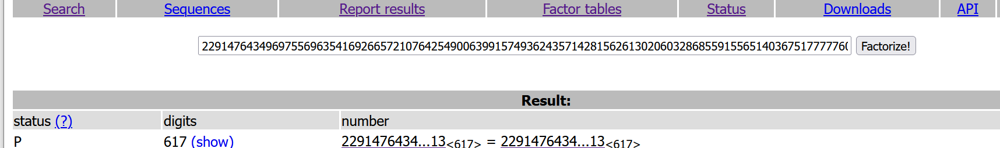
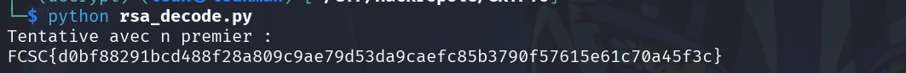

Description : 

Je viens de suivre un cours sur RSA mais je crois que j’ai oublié quelque chose. Il me semble que le prof parlait de deux trucs, mais je ne sais plus exactement quoi. Vous pouvez m’aider ?

### Note : 
## Comprendre le chiffrement RSA

Le RSA (Rivest-Shamir-Adleman) est un algorithme de cryptographie asymétrique. Contrairement à Vigenère, il utilise deux clés différentes :

1. Clé publique : Utilisée pour chiffrer. Tout le monde peut la connaître.
2. Clé privée : Utilisée pour déchiffrer. Elle doit rester secrète.
3. La création des clés (La recette)

• On choisit deux grands nombres premiers p et q.

• On calcule leur produit $n = p * q$. Ce `n` fera partie des deux clés.
• On calcule l'indicateur d'Euler :

$$
 φ(n) = (p-1)(q-1).
$$

• On choisit un entier e (souvent **65537**) tel que `e` et `φ(n)` soient premiers entre eux.

• On calcule d, l'inverse de `e` modulo `φ(n)`. C'est la pièce secrète.

Clé publique : `(n, e)` Clé privée : `(n, d)`

2. **Le chiffrement**

Pour transformer un message M en texte chiffré C : On utilise la formule : 

						$C = M^e mod n$

3. **Le déchiffrement**  

Pour retrouver le message original M à partir de C : On utilise la formule : 
$$
M = C^d mod n
$$

Pourquoi est-ce sécurisé ?

La sécurité repose sur la difficulté de factoriser de très grands nombres. Si on connaît `n`, il est extrêmement difficile de retrouver `p` et `q`, et donc impossible de calculer `d` (la clé privée).

#### Vecteur d'attaque du RSA 

Étape :

- **Trouver p et q** : On utilise des outils comme `factordb.com` ou l'algorithme de Fermat si p et q sont proches.
    
- **Calculer ϕ(n)** : C'est facile une fois qu'on a les nombres premiers : ϕ(n)=(p−1)(q−1).
    
- **Calculer la clé privée d** : On utilise l'inverse modulaire de e. En Python, c'est `pow(e, -1, phi)`.
    
- **Déchiffrer le message** : On applique la formule $$
M = C^d mod n
$$
    
- **Convertir le nombre en texte** : Le résultat M est souvent un grand nombre qu'il faut convertir en caractères (ASCII).

Script python :

```
from Crypto.Util.number import long_to_bytes

# Données fournies par le challenge
n = 123456789... # Le n
e = 65537        # Le e
c = 987654321... # Le message chiffré

# ÉTAPE 1 : Factoriser n pour trouver p et q
# (Ici je mets des valeurs d'exemple, utilise factordb pour les tiennes)
p = 1234567... 
q = 9876543...

# ÉTAPE 2 : Calculer Phi(n)
phi = (p - 1) * (q - 1)

# ÉTAPE 3 : Calculer d (la clé privée secrète)
d = pow(e, -1, phi)

# ÉTAPE 4 : Déchiffrer le message
m = pow(c, d, n)

# ÉTAPE 5 : Transformer le nombre géant en texte lisible
flag = long_to_bytes(m)
print(f"Le flag est : {flag.decode()}")
```

### Résolution 

Pour notre cas voici le code source utilisé : 
```
from Crypto.Util.number import getStrongPrime, bytes_to_long, long_to_bytes
n = getStrongPrime(2048)

e = 2 ** 16 + 1
flag = bytes_to_long(open("flag.txt", "rb").read())

c = pow(flag, e, n)

print(f"{n = }")

print(f"{e = }")

print(f"{c = }")
```

info de n,e,c 

```
n = 22914764349697556963541692665721076425490063991574936243571428156261302060328685591556514036751777776065771167330244010708082147401402002914377904950080486799957005111360365028092884367373338454223568447811216200859660057226322801828334633020895296785582519610777820724907394060126570265818769159991752144783469338557691407102432786644694590118176582000965124360500257946304028767088296724907062561163478654995994205065812479605136088813543435895840276066683243706020091519857275219422246006137390619897086478975872204136389082598585864385077220265194919486850918633328368814287347732293510186569121425821644289329813
e = 65537
c = 11189917160698738647911433493693285101538131455035611550077950709107429331298329502327358588774261161674422351739941120882289954400477590502272629693853242116507000433761914368814656180874783594812260498542390500221519883099478550863172147588922341571443502449435143090576514228274833316274013491937919397957017546671325357027765817692571583998487352090789855980131184451611087822399088669705683765370510052781742383736278295296012267794429263720509724794426552010741678342838319060084074826713065120930332229122961216786019982413982114571551833129932338204333681414465713448112309599140515483842800125894387412148599
```

Pour déchiffrer , nous allons utiliser les ressources en ligne comme Factordb.com ou RsaCtfTool pour décomposer le `n` 
Pour notre cas nous allons utiliser Factordb pour décomposer N 


**Note :** 
- **FF (Fully Factored) :** C'est le Graal. Le nombre a été totalement décomposé en nombres premiers. Tu as toutes les pièces (p,q,r...) pour calculer ϕ(n).
    
- **P (Prime) :** Le nombre est **Premier**. C'est ce que tu as eu pour ton flag. Il n'est pas composé, donc ϕ(n)=n−1. 
    
- **PRP (Probably Prime) :** Le nombre a passé des tests de primalité très poussés. Mathématiquement, on le considère comme **Premier** pour le RSA. 

Ici on a le status P, ce qui signifie que n lui même est un nombre premier , donc le calcule de l'indicatrice d'Euler sera donc 
```
phi = n-1
```

Script Python  

```
from Crypto.Util.number import long_to_bytes

n = 22914764349697556963541692665721076425490063991574936243571428156261302060328685591556514036751777776065771167330244010708082147401402002914377904950080486799957005111360365028092884367373338454223568447811216200859660057226322801828334633020895296785582519610777820724907394060126570265818769159991752144783469338557691407102432786644694590118176582000965124360500257946304028767088296724907062561163478654995994205065812479605136088813543435895840276066683243706020091519857275219422246006137390619897086478975872204136389082598585864385077220265194919486850918633328368814287347732293510186569121425821644289329813 
e = 65537
c = 11189917160698738647911433493693285101538131455035611550077950709107429331298329502327358588774261161674422351739941120882289954400477590502272629693853242116507000433761914368814656180874783594812260498542390500221519883099478550863172147588922341571443502449435143090576514228274833316274013491937919397957017546671325357027765817692571583998487352090789855980131184451611087822399088669705683765370510052781742383736278295296012267794429263720509724794426552010741678342838319060084074826713065120930332229122961216786019982413982114571551833129932338204333681414465713448112309599140515483842800125894387412148599

# Si n est premier, phi est simplement n - 1
phi = n - 1

try:
    d = pow(e, -1, phi)
    m = pow(c, d, n)
    print("Tentative avec n premier :")
    print(long_to_bytes(m).decode())
except:
    print("Ce n'était pas la bonne méthode. Vérifie si tu n'as pas confondu n et p.")

```



Flag 

```
FCSC{d0bf88291bcd488f28a809c9ae79d53da9caefc85b3790f57615e61c70a45f3c}
```

## Autre cas 

#### Attaque par exposent faible (e petit )

**Dans le cas ou e est petit on a pas besoin de factoriser p et q**
car lorsque e est petit et que le message originel est plus petit telque  
$$
m^e < N 
$$

Dans ce cas on distingue deux types d'attaque : 

- **Attaque par racine : Dans le cas ou m^e < N**

alors le chiffrement est $c= m^e$ sans modulo car $m^e < N$

et pour dechiffrer il suffit juste de calculer la racine e-ieme

```
decrypt= racine-e-ieme(c) 

```
**en python** 
ici vu que le cypher (c) est tres grand on on va utiliser la bibliotheque **gmpy2** qui permet de calculer la racine n-ieme ( c**1/e)

**gmpy.root** renvoie la racine n-ieme de x sous forme de nombre a virgule
**gmpy2.iroot** calcule la partie entiere de la partie n-ieme de x , renvoie un tuple (y,b) oû y est la partie entiere tronquée et b  un boolen
indiquant que la racine etait exacte

Code python 
```
import gmpy2
from Crypto.Util.number import long_to_bytes

# Données du challenge
n = 34022661228... # (valeur tronquée pour l'exemple)
e = 20
c = 64063743081... # (valeur tronquée pour l'exemple)

def decrypt_small_e(c, e, n):
    print(f"[*] Tentative d'attaque par racine {e}-ième...")
    
    # Calcul de la racine e-ième
    # message est la racine, exact est un booléen
    message, exact = gmpy2.iroot(c, e)
    
    if exact:
        print("[+] Succès ! La racine est exacte (m^e < n).")
        try:
            plaintext = long_to_bytes(int(message))
            return plaintext.decode('utf-8', errors='ignore')
        except Exception:
            return long_to_bytes(int(message))
    else:
        print("[-] Échec : La racine n'est pas exacte. Le modulo n a été franchi.")
        return None

# Exécution
resultat = decrypt_small_e(c, e, n)
if resultat:
    print(f"\nLe Flag est : {resultat}")
```

- **Attaque  Coppersmith, Hastad,et Franklin-Reiter**
