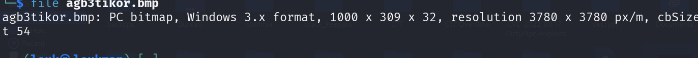
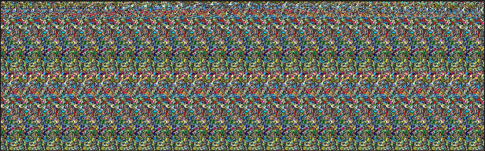
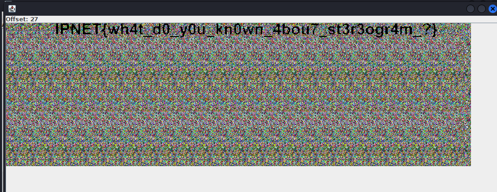

### **Catégorie**

Stéganographie

### **Outils utilisés**

- `file` (CLI Linux)
- `stegsolve` (outil d'analyse d'images)

### **Méthodologie**

#### **Étape 1 : Vérification du type de fichier**

La première étape consiste à identifier le type exact du fichier fourni à l'aide de la commande `file` :

```bash
file nom_image
```

**Résultat** : Le fichier est au format BMP (Bitmap).


> **À propos du format BMP**

> Le format BMP (Bitmap) est un format d'image matricielle non compressé développé par Microsoft pour Windows. Il stocke les images en haute qualité en enregistrant chaque pixel individuellement (couleur, détails), ce qui génère des fichiers souvent très volumineux comparés aux formats compressés comme JPG ou PNG.

#### **Étape 2 : Analyse visuelle de l'image**

Après visualisation de l'image, on observe qu'elle contient ce qui ressemble à un **spectrogramme**.

> **Qu'est-ce qu'un spectrogramme ?**

> Un spectrogramme est un diagramme représentant le spectre d'un phénomène périodique, associant à chaque fréquence une intensité ou une puissance. Dans les CTF, les spectrogrammes sont fréquemment utilisés pour dissimuler de l'information (texte, flag) dans les composantes visuelles de l'image.



#### **Étape 3 : Extraction avec Stegsolve**

Sachant que l'image contient un spectrogramme, nous utilisons **Stegsolve** pour analyser les différents plans de bits (bit planes) et canaux de couleur de l'image.

```bash
java -jar stegsolve.jar
```

1. Ouvrir l'image dans Stegsolve
2. Naviguer à travers les différents plans de bits (Red/Green/Blue plane 0-7)
3. Observer chaque vue jusqu'à révéler le flag caché dans l'un des plans

**Résultat** : Le flag apparaît clairement dans l'un des plans d'analyse !



### **Flag** 🚩

```
IPNET{wh4t_d0_y0u_kn0wn_4bou7_st3r3ogr4m_?}
```
