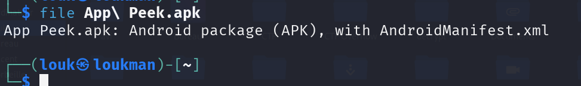
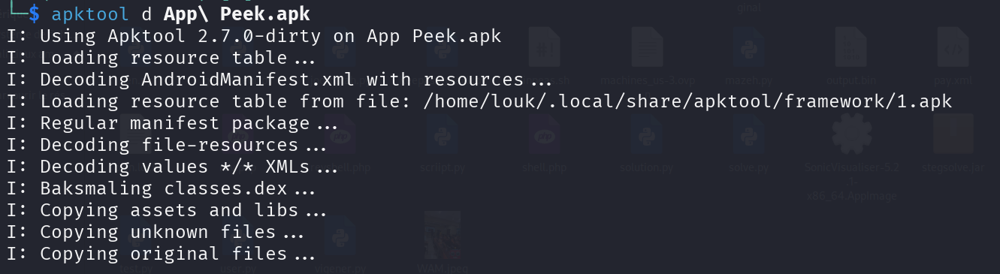
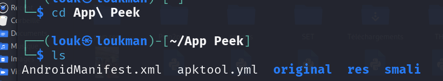
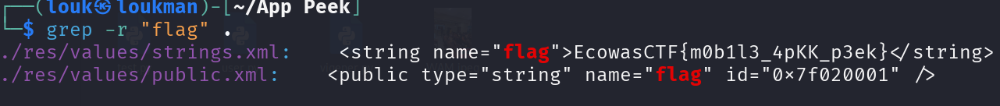
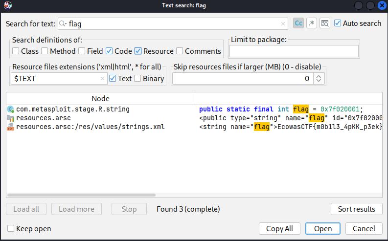
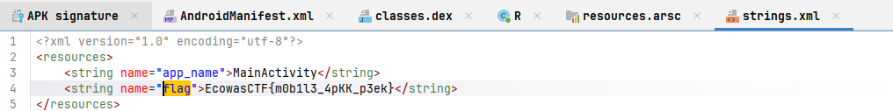

### Description

Analyze the APK and extract the flag.

##### Catégorie : Mobile

### Etape 1 - Analyse du fichier et Reconnaissance

Avant toute manipulation, nous vérifions la nature du fichier pour confirmer qu'il s'agit bien d'une archive Android. **Commande :**

```bash
file "App Peek.apk"
```

_Résultat :_ `Zip archive data, at least v2.0 to extract...` (confirmant le format APK).


Une première tentative avec `strings` n'a rien donné de concluant, ce qui suggère que le flag n'est pas dans les métadonnées brutes de l'archive mais à l'intérieur des composants compressés.
Au premier a bord, nous allons utiliser la commande file pour confirmer qu'il s'agit bien d'un pka 

#### Etape 2- Décompiler et extraire les informations dans le fichier 

Puisqu'un APK est une archive, nous utilisons **apktool** pour le "disstiller" (le décompiler). Contrairement à un simple `unzip`, `apktool` décode le fichier `resources.arsc` et les fichiers XML (comme le Manifest) pour les rendre lisibles.

**Commande :**

```
apktool d "App Peek.apk"
cd "App Peek"
```

NB : 
Si apktool n'est pas installé on peu utiliser la commande suivante pour télécharger 

```
sudo apt install apktool -y && sudo apt upgrade 
```



Allez dans le dossier créer 
```
cd App\ Peek 
```



#### Recherche récursive du Flag

Une fois l'arborescence extraite, nous effectuons une recherche textuelle sur l'ensemble des fichiers (code Smali, XML, ressources).

**Commande :**

```bash
grep -r "flag" .
```



Booom on a le flag 

#### Flag : 

```
EcowasCTF{m0b1l3_4pKK_p3ek}
```

>****Pourquoi `apktool` a réussi là où `strings` a échoué ?** Les fichiers comme `AndroidManifest.xml` ou `strings.xml` sont stockés sous forme binaire dans l'APK (`Binarized XML`). La commande `strings` ne peut pas les lire correctement. `apktool` les convertit en texte clair, rendant le `grep` possible.**

>**jadx-gui**
>Alternativement, on peu utiliser le décompilateur JADX-GUI en espace graphique qui permet de décoder les fichier **.dex** en code java lisible. 

NB :**CTRL+Shift+F** pour effectuer une recherche  



Cliquez sur open pour ouvrir : 


