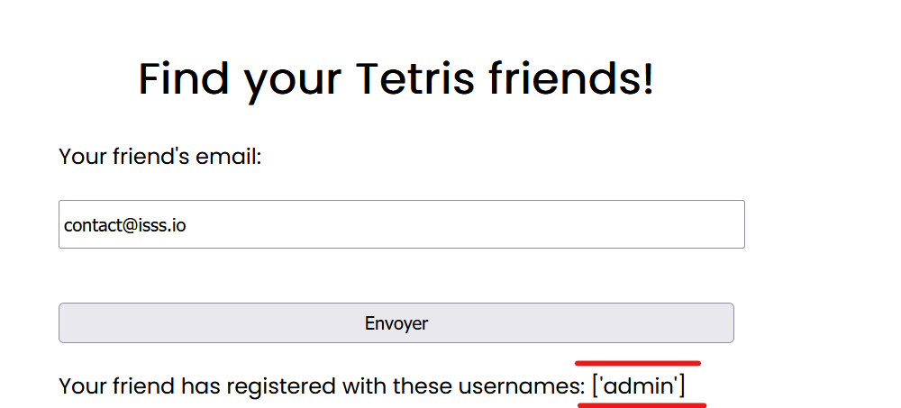
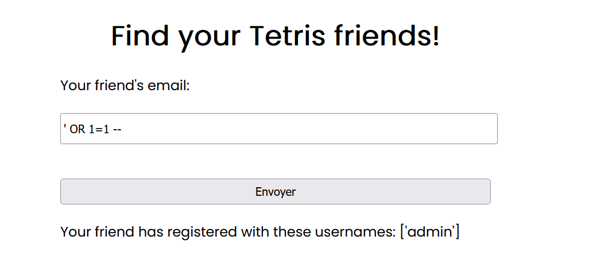
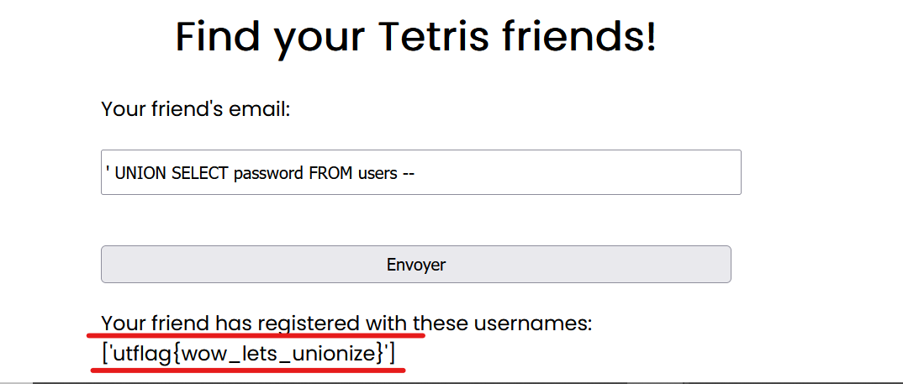

## 📝 Description du Challenge

> **Description :** After sneaking into the Postgres HQ, you peeked over someone's shoulder to see them type the following SQL command: `INSERT INTO users(username, password, email) VALUES ('admin', 'utflag{*****************}', 'contact@isss.io');` But you conveniently couldn't make out the starry part.
> 
> **URL :** `http://forever.isss.io:5006/`

L'objectif est clair : le flag se trouve dans le champ `password` de l'utilisateur `admin` dans une base de données **PostgreSQL**.

##  1. Reconnaissance & Identification de la Vulnérabilité

En arrivant sur l'interface web, on fait face à un formulaire de recherche qui demande l'adresse email d'un ami Tetris pour trouver son nom d'utilisateur.

> **Rappel Théorique :** Une vulnérabilité **SQL Injection (SQLi)** apparaît lorsque l'application intègre directement des entrées utilisateur non nettoyées dans une requête SQL. Pour la détecter, on teste des caractères spéciaux (`'`, `"`) ou des opérateurs logiques (`OR 1=1`) pour observer un changement de comportement de l'application.

Faisons nos premiers tests :

1. En entrant l'adresse légitime `contact@isss.io`, l'application nous renvoie le username associé : `admin`.
    
2. En injectant un payload basique comme `' OR 1=1 --` , l'application renvoie toujours `admin`.
    

Le fait que le comportement ne casse pas et renvoie le premier élément de la table valide la présence d'une **SQL Injection**. Cela nous indique également qu'il n'y a probablement qu'un seul utilisateur (`admin`) enregistré dans cette table.





## 2. Exploitation (UNION Based SQLi)

Puisque nous savons grâce à la description que le flag est dans la colonne `password` et que l'application affiche directement le résultat de la requête à l'écran, une **injection basée sur l'opérateur UNION** est la méthode parfaite.

### La contrainte technique

Si on tente d'extraire toutes les colonnes d'un coup avec un payload du style :

```sql
' UNION SELECT * FROM users --
```

L'application renvoie une erreur. Pourquoi ? Dans une injection UNION, la requête forgée par l'attaquant doit retourner **exactement le même nombre de colonnes** et des **types de données compatibles** avec la requête initiale du développeur. Ici, le backend n'attend et ne traite qu'un seul champ (le `username`).

### Le Payload Gagnant

Nous allons donc demander uniquement la colonne qui nous intéresse, `password`, ce qui correspond parfaitement au nombre de colonnes attendu :

```sql
' UNION SELECT password FROM users --
```

## 🏁 3. Capture du Flag

En soumettant ce payload dans le champ de recherche, le serveur exécute notre requête modifiée et nous renvoie la valeur stockée dans la colonne `password`.



```
utflag{wow_lets_unionize}
```

**_3ch0 training__**
