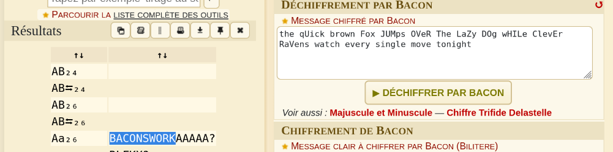

## Contenu du challenge

Le challenge nous fournit la phrase suivante :

```text
the qUick brown Fox JUMps OVeR The LaZy DOg wHILe ClevEr RaVens watch every single move tonight
```

---

## Analyse & Résolution

En observant attentivement le texte, on remarque une alternance irrégulière de lettres **majuscules** et **minuscules** au sein des mots. Il s'agit d'une caractéristique typique du **Chiffre de Bacon bilatère** (*Bacon's cipher*), où les deux états (majuscule/minuscule) représentent les symboles `A` et `B` de l'alphabet de Bacon.

Pour décoder ce message, nous utilisons l'outil en ligne dédié :
 [Outil de décodage Chiffre Bacon Bilatère - dCode](https://www.dcode.fr/chiffre-bacon-bilitere)

Après avoir configuré l'outil pour traiter les majuscules et minuscules comme les deux éléments du alphabet bilatère, nous obtenons le message en clair suivant :
`BACONSWORK`



---

## 🚩 Flag

```text
cspp{BACONSWORK}
```
