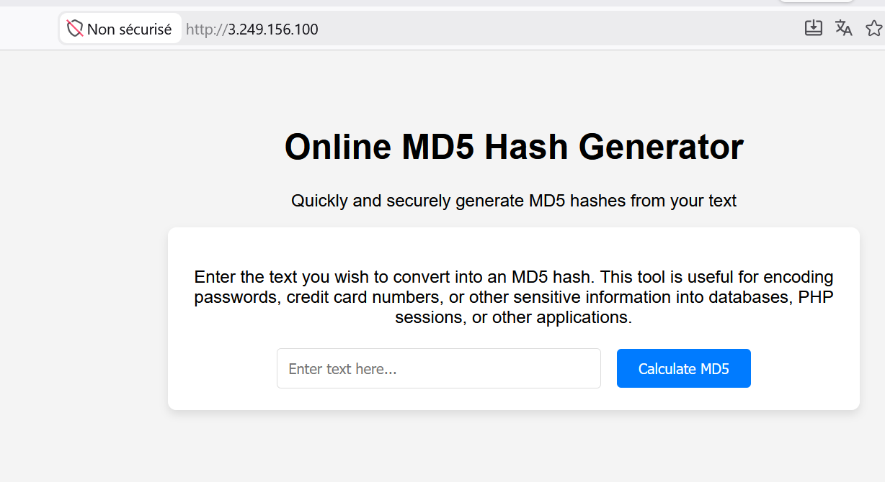
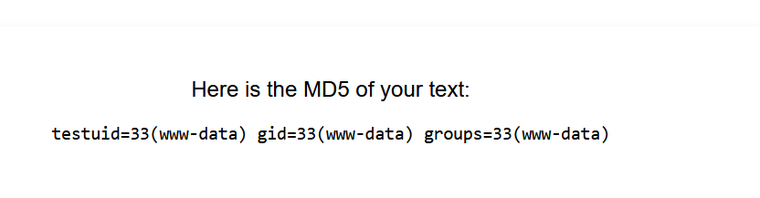
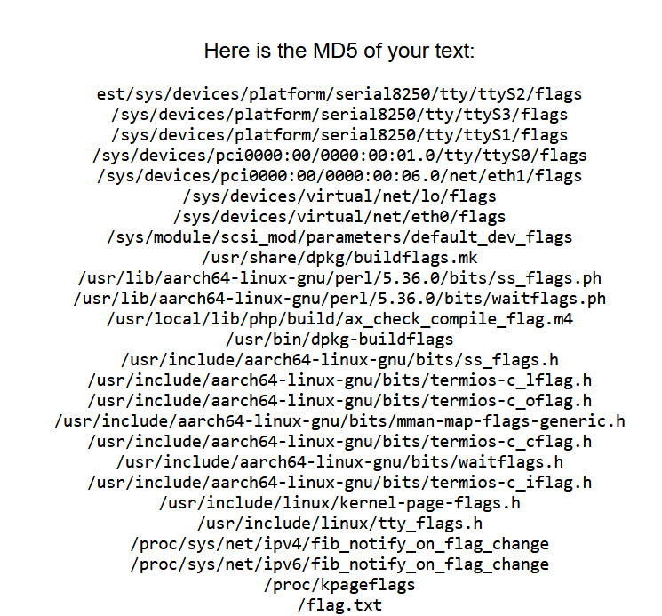

**Tags :** PHP RCE

---

## 1. Analyse de la cible

Le site propose un générateur de hash MD5 en ligne. En saisissant un texte, le système calcule et affiche le hash correspondant.



Après analyse, il semble que l'entrée utilisateur soit traitée via une commande système en arrière-plan, probablement de cette forme :

code PHP

```
shell_exec("echo " . $_POST['inputText'] . " | md5sum");
```

> ****Source de la vulnérabilité (Command Injection)****
> 
> 1. **`shell_exec()` :** Ouvre un terminal système qui exécute la chaîne brute comme une commande machine.
> 2. **Concaténation directe :** Fusionne l'entrée utilisateur `$_POST` sans aucun filtrage ni délimitation.
> 3. **Confusion code/donnée :** Le système traite les données de l'attaquant comme des instructions légitimes.
> 4. **Séparateurs Linux (`|`, `;`, `&&`) :** Permettent de briser la commande `echo` pour injecter du code arbitraire.
> 5. **Absence d'échappement :** Le manque de `escapeshellarg()` ou d'alternative native PHP casse toute sécurité.
>     

---

## 2. Exploitation (RCE)

Pour confirmer la vulnérabilité d'injection de commande, nous utilisons le séparateur de commande ; et le symbole de commentaire # pour neutraliser le reste de la ligne de commande initiale (| md5sum).

#### Payload de test

```
test; id #
```

Le résultat confirme une exécution de commande avec les privilèges **www-data** :



---

## 3. Post-Exploitation

#### Recherche du flag

Nous utilisons la commande find pour localiser le fichier contenant le flag sur le système :

code Text

```
test; find / -name "*flag*" 2>/dev/null #
```



#### Lecture du flag

Le fichier est situé à la racine /flag.txt. Nous le lisons avec cat :

```
test; cat /flag.txt #
```

**Flag :** 5bdd59d4-2ab4-4a30-af10-534e35e7065d
