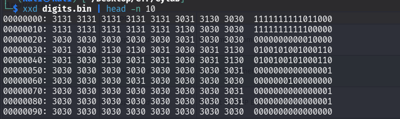
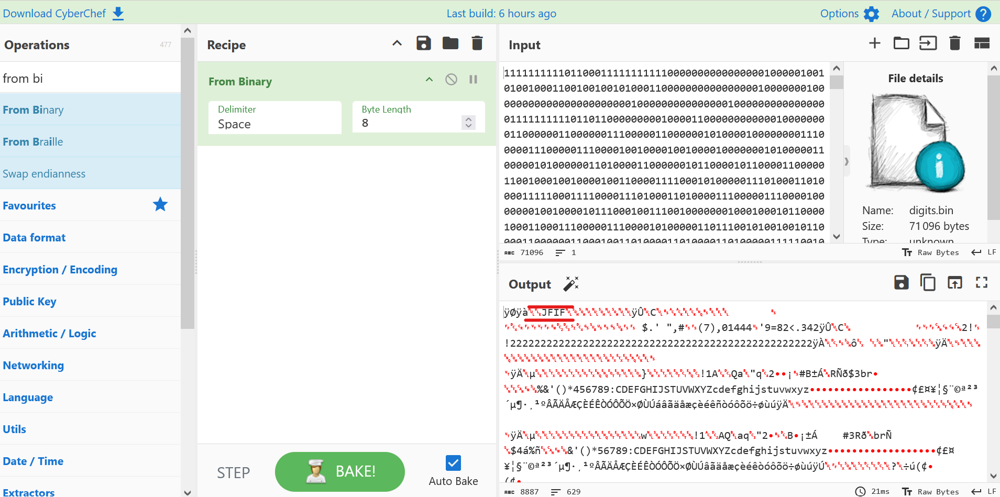
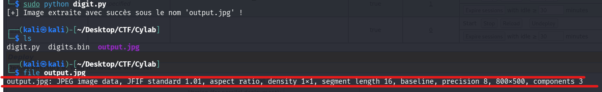
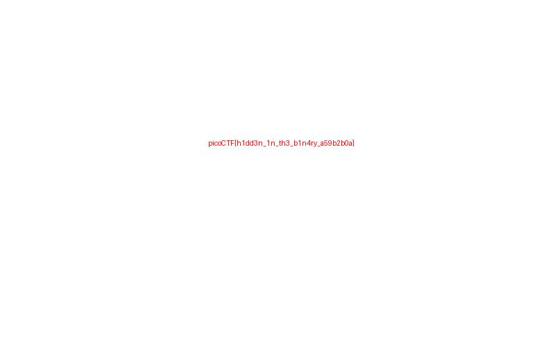

## Métadonnées

- **Catégorie :** Forensics
    
- **Outils :** file xxd head Cyberchef Python
    
- **Flag :** `picoCTF{h1dd3n_1n_th3_b1n4ry_a59b2b0a}`
    

---

##  Étape 1 : Analyse initiale du fichier

Pour débuter l'investigation, on vérifie la nature réelle du fichier grâce à la commande `file`.

```bash
file digits.bin
```

### Résultat :

```text
digits.bin: ASCII text, with very long lines (65536), with no line terminators
```

> 📌 **Note :** Le fichier possède l'extension `.bin` mais la commande révèle qu'il s'agit en réalité d'un fichier texte brut (ASCII) contenant une unique ligne géante de 65 536 caractères.

---

##  Étape 2 : Inspection du contenu (Heuristique)

On inspecte les premières lignes du fichier avec `xxd` et `head` pour comprendre la structure du texte.

```bash
xxd digits.bin | head -n 10
```

### Résultat :



On constate rapidement que le fichier ne contient que des caractères textuels `0` et `1`. C'est une suite de bits représentée sous forme de texte.

---

##  Étape 3 : Décodage et Extraction

Puisque le fichier contient une représentation textuelle de bits, nous devons convertir ces bits en données binaires réelles.

### Méthode 1 : CyberChef

1. Ouvrir **CyberChef**.
    
2. Uploader le fichier `digits.bin` comme input.
    
3. Utiliser la recette **`From Binary`** pour regrouper les caractères par paquets de 8 bits et les convertir en octets.
    



Une fois le décodage effectué, on inspecte le résultat (Output). On remarque immédiatement la présence des caractères `JFIF` dans l'en-tête, ce qui correspond à la signature (Magic Bytes) d'une image au format **JPEG**.

4. Enregistrer le résultat sous le nom `output.jpg`.
    

### Méthode 2 : Script Python (Alternative)

On peut automatiser ce processus de conversion "Texte binaire -> Fichier réel" avec le script suivant :

```python
# solve.py
with open("digits.bin", "r") as f:
    binary_text = f.read().strip()

# Regroupement par 8 bits pour reconstruire les octets
file_bytes = bytes(int(binary_text[i:i+8], 2) for i in range(0, len(binary_text), 8))

# Sauvegarde de l'image finale
with open("output.jpg", "wb") as out:
    out.write(file_bytes)

print("[+] Image extraite avec succès sous le nom 'output.jpg' !")
```



---

## 🏁 Étape 4 : Capture du Flag

En ouvrant l'image récupérée `output.jpg`, le flag apparaît directement écrit dessus.



**Flag :** `picoCTF{h1dd3n_1n_th3_b1n4ry_a59b2b0a}`

---

##  Mémo des commandes utilisées

rappel de l'utilité des commandes exécutées durant ce challenge :

- **`file <fichier>`** : Analyse l'en-tête et la structure d'un fichier pour déterminer son type réel (indépendamment de son extension). Très utile pour repérer les faux fichiers exécutables ou les extensions trompeuses.
    
- **`xxd <fichier>`** : Génère un dump hexadécimal d'un fichier. Elle permet de voir le contenu brut (en hexadécimal à gauche, et sa traduction ASCII à droite).
    
- **`head -n <nombre>`** : Permet d'afficher uniquement les X premières lignes d'un flux ou d'un fichier. Combinée avec un _pipe_ (`|`), elle évite de saturer le terminal avec un fichier trop volumineux.
