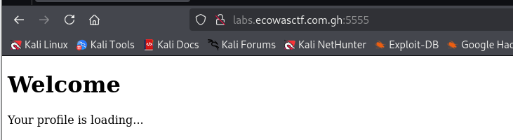
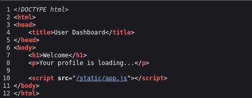
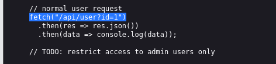
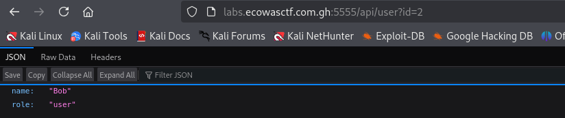
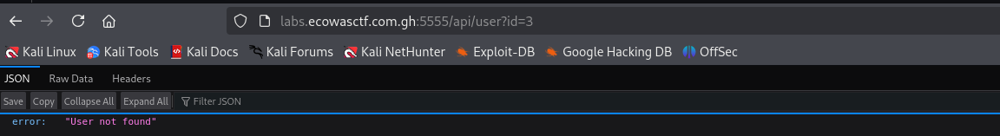
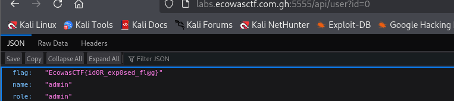

#### Description :
The authentication system here seems secure at first glance… but sometimes, trust is misplaced. Your goal is to exploit how the server validates users and discover the hidden flag.

#### Catégorie : web

### Etape 1- Accéder à la page 



Normale rien d'intéressant. 
On va inspecter le code source et voir s'il y a un truc intéressant 



Intéressant, nous avons un fichier js nommé **app.js** qui pourrai contenir des infos sur les api 



Boom on a un /api/user avec un paramètre id ( **/api/user?id=1**) pour désigner l'id de chaque utilisateur.  
D'après le code, les utilisateurs normaux ont un id de 1 autrement dit les autres utilisateurs aurons un id différent de 1 si ces comptes existent
Ainsi cela nous fait recours à la vulnérabilité **IDOR** ( Insecure Direct Object)

#### Note : Vulnérabilité IDOR (Insecur Direct Object Reference)

IDOR (Insecure Direct Object Reference) est une vulnérabilité de sécurité importante qui se produit lorsque les vérifications d'autorisation ne sont pas correctement mises en œuvre, permettant aux utilisateurs malveillants d'accéder à des données ou à des ressources qui ne leur appartiennent pas.

Par exemple, si un numéro de transaction est directement inclus dans une URL de transaction et que ce numéro peut être manipulé pour fournir un numéro de transaction différent, il est possible d'accéder aux informations de transaction d'un autre utilisateur. Un exemple simple est fourni ci-dessous:
https://example.com/transaction?id=1234

### Etape 2- Exploitation de la vulnérabilité 

Nous allons au premier a bord accéder à l'id 2

url : 
```
http://labs.ecowasctf.com.gh:5555/api/user?id=2
```


Labas on a l'utlisateur Bob 
Mais A partir de l'id 3 on a rien 


Ce qui signifie que l'id de l'admin est 0 

Url pour accéder au compte admin 

```
http://labs.ecowasctf.com.gh:5555/api/user?id=0
```



Boom on a ainsi le flag 

### FLAG :
```
EcowasCTF{id0R_exp0sed_fl@g}
```
