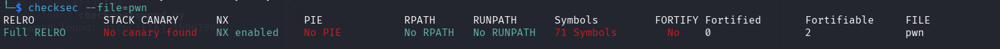

***3ch0 training***

Description
Exploit the given binary to read the file `flag` on the remote server.

Étape 1- Déterminer le type de fichier 

On utilise l'outil file

```
file pwn
```

Résultat

```
pwn: ELF 64-bit LSB executable, x86-64, version 1 (SYSV), dynamically linked, interpreter /lib64/ld-linux-x86-64.so.2, BuildID[sha1]=cf1bd2c99cadd24d1e86964933b28aa0027ac464, for GNU/Linux 3.2.0, not stripped
```

Il s'agit d'un exécutable linux

Etape 2- Vérifier les protections

```
checksec --file=pwn
```

Résulat
```
RELRO           STACK CANARY      NX            PIE             RPATH      RUNPATH      Symbols         FORTIFY Fortified       Fortifiable     FILE
Full RELRO      No canary found   NX enabled    No PIE          No RPATH   No RUNPATH   71 Symbols        No    0               2               pwn

```



On a NX activé : Signification 

PIE  désactiver : Signification

CANARY désactivé : Signification

Etape 3- Scan rapide  du binaire avec strings

Nous allons utiliser la commande strings pour lister les caractères lisibles (parfois on peu directement trouver le flag)

Mais rien  de bon, cette commande affiche la présence des mots comme (, fgets , **main** qui est la fonction principale ) ou encore **Yes!**, **Shell** 

Etape 4 Decompiler avec ghidra

Dans ghidra localiser la fonction main

```

undefined8 main(void)

{
  int iVar1;
  time_t tVar2;
  char local_38 [36];
  int local_14;
  uint local_10;
  uint local_c;
  
  tVar2 = time((time_t *)0x0);
  srand((uint)tVar2);
  local_c = rand();
  local_10 = rand();
  local_14 = local_10 + local_c;
  printf(">>> %d + %d = ",(ulong)local_c,(ulong)local_10);
  fflush(stdout);
  fgets(local_38,100,stdin);
  iVar1 = atoi(local_38);
  if (local_14 == iVar1) {
    puts("Yes!");
  }
  else {
    puts("No!");
  }
  return 0;
}
```

Fonction shell
```
void shell(void)

{
  puts("Enjoy your shell!");
  system("/bin/bash");
  return;
}
```

Explication 

Ici le programme utilise la fonction fgets pour récupérer l'entrer utilisateurs.
Ce  qui signifie qu'on peu  entrer plus de 38 caractères et écrire sur les autres cases.

Et puis  on obtient uniquement le shell (shell function )orsque le local_14==ivar1 

buffer overflow

Exploitation
