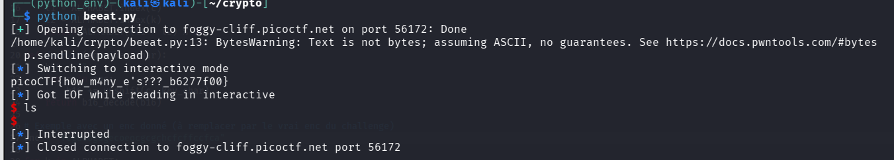

- **Catégorie :** General Skills
    
- **Difficulté :** Easy
    
- **Points :** 100 pts
    
- **Plateforme :** PicoCTF
    
- **Auteur :** LT 'syreal' Jones
    

## 📄 Code Source du Serveur (`bytemancy.py`)

Voici le script Python qui tourne sur l'instance distante et avec lequel on doit interagir :

```python
while(True):
  try:
    print('⊹──────[ BYTEMANCY-1 ]──────⊹')
    print("☍⟐☉⟊☽☈⟁⧋⟡☍⟐☉⟊☽☈⟁⧋⟡☍⟐☉⟊☽☈⟁⧋⟡☍⟐")
    print()
    print('Send me ASCII DECIMAL 101 1751 times, side-by-side, no space.')
    print()
    print("☍⟐☉⟊☽☈⟁⧋⟡☍⟐☉⟊☽☈⟁⧋⟡☍⟐☉⟊☽☈⟁⧋⟡☍⟐")
    print('⊹─────────────⟡─────────────⊹')
    user_input = input('==> ')
    if user_input == "\x65"*1751:
      print(open("./flag.txt", "r").read())
      break
    else:
      print("That wasn't it. I got: " + str(user_input))
      print()
      print()
      print()
  except Exception as e:
    print(e)
    break
```

## Analyse & Logique

1. **Le Défi :** Le serveur nous demande d'envoyer la valeur décimale ASCII **101** répétée **1751** fois.
    
2. **La Correspondance :** La valeur décimale `101` correspond en hexadécimal à `0x65`, ce qui représente la lettre minuscule **`'e'`** en ASCII.
    
3. **La Condition de Succès :** La ligne `if user_input == "\x65"*1751:` confirme qu'on doit envoyer une chaîne brute composée exactement de 1751 fois le caractère `'e'` pour déclencher l'affichage du fichier `flag.txt`.
    

Faire un copier-coller manuel de 1751 caractères dans un terminal réseau étant fastidieux et source d'erreurs, l'utilisation d'un script d'automatisation via le framework **Pwntools** est la solution idéale.

## Outil Pwntools

**Pwntools** est une bibliothèque Python incontournable en CTF (catégories Pwn, Reverse et General Skills). Elle permet de prototyper rapidement des exploits et de gérer facilement les connexions réseau ou les interactions avec des binaires locaux.

### 📌 Fonctions utiles utilisées (et à retenir) :

- **`remote(HOST, PORT)`** : Initialise une connexion TCP vers un serveur distant. Retourne un objet de type tube (tube/socket) pour interagir avec la cible.
    
- **`p.recvuntil(bytes_sequence)`** : Lit les données reçues sur le flux réseau _jusqu'à_ rencontrer la séquence d'octets spécifiée (ici, le prompt `b'==> '`). Indispensable pour synchroniser le script avec les demandes du serveur sans bloquer.
    
- **`p.sendline(payload)`** : Envoie la charge utile (`payload`) vers le serveur en ajoutant automatiquement un caractère de fin de ligne (`\n`). Idéal pour simuler la touche "Entrée" après une saisie utilisateur (`input()`).
    
- **`p.interactive()`** : Bascule la main de manière bidirectionnelle entre le script et ton propre terminal Kali. C'est ce qui te permet de lire le flag directement ou de taper des commandes si le serveur t'ouvre un shell.
    

## Script d'Exploitation (`beeat.py`)

```python
from pwn import *

# 1. Connexion au serveur distant
HOST = 'foggy-cliff.picoctf.net'
PORT = 56172
p = remote(HOST, PORT)

# 2. Attente de l'apparition du prompt '==> '
p.recvuntil(b'==> ')

# 3. Préparation du payload (ASCII 101 -> 'e')
payload = b"e" * 1751

# 4. Envoi de la réponse
p.sendline(payload)

# 5. Récupération du flag en mode interactif
p.interactive()
```



## 🏁 Flag

> ****Flag capturé** `picoCTF{h0w_m4ny_e's???_b6277f00}`**
