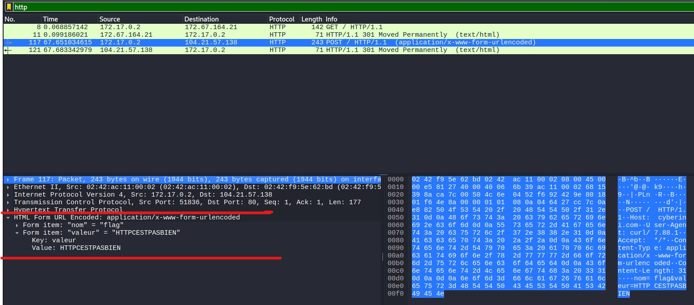
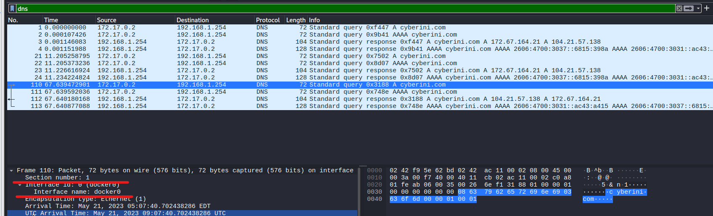

## Step 1 : Inspection du Trafic & Extraction du Flag

Après l'ouverture du fichier `capture.pcapng` dans Wireshark :

1. Application du filtre pour isoler les requêtes web :
```text
   http
```

2. Repérage d'une requête HTTP avec la méthode `POST`.
    
3. Inspection du corps de la requête :

```
key: value
value: HTTPCESTPASBIEN
```



> **Flag**
> 
> Le mot de passe / flag transmis en clair dans le formulaire `POST` est **`HTTPCESTPASBIEN`**.

## Step 2 : Question Bonus (Environnement d'Exécution)

> **Question :** Quel est l’environnement d’exécution dans lequel se trouvait la machine capturée ?

### Méthodologie :

1. **Filtrage des requêtes DNS :**
    
        
    ```
    dns
    ```
    
2. **Analyse des interfaces et requêtes :**
    
    - L'inspection des paquets DNS et des interfaces réseau capturées montre des résolutions de noms/noms d'hôtes internes et des sous-réseaux caractéristiques du démon Docker (ex: pont réseau `docker0` ou domaines internes de conteneurs).
        

> **Conclusion Bonus**
> 
> La machine s'exécutait à l'intérieur d'un **conteneur Docker**.



## Notions Clés

> **A retenir**
> 
> - **Chiffrement du trafic :** Le protocole HTTP fait circuler les données de formulaires en clair. Toute capture de paquets (`.pcap`) permet de reconstituer les requêtes `POST` sans effort de décryptage.
>     
> - **Empreinte réseau d'un conteneur :** Les requêtes DNS internes et les caractéristiques des interfaces réseau (adresses en `172.17.x.x`, requêtes vers des conteneurs voisins) permettent d'identifier si une capture provient d'un environnement Docker.
>
