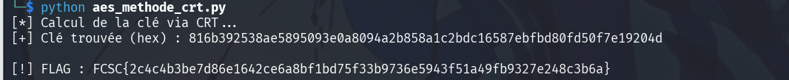

AES CRT (Théorème des Restes Chinois)
## Description

Code Source :

```
import os

from Crypto.Cipher import AES

from Crypto.Util.Padding import pad

key = os.urandom(32)

print("carotte = ", int.from_bytes(key) % 17488856370348678479)

print("radis   = ", int.from_bytes(key) % 16548497022403653709)

print("tomate  = ", int.from_bytes(key) % 17646308379662286151)

print("pomme   = ", int.from_bytes(key) % 14933475126425703583)

print("banane  = ", int.from_bytes(key) % 17256641469715966189)

flag = open("flag.txt", "rb").read()
E = AES.new(key, AES.MODE_ECB)
enc = E.encrypt(pad(flag, 16))
print(f"enc = {enc.hex()}")
```

Sortie :
```
carotte =  392278890668246705
radis   =  4588810924820033807
tomate  =  17164682861166542664
pomme   =  12928514648456294931
banane  =  5973470563196845286
enc = 2da1dbe8c3a739d9c4a0dc29a27377fe8abc1c0feacc9475019c5954bbbf74dcedce7ed3dc3ba34fa14a9181d4d7ec0133ca96012b0a9f4aa93c42c61acbeae7640dd101a6d2db9ad4f3b8ccfe285e0d

```
### 1. Description du Challenge

Le but est de **récupérer le Flag** contenu dans le fichier chiffré `enc`.

- **L'obstacle :** Le flag a été chiffré avec **AES-256**, un algorithme très robuste. Pour déchiffrer, il faut absolument la `key`.
    
- **Le problème :** La `key` est générée de façon aléatoire (`os.urandom(32)`), on ne peut donc pas la deviner.
    
- **La faille :** Le programme affiche le résultat de la clé passée dans plusieurs opérations **modulo**. Ces résultats (carotte, radis, tomate...) sont des indices mathématiques qui permettent de reconstruire la clé originale

### 2. Notion de base
#### A. Le Modulo (`%`)

En mathématiques, le modulo est le **reste d'une division**.

- Si je dis 17≡2(mod5), cela signifie que dans 17, il y a 3 fois 5, et il reste **2**.
    
- Dans le challenge, `int.from_bytes(key) % 1748...` signifie : "Prends la clé, divise-la par ce grand nombre, et donne-moi le reste (carotte)".
    

#### B. Le Théorème des Restes Chinois (CRT)

C'est la pièce maîtresse. Ce théorème dit que si tu connais les restes d'un nombre inconnu X divisé par plusieurs nombres (qui n'ont pas de diviseurs communs), tu peux retrouver X de manière unique.

- **Analogie :** C'est comme un système d'engrenages. Si je sais qu'un engrenage de 10 dents est à la position 3 et qu'un engrenage de 7 dents est à la position 2, il n'y a qu'un seul moment où ces deux conditions se croisent.
    

#### C. AES (Advanced Encryption Standard)

C'est l'algorithme de chiffrement symétrique le plus utilisé au monde.

- **Symétrique :** Cela signifie qu'on utilise la **même clé** pour chiffrer et pour déchiffrer.
    
- **Taille de clé :** Ici, on utilise 32 octets (256 bits), ce qui correspond à l'AES-256.
    
- **Mode ECB (Electronic Codebook) :** C'est la méthode la plus simple pour appliquer l'AES. Elle découpe le message en blocs de 16 octets et les chiffre un par un.
    

#### D. Le "Padding"

L'AES ne peut chiffrer que des blocs de taille fixe (16 octets). Si ton flag fait 20 octets, il faut ajouter des données inutiles à la fin pour arriver à 32 octets (le multiple de 16 supérieur). C'est ce que fait la fonction `pad`.

## Résolution

Code python 
```
from Crypto.Cipher import AES
from Crypto.Util.number import long_to_bytes
from sympy.ntheory.modular import solve_congruence

# Données : (reste, modulo)
data = [
    (392278890668246705, 17488856370348678479),   # carotte
    (4588810924820033807, 16548497022403653709),  # radis
    (17164682861166542664, 17646308379662286151), # tomate
    (12928514648456294931, 14933475126425703583), # pomme
    (5973470563196845286, 17256641469715966189)   # banane
]

# 1. Résolution du Théorème des Restes Chinois
print("[*] Calcul de la clé via CRT...")
key_int, _ = solve_congruence(*data)

# 2. Conversion de l'entier en 32 octets (AES-256)
key = long_to_bytes(key_int, 32)
print(f"[+] Clé trouvée (hex) : {key.hex()}")

# 3. Déchiffrement AES
enc_hex = "2da1dbe8c3a739d9c4a0dc29a27377fe8abc1c0feacc9475019c5954bbbf74dcedce7ed3dc3ba34fa14a9181d4d7ec0133ca96012b0a9f4aa93c42c61acbeae7640dd101a6d2db9ad4f3b8ccfe285e0d"
enc_data = bytes.fromhex(enc_hex)

cipher = AES.new(key, AES.MODE_ECB)
decrypted = cipher.decrypt(enc_data)

print(f"\n[!] FLAG : {decrypted.strip().decode()}")
```



Flag : 

```
FCSC{2c4c4b3be7d86e1642ce6a8bf1bd75f33b9736e5943f51a49fb9327e248c3b6a}
```
