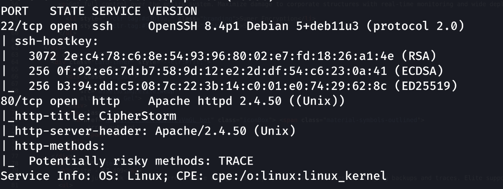
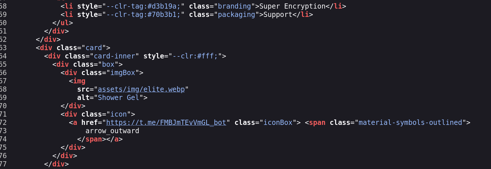
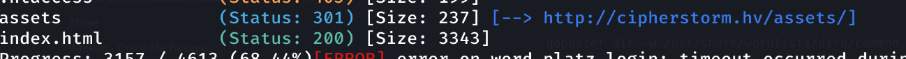

Description 
Recent work by our team has revealed that a group called 'Cipher Storm' has been developing and selling ransomware and has seen a recent increase in activity. We know that this group writes and sells malware used in many ransomware attacks. To stop the group's activities, we need to reach the people behind it. The first step is to start analyzing the team's website. Good luck with your mission!

---
### Etape 1- Enumeration et reconnaisance 

1. Scan des ports et services 

Pour cela nous utilsons la commande nmap 
```
nmap -sC -sV <IP>
```



Au cours du scan nmap on decouvre 2 ports 
- Un port 22 pour le service ssh 
- Puis un port 80 pour le service HTTP . 

L'activation du script par defaut de nmap nous montre egalement que la plateforme supporte la methode TRACE 

>[Note]
>LA methode TRACE est utilise en HTTP Pour indiquer au serveur de retourner exactement la reponse de la requette envoyee

Vu qu'on a le port 80 avec un nom de domaine cipherstorm.hv nous allons l'ajouter au fichier de configuration dns /ets/hosts 

```bash
sudo nano /etc/hosts 

# Puis ajouter les configs <IP>   cipherstorm.hv 
```

Lorsqu'on accede a la plateforme on a juste quelque informations 

Q1- What is the Telegram address used to communicate with the ransomware team?

Lorsqu'on regarde le code source de la page on remarque un lien vers un compte telegramme 

R- [t.me/FMBJmTEvVmGL_bot](view-source:https://t.me/FMBJmTEvVmGL_bot)



2. Enumeration des repertoires caches 

Nous allons utiliser l'outil gobuster pour effectuer le scan 

```bash
gobuster dir -w /usr/share/wordlists/dirb/common.txt -u http://cipherstorm.hv
```

Cette enumeration de nous donne rien d'interressant 



2. Analyse 

Au cours de notre scan nmap avec l'activation du scipt par defaut on a remarque la presence de la Methode TRACE qui indique au serveur de renveyoer exactement la reponse de la requete envoye . 

D'Apres quelque recherche cette activation entraine une vulnerabilite XST (Cross- Site Tracing). 

La vulnérabilité **XST** (Cross-Site Tracing) est une faille de sécurité qui exploite la méthode HTTP `TRACE` pour contourner des protections de cookies comme le drapeau `HttpOnly`
