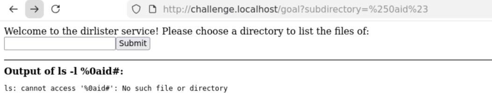
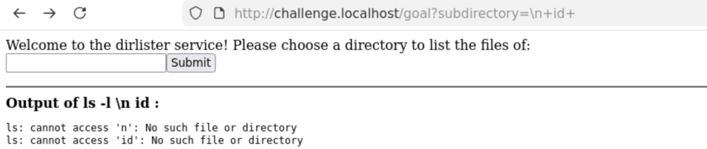
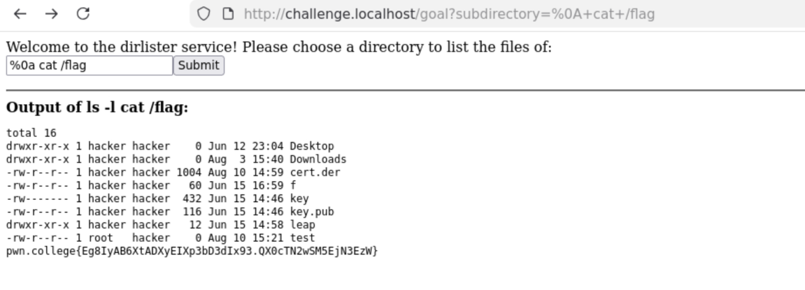

> ****Informations Générales****
> - **Plateforme :** pwn.college
> - **Catégorie :** Command Injection (Contournement de liste noire stricte)
> - **Objectif :** Contourner un filtrage massif de caractères spéciaux en utilisant un saut de ligne non filtré (`\n` / `%0a`).

---

## 1. Description du Challenge

Dans ce niveau, le développeur tente de verrouiller complètement l'application en bloquant une longue liste de caractères spéciaux et de métacaractères du shell (` ; `, ` & `, ` | `, ` > `, ` < `, ` ( `, ` ) `, ` ` `, ` $ `). 

Cependant, une omission critique dans une telle liste noire laisse une faille béante : le caractère de **saut de ligne (*newline*)** n'est pas filtré.

---

## 2. Analyse du Code Source

```python
#!/usr/bin/exec-suid -- /usr/bin/python3 -I

import subprocess
import flask
import os

app = flask.Flask(__name__)

@app.route("/goal", methods=["GET"])
def challenge():
    # 🛡️ Liste noire stricte de caractères bloqués
    arg = (
        flask.request.args.get("subdirectory", "/challenge")
        .replace(";", "")
        .replace("&", "")
        .replace("|", "")
        .replace(">", "")
        .replace("<", "")
        .replace("(", "")
        .replace(")", "")
        .replace("`", "")
        .replace("$", "")
    )
    command = f"ls -l {arg}"

    print(f"DEBUG: {command=}")
    result = subprocess.run(
        command,
        shell=True,            # Interpréteur shell toujours actif
        stdout=subprocess.PIPE,
        stderr=subprocess.STDOUT,
        encoding="latin",
    ).stdout

    return f"""
        <html><body>
        Welcome to the dirlister service! Please choose a directory to list the files of:
        <form action="/goal"><input type=text name=subdirectory><input type=submit value=Submit></form>
        <hr>
        <b>Output of {command}:</b><br>
        <pre>{result}</pre>
        </body></html>
        """

os.setuid(os.geteuid())
os.environ["PATH"] = "/usr/local/sbin:/usr/local/bin:/usr/sbin:/usr/bin:/sbin:/bin"
app.secret_key = os.urandom(8)
app.config["SERVER_NAME"] = "challenge.localhost:80"
app.run("challenge.localhost", 80)
````

###  Logique de l'Exploitation

1. **L'échec des méthodes classiques :** Tous les séparateurs courants (`;`, `|`, `&`) et les redirections (`>`) sont bloqués par les `.replace()`.
    
          
2. **L'oubli du développeur :** Le saut de ligne (`\n`) n'est pas nettoyé. Or, pour un shell Linux comme Bash, un retour à la ligne a exactement la même fonction syntaxique qu'un point-virgule : il sépare deux instructions distinctes.
    
      
    
3. **Le piège du formulaire HTML :** Si on tape le saut de ligne directement dans l'input du site web, le navigateur risque de l'encoder ou de l'ignorer. Il faut donc injecter le caractère via son équivalent URL-encodé (`%0a`) directement **dans la barre d'adresse de l'URL**.
    

		




##  3. Exploitation

### Étape 1 : Injection du saut de ligne via l'URL

Dans l'URL du navigateur, on modifie le paramètre `subdirectory` en injectant `%0a` suivi de la commande voulue :

  

```text
[http://challenge.localhost/goal?subdirectory=%0acat+/flag](http://challenge.localhost/goal?subdirectory=%0acat+/flag)
```

- **Ce que fait le serveur :**
    
      
    - Il décode `%0a` en un vrai retour à la ligne (`\n`).
        
          
        
    - La variable `command` devient :
                  
        
               
        ```bash
        ls -l 
        cat /flag
        ```
        
    - Le shell exécute `ls -l` (sur un argument vide), puis passe à la ligne et exécute `cat /flag`.
        
                  

> ****Résultat :** Le résultat des deux commandes s'affiche dans la balise `<pre>` de la page web, révélant directement le flag.**
> 
>   



## 🏁 4. Flag Obtenu

> `pwn.college{Eg8IyAB6XtADXyEIXp3bD3dIx93.QX0cTN2wSM5EjN3EzW}`

## 🛠️ 5. Remédiation

Les listes noires de caractères (_blacklisting_) sont presque toujours vouées à l'échec en sécurité car il est impossible de penser à toutes les variations syntaxiques (sauts de ligne, encodages, variables d'environnement, etc.). La solution corrective consiste à :

  

1. **Abandonner `shell=True`**.
    
          
2. Valider strictement l'entrée utilisateur via une **liste blanche (_whitelisting_)** (par exemple, s'assurer que le paramètre ne contient que des caractères alphanumériques autorisés pour un chemin de dossier).
