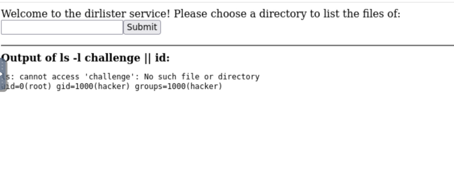
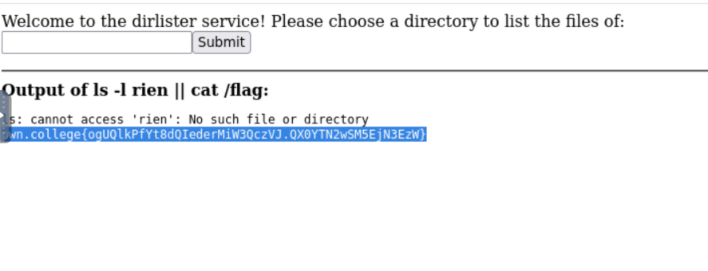

---

> ****Informations Générales****
> - **Plateforme :** pwn.college
> - **Catégorie :** Command Injection (Filtres)
> - **Impact :** Exécution de commandes à distance (RCE) / Root

---

##  1. Description du Challenge

Ce niveau reprend le même service de listing de répertoires, mais le développeur a conscience du problème d'injection précédent et tente de l'atténuer en filtrant le point-virgule (`;`). 

L'objectif est de trouver un **autre séparateur de commandes** (appris dans les modules de Linux / Piping) pour contourner ce filtre.

---

##  2. Analyse du Code Source

```python
@app.route("/scenario", methods=["GET"])
def challenge():
    # 🛡️ Tentative de protection : suppression du point-virgule
    arg = flask.request.args.get("storage-path", "/challenge").replace(";", "")
    command = f"ls -l {arg}"

    print(f"DEBUG: {command=}")
    result = subprocess.run(
        command,
        shell=True,
        stdout=subprocess.PIPE,
        stderr=subprocess.STDOUT,
        encoding="latin",
    ).stdout
````

### 🧠 Failles et Limites de la Protection

La fonction `.replace(";", "")` est une mauvaise pratique de sécurité (_blacklist naïve_). Elle se contente de supprimer le caractère `;`, mais laisse intacts les autres opérateurs logiques et métacaractères du shell interprétés par `shell=True`.

  

## 🚀 3. Exploitation (Bypass du filtre)

Puisque le point-virgule est bloqué, on peut utiliser l'opérateur logique **`||` (OR)**.

  

### Pourquoi `||` fonctionne ?

En bash, l'opérateur `||` exécute la seconde commande **uniquement si la première échoue** (code de retour différent de 0).

  

1. On passe une valeur invalide (ex: `challenge`) pour que la commande `ls -l challenge` échoue.
    
      
    
2. Le shell évalue l'opérateur `||` et enchaîne directement avec notre commande malveillante.
    



### Payload :

```
challenge || cat /flag
```

> ****Résultat :****
> 
> La commande `ls` renvoie une erreur (fichier introuvable), mais l'opérateur `||` déclenche l'exécution immédiate de `cat /flag` avec les privilèges `root`.
> 
>   



## 🚩 4. Récupération du Flag

> ****Flag obtenu :****
> 
> `pwn.college{ogUQlkPfYt8dQIederMiW3QczVJ.QX0YTN2wSM5EjN3EzW}`
