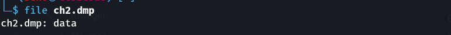
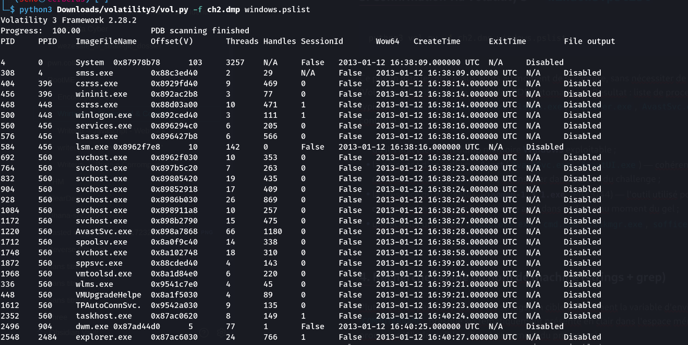
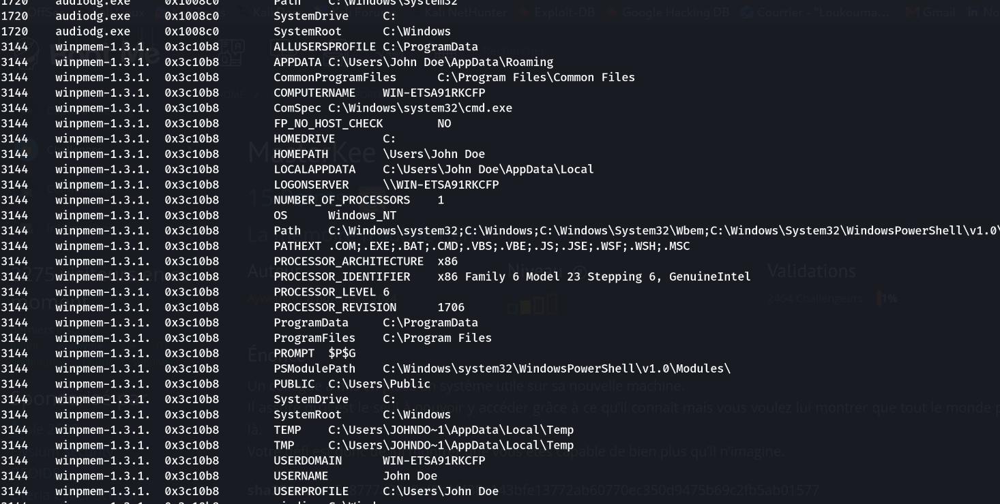

On dispose d'un dump de la mémoire vive (`ch2.dmp`) d'une machine dont le nom n'a pas été noté au moment de la capture. Le mot de passe de validation est **le nom de la machine**.

## Outils utilisés

- `file` — identification du type de fichier
- `strings` — extraction des chaînes lisibles
- `grep` — filtrage ciblé
- [Volatility 3](https://github.com/volatilityfoundation/volatility3) — framework d'analyse forensique mémoire

## Méthodologie

### 1. Identification du fichier

```bash
file ch2.dmp
# ch2.dmp: data
```

`file` ne reconnaît pas de signature précise (dump mémoire brut, sans header standard identifiable directement) — il faut creuser plus loin.



### 2. Premier passage aux chaînes de caractères

```bash
strings ch2.dmp | less
```

Une lecture manuelle des strings sur un dump de plusieurs centaines de Mo n'est pas efficace pour une recherche ciblée — direction : confirmer d'abord qu'il s'agit bien d'un dump Windows exploitable avec Volatility, puis grep ciblé.

### 3. Confirmation via Volatility 3 — `windows.pslist`

```bash
python3 vol.py -f ch2.dmp windows.pslist
```

Ce plugin liste les processus actifs au moment de la capture, sans nécessiter de profil pré-construit (Volatility 3 fait du scan de symboles PDB automatique). Résultat : liste de processus Windows 7 typique (`csrss.exe`, `wininit.exe`, `lsass.exe`, `explorer.exe`, `AvastSvc.exe`, etc.), ce qui confirme :

- qu'il s'agit bien d'un dump mémoire **Windows** exploitable ;
- la présence d'un antivirus **Avast** (`AvastSvc.exe`, `AvastUI.exe`) — cohérent avec l'énoncé qui mentionne des logs d'antivirus à consulter dans la suite du challenge ;
- la présence du processus **`winpmem-1.3.1.exe`** (PID 3144) — l'outil utilisé pour réaliser la capture mémoire lui-même, encore actif dans le dump au moment du gel ;
- une activité utilisateur : `iexplore.exe`, `cmd.exe`, `taskmgr.exe`, `soffice.bin` (LibreOffice).


### 4. Recherche rapide du nom de machine (strings + grep)

Plutôt que de parcourir toutes les strings, on cible directement la variable d'environnement `COMPUTERNAME`, presque systématiquement présente en clair dans l'espace mémoire d'un processus Windows (bloc d'environnement du processus) :

```bash
strings ch2.dmp | grep -i COMPUTERNAME
```

Résultat :

```
GetComputerNameExW
GetComputerNameA
COMPUTERNAME=WIN-ETSA91RKCFP
NetServerComputerNameAdd
NetServerComputerNameDel
GetComputerNameW
SspiGetComputerNameForSPN
GetComputerNameW
_basGetComputerName@0
```

La majorité des lignes sont des noms de fonctions de l'API Windows (imports/exports de DLL — `kernel32.dll`, `advapi32.dll`) et ne sont pas la donnée recherchée. La seule ligne au format `VARIABLE=valeur` donne directement la réponse : `COMPUTERNAME=WIN-ETSA91RKCFP`.

### 5. Confirmation propre via `windows.envars`

Le `strings | grep` fonctionne mais reste un raccourci bruité. Le plugin `windows.envars` extrait proprement le bloc d'environnement (PEB → `ProcessParameters` → `Environment`) de **chaque processus**, sans le bruit des noms de fonctions API :

```bash
python3 vol.py -f ch2.dmp windows.envars
```

Extrait représentatif (la variable `COMPUTERNAME` apparaît de façon identique dans la quasi-totalité des ~35 processus listés) :

```
PID	Process	Block	Variable	Value
560	services.exe	0x120ea8	COMPUTERNAME	WIN-ETSA91RKCFP
576	lsass.exe	0x250ea8	COMPUTERNAME	WIN-ETSA91RKCFP
2548	explorer.exe	0x2e1060	COMPUTERNAME	WIN-ETSA91RKCFP
2548	explorer.exe	0x2e1060	USERDOMAIN	WIN-ETSA91RKCFP
2548	explorer.exe	0x2e1060	USERNAME	John Doe
2548	explorer.exe	0x2e1060	LOGONSERVER	\\WIN-ETSA91RKCFP
```



Cette sortie confirme sans ambiguïté le nom de machine, et fournit au passage d'autres artefacts utiles pour la suite de l'analyse (série "Command & Control") :

- **Nom d'utilisateur interactif** : `John Doe` (processus `explorer.exe`, `iexplore.exe`, `cmd.exe`, `soffice.bin`, etc.) — profil `C:\Users\John Doe`.
- **Domaine** : `WORKGROUP` — machine non jointe à un domaine Active Directory.
- **`USERDOMAIN` = `WIN-ETSA91RKCFP`** et **`LOGONSERVER` = `\\WIN-ETSA91RKCFP`** pour les processus de session utilisateur, ce qui recoupe et confirme `COMPUTERNAME`.
- Le processus `svchost.exe` (PID 3624) porte des variables `MpConfig_*` référençant **Windows Defender**, en plus d'Avast déjà repéré via `pslist`.
- Les entrées pour `conhost.exe` (PID 3228) sortent illisibles/corrompues (caractères CJK aléatoires) — artefact classique de désynchronisation lors du parsing brut de mémoire non alignée, à ignorer.

## Résultat

**Nom de machine / mot de passe de validation : `WIN-ETSA91RKCFP`**

## Cheat sheet — Volatility 3, plugins utiles pour l'analyse mémoire Windows

| Plugin | Utilité |
|---|---|
| `windows.info` | Infos de base sur le système (build, arch) — bon premier réflexe |
| `windows.pslist` | Liste des processus (vue "propre", basée sur la liste chaînée `EPROCESS`) |
| `windows.psscan` | Scan brut des structures `EPROCESS` en mémoire — révèle des processus cachés/terminés que `pslist` ne voit pas (rootkits, unlink) |
| `windows.pstree` | Arborescence parent/enfant des processus |
| `windows.cmdline` | Ligne de commande complète de chaque processus |
| `windows.envars` | Variables d'environnement par processus (COMPUTERNAME, USERNAME, PATH, etc.) |
| `windows.netscan` | Connexions réseau actives/historiques trouvées en mémoire |
| `windows.filescan` | Objets fichiers présents en mémoire |
| `windows.dumpfiles` | Extraction d'un fichier depuis la mémoire (à partir d'une offset trouvée avec `filescan`) |
| `windows.dlllist` | DLL chargées par processus |
| `windows.handles` | Handles ouverts par processus (fichiers, clés de registre, mutex…) |
| `windows.malfind` | Détection de code injecté / pages mémoire suspectes (RWX, sans mapping fichier) |
| `windows.svcscan` | Liste des services Windows installés |
| `windows.registry.hivelist` | Liste des ruches de registre chargées en mémoire |
| `windows.registry.printkey` | Lecture d'une clé de registre précise (ex. `ControlSet001\Control\ComputerName\ComputerName`) |
| `windows.hashdump` | Extraction des hashs SAM (nécessite les ruches SAM + SYSTEM en mémoire) |

Astuce générale : sur un dump inconnu, l'enchaînement `windows.info` → `windows.pslist` → `windows.cmdline` → `windows.netscan` donne rapidement une vue d'ensemble avant de creuser une piste précise.
