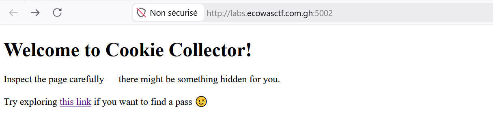
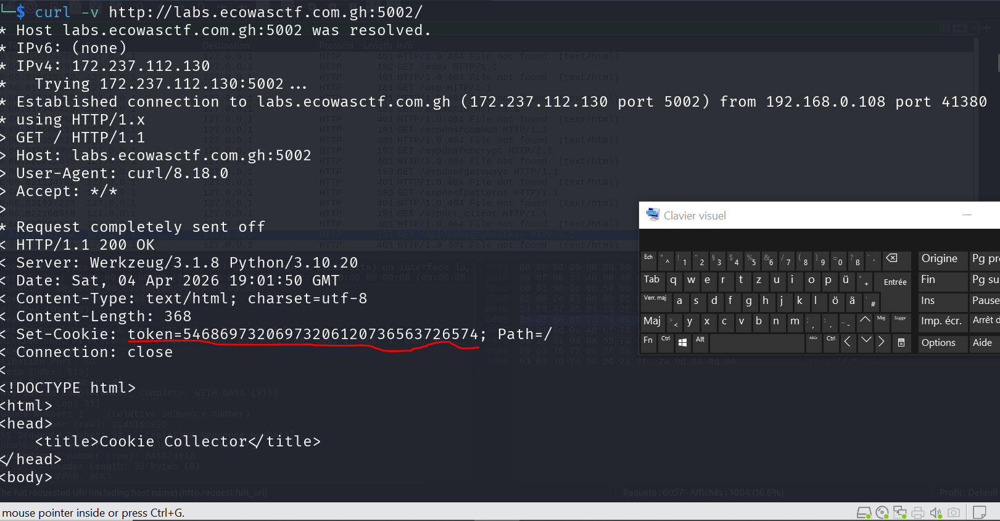
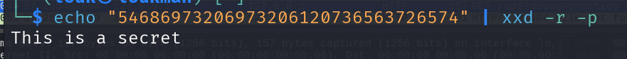
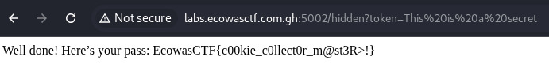

### Description

The server likes cookies...but not the kind you eat. Somewhere hidden on the page is a special endpoint, and it’s waiting for the correct "token" to give you a pass. Can you find it?

L'objectif de ce challenge est de récupérer le token et ensuite de l'utiliser pour accéder a l'endpoit caché 
#### Etape 1- Explorez la page web 



Rien de bon , il nous fourni un lien vers une autre page **/hidden** qui attend en paramètre le token 

#### Etape 2- Recupérer le Cookies 

Pour récupérer le cookies, nous pouvons utiliser l'outil développeur ( avec F12 et regarder dans Cookies situés dans storage), on peu aussi utiliser l'outil en ligne de commande **curl**. Dans notre cas  nous allons utiliser **curl** pour récupérer le cookies 

**Commande : **
```
curl -v http://labs.ecowasctf.com.gh:5002/ 
```



On a ainsi notre token qui est encodé en hexadécimal 

**Token** : 54686973206973206120736563726574

- **Décoder le token avec xxd** 

**Commande** : 
```
echo "54686973206973206120736563726574" | xxd -r -p
```



Ainsi la valeur du token est : "**This is a secret**"

#### Etape 3- Se connecter avec le token 

**Commande :** 

```
curl -v http://labs.ecowasctf.com.gh:5002/hidden?token=This%20is%20a%20secret
```

NB: Pour utiliser entrer le token, nous devons encoder les espaces par %20

**Ou via le Web** 


### Flag : 
```
EcowasCTF{c00kie_c0llect0r_m@st3R>!}
```
