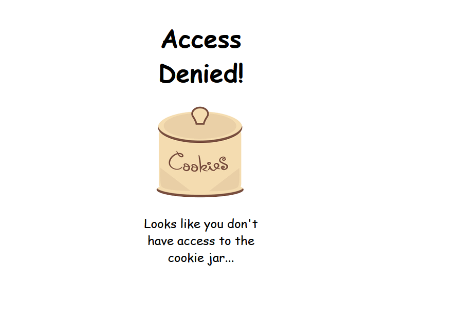
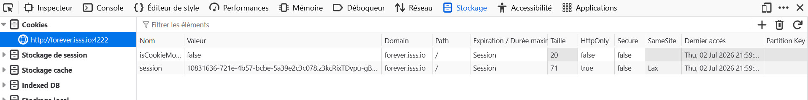
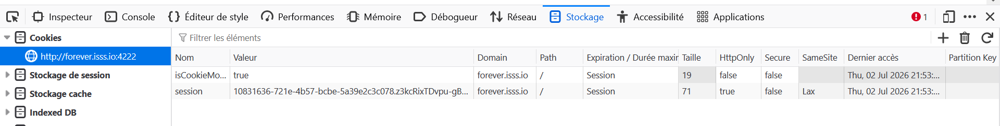
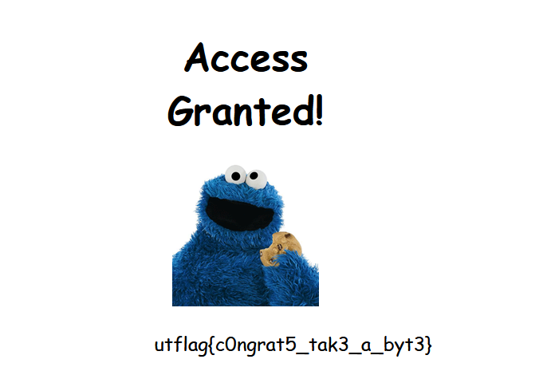

## Infos

| **Catégorie** | Web                            |
| ------------- | ------------------------------ |
| **CTF**       | ForeverCTF                     |
| **URL**       | http://forever.isss.io:4222/   |
| **Flag**      | `utflag{c0ngrat5_tak3_a_byt3}` |

> **Description**
> I'm trying to open this jar of cookies, but the website doesn't recognize me. Can you open the jar for me and inspect the cookies?

**Objectif :** le challenge consiste à manipuler les cookies afin de trouver le flag.

---

## Étape 1 — Accéder à la plateforme

En accédant au site, rien de spécial ne saute aux yeux. L'inspection du code source ne révèle rien non plus : on obtient simplement un message **"Access Denied"**.



---

## Étape 2 — Consulter les cookies

Le code source n'ayant rien donné, on utilise les outils de développeur pour inspecter les cookies :
`F12` (ou `Ctrl+Maj+I`) → onglet **Stockage** → **Cookies**

On y trouve deux cookies :
- `isCookieMonster` → valeur `false`
- `session` → `10831636-721e-4b57-bcbe-5a39e2c3c078.z3kcRixTDvpu-gBOWx9qg3Z_qjQ`



Le cookie qui nous intéresse est **`isCookieMonster`** : en modifiant sa valeur à `true`, on devrait pouvoir obtenir l'accès.

---

## Étape 3 — Manipulation du cookie

On modifie la valeur du cookie `isCookieMonster` de `false` à `true`, puis on rafraîchit la page. C'est ce qu'on appelle la **manipulation de cookies (cookie tampering)**.



Une fois la page rafraîchie, le message **"Access Granted"** apparaît, accompagné du flag.



---

## Flag

```
utflag{c0ngrat5_tak3_a_byt3}
```

---

## 🧠 Leçon retenue

Ce challenge illustre une mauvaise pratique classique : **faire confiance à des données côté client** (cookies) pour gérer une autorisation, sans validation côté serveur. Un cookie n'est jamais une preuve fiable d'identité ou de droits à lui seul — il peut toujours être lu et modifié par l'utilisateur.

---
**_3cho training_**
