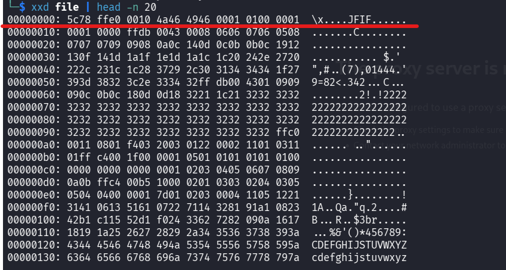
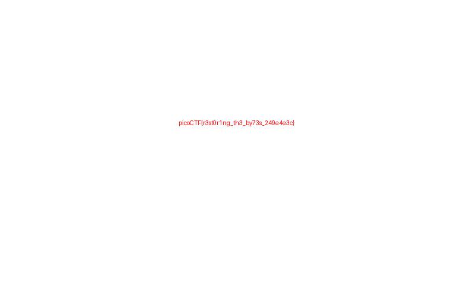

## Métadonnées

- **Catégorie :** Forensics
    
- **Outils :** file xxd MagicBytes HexEditor
    
- **Flag :** `picoCTF{r3st0r1ng_th3_by73s_249e4e3c}`
    

---

## 💬 Description du challenge

> _This file seems broken... or is it? Maybe a couple of bytes could make all the difference. Can you figure out how to bring it back to life?_

---

##  Étape 1 : Analyse du fichier et constat de corruption

On commence par vérifier le type de fichier avec la commande `file`.

```bash
file file
```

### Résultat :

```text
file: data
```

> 📌 **Note :** Le système renvoie simplement `data`. Cela signifie qu'aucun en-tête connu (Magic Bytes) n'a été détecté au tout début du fichier. Le fichier est soit brut, soit corrompu.

---

##  Étape 2 : Inspection des en-têtes (Hexdump)

Pour comprendre l'origine de la corruption, on examine les premières lignes du fichier en hexadécimal.

```bash
xxd file | head -n 10
```

### Résultat (Avant correction) :


_(Note : On y aperçoit des octets parasites au tout début, comme `5c78` correspondant aux caractères ASCII `\x`, décalant la structure réelle du fichier)._

---

##  Étape 3 : Restauration des Magic Bytes (Correctif)

L'objectif est de supprimer les octets corrompus du début pour que le fichier commence directement par la vraie signature d'une image JPEG (`FF D8 FF E0`).

### Technique avec `xxd` (Hex Dump -> Édition -> Recompilation)

1. **Exporter le fichier en dump textuel éditable :**
    
    ```bash
    xxd file > file.txt
    ```
    
2. **Édition du fichier `file.txt` :**
    
    On ouvre le fichier avec un éditeur (`nano`, `mousepad` ou via VS Code) et on nettoie la première ligne pour qu'elle soit parfaitement alignée avec l'en-tête JPEG standard :
    

```text
   00000000: ffd8 ffe0 0010 4a46 4946 0001 0100 0001  ......JFIF......
   00000010: 0001 0000 ffdb 0043 0008 0606 0706 0508  .......C........
```

3. **Reconvertir le dump texte modifié en un vrai fichier binaire :**
    

```bash
   xxd -r file.txt output.jpg
```

---

##  Étape 4 : Vérification du fichier réparé

On passe à nouveau la commande `file` sur notre fichier de sortie pour valider la réparation.

```bash
file output.jpg
```

### Résultat :

```text
output.jpg: JPEG image data, JFIF standard 1.01, aspect ratio, density 1x1, segment length 16, baseline, precision 8, 800x500, components 3
```

Le système identifie désormais parfaitement le fichier comme une image JPEG valide.

---

## 🏁 Étape 5 : Capture du Flag

En ouvrant l'image `output.jpg`, le flag est visible sur le visuel restauré.

Pasted image 20260518214749.png

**Flag :**

`picoCTF{r3st0r1ng_th3_by73s_249e4e3c}`



---

##  Mémo de Forensics : Les Magic Bytes

Chaque type de fichier possède une signature unique (les premiers octets du fichier) appelée **Magic Bytes**. C'est grâce à elle que la commande `file` sait de quoi il s'agit.

|**Format**|**Magic Bytes (Hex)**|**Traduction ASCII**|
|---|---|---|
|**JPEG**|`FF D8 FF`|`...`|
|**PNG**|`89 50 4E 47 0D 0A 1A 0A`|`.PNG....`|
|**GIF**|`47 49 46 38`|`GIF8`|
|**ELF (Executable Linux)**|`7F 45 4C 46`|`.ELF`|
|**PDF**|`25 50 44 46`|`%PDF`|

_Si ces octets sont modifiés, altérés ou décalés, le système d'exploitation sera incapable d'ouvrir le fichier nativement._
