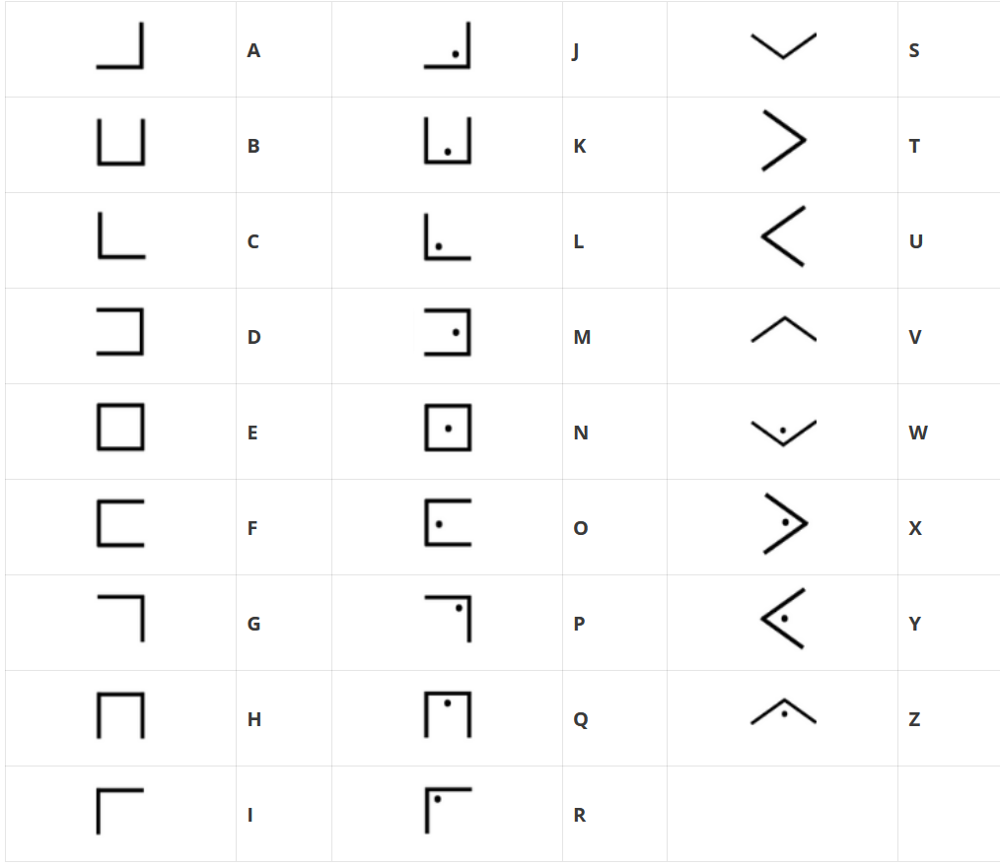

### Image du chall : 


### 1. Description du Challenge

Le nom du fichier `crayon-cochon.png` est un énorme indice : "Cochon" fait référence au nom anglais **Pigpen** (parc à cochons).

- **Le concept :** C'est un chiffrement par substitution mono-alphabétique. Chaque lettre de l'alphabet est remplacée par un symbole géométrique correspondant à sa position dans une grille.
    
- **Le visuel :** Les symboles représentent les "enclos" (les lignes de la grille) et la présence ou l'absence d'un point permet de différencier deux lettres dans un même enclos.
    

---

### 2. Notions de Base : Comment lire le Pigpen

L'alphabet est généralement découpé en quatre grilles :

1. **Grille #1 (A-I) :** Un quadrillage de type Morpion (#).
    
2. **Grille #2 (J-R) :** Le même quadrillage mais avec des **points** dans chaque case.
    
3. **Grille #3 (S-V) :** Une croix en X (×).
    
4. **Grille #4 (W-Z) :** La même croix avec des **points**.
    

**Comment déchiffrer un symbole ?**

- Un symbole en forme de `L` correspond à la case en bas à gauche du quadrillage (la lettre **G** ). 
- Un symbole en forme de `L` avec un point correspond à la même case dans la deuxième grille (la lettre **P**).

En gros le chiffrément utilisé est le **le chiffre des francs-maçons** ou le **Chiffre PigPen** 

Table de decodage : 


### Résolution 
Pour résoudre ce challenge, nous allons utiluser l'outil en ligne dcode pour déchiffrer. 
url : [Cliquez ici]([url](https://www.dcode.fr/chiffre-pig-pen-francs-macons))

dcode nous propose un clavier visuel qui nous permettra de saisir les symboles. 
message chiffré : 

```
THIS BELOW IS THE FLAG KFNOKBHDBLEBSVJMRXKYOXDQZAEAH
```

### Flag 🚩:

```
KFNOKBHDBLEBSVJMRXKYOXDQZAEAH
```
