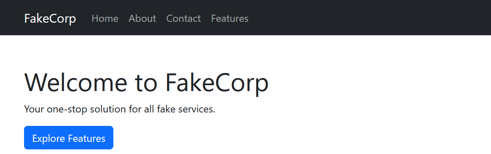
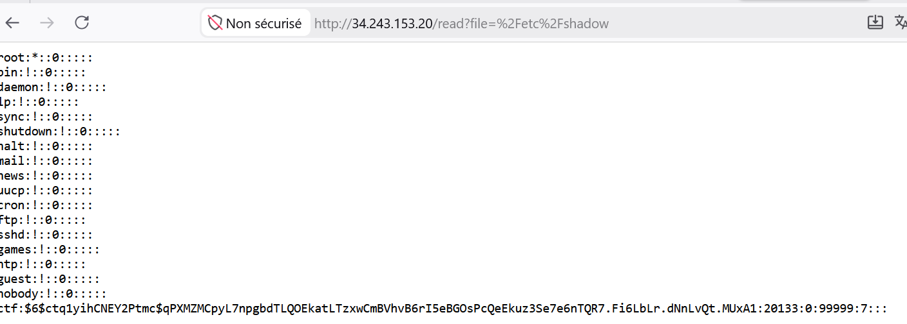
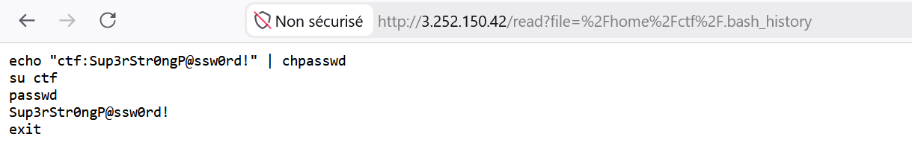

Le but de ce challenge est d'exploiter une vulnérabilité de type **LFI (Local File Inclusion)** sur un service web pour obtenir un accès initial, puis d'exploiter une tâche planifiée (**Cron Job**) mal configurée pour élever nos privilèges en root.
#### Etape 1- Enumération 

Tout d'abord au cours du scan nmap, nous avons découvert deux services, le service SSH sur le port 22 et le service HTTP sur le port 80. Nous allons commencer par explorer le service HTTP qui sera notre point d'entrée. 

**Accéder  à la page web.**



L'application web propose une fonctionnalité permettant de lire le contenu de fichiers sur le serveur.

**Exploitation de la LFI**

En testant la lecture de fichiers sensibles, nous confirmons la vulnérabilité :

- flag.txt -> "Not That Easy" (Indique qu'il faut creuser davantage).
    
- /etc/passwd -> Révèle l'existence d'un utilisateur **ctf**.
    
- /etc/shadow -> Révèle le hash du mot de passe de l'utilisateur ctf.



```
$6$ctq1yihCNEY2Ptmc$qPXMZMCpyL7npgbdTLQOEkatLTzxwCmBVhvB6rI5eBGOsPcQeEkuz3Se7e6nTQR7.Fi6LbLr.dNnLvQt.MUxA1
```

Signification : 

- **$6$ : Indique que le hash utilise l'algorithme** **SHA-512** (très courant sous Linux).
    
- **ctq1yihCNEY2Ptmc** : C'est le **salt** (sel), utilisé pour empêcher les attaques par table arc-en-ciel (rainbow tables).
    
- **Le reste** : C'est le hash du mot de passe lui-même

**Mais le problème ?** 

le hash sha512crypt (mode 1800) est conçu pour être **volontairement lent** afin de décourager les attaques par force brute (il effectue 5000 itérations par défaut). Donc parcourir un wordlist comme rockyou consommera assez de ressource. 

Mais puisque nous pouvons lire les fichiers et que nous connaissons déjà l'utilisateur (**ctf)**, nous allons essayer de consulter directement l'historique du terminal (**bash_history**) pour voir si nous pouvons trouver le mot de passe. 

entrez : 
```
/home/ctf/.bash_history
```



Boom on remarque que dans l'historique l'utilisateur a changé  son mot de passe. Avec le nouveau mot de passe : 

```
Sup3rStr0ngP@ssw0rd!
```

Donc maintenant nous avons le nom d'utilisateur et son mot de passe. Nous pouvons maintenant nous connecter pas **ssh**

**Etape 2- Accès Initial**

Avec ces identifiants, nous nous connectons via SSH :

```
ssh ctf@IP_CIBLE
# Mot de passe : Sup3rStr0ngP@ssw0rd!
```

Une fois connecté, nous récupérons le premier flag :

>**User flag**
>5c0028b1-7f6b-4385-d307-0677a8cf43aa

#### Etape 3- Escalade de priviledge

Pour obtenir le flag root, nous devons élever nos privilèges.

### Analyse du système

Nous listons les tâches planifiées par le système :

```
cat /etc/crontabs/root
```

Le résultat montre une exécution toutes les minutes :  
```
* * * * * /bin/sh /opt/root_cron.sh
```

En analysant /opt/root_cron.sh, nous découvrons qu'il exécute un script situé dans /tmp :

```
#!/bin/sh
/bin/sh /tmp/backup.sh
```

**Détournement du script (Exploitation)**

En vérifiant les permissions de /tmp/backup.sh, nous constatons qu'il est modifiable par n'importe quel utilisateur (-rwxrw-rw-). Nous allons donc injecter une commande pour lire le fichier contenant le flag root :```
```
-rwxrw-rw-    1 root     root            49 Feb 14  2025 /tmp/backup.sh
```

Payload :
```
echo "cat /root/flag-root.txt > /tmp/my_flag.txt" > /tmp/backup.sh
```

Après avoir attendu une minute pour laisser le Cron Job s'exécuter avec les privilèges root, nous lisons le fichier généré :

```
cat /tmp/my_flag.txt
```

>**Root flag**
>c6322974-f9e1-41e6-ef27-e407e30a6dcf

#### Conclusion

Ce challenge illustre parfaitement deux vecteurs d'attaque classiques :

1. **LFI** : Ne pas oublier de vérifier les fichiers cachés (comme .bash_history) pour trouver des indices oubliés.
    
2. **Cron Job Hijacking** : Toujours vérifier les permissions des scripts exécutés par root. Si un utilisateur peut modifier un script exécuté par un utilisateur privilégié, l'escalade de privilèges est immédiate.
