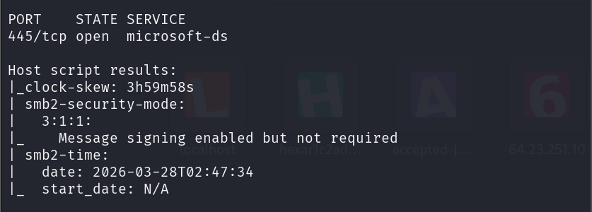
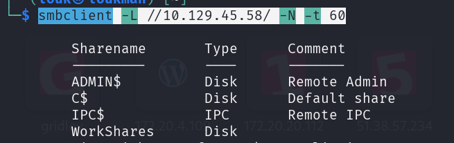
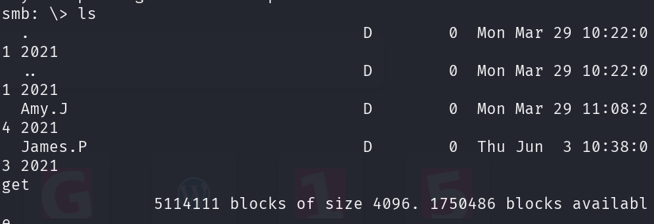
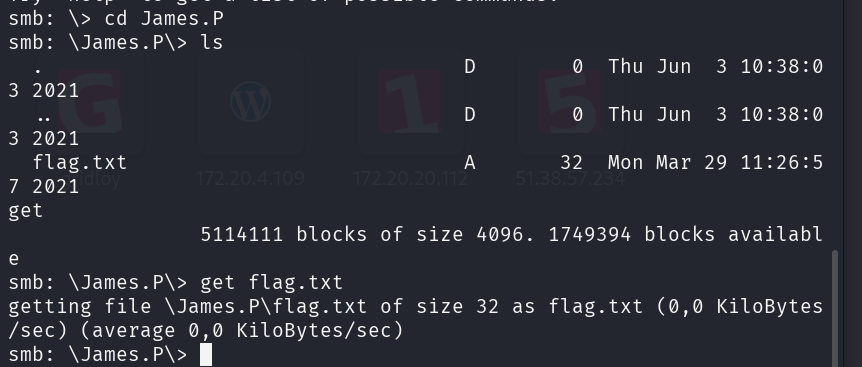

###### Platform: Windows
### Description 
 Dancing is a very easy Windows machine which introduces the Server Message Block (SMB) protocol, its enumeration and its exploitation when misconfigured to allow access without a password.

## 1. Qu'est-ce que SMB ?

Le protocole **SMB** (port **445**) permet de partager des ressources sur un réseau : des fichiers, des imprimantes ou des ports séries.

- Sous Windows, c'est ce qui gère les dossiers partagés que tu vois dans ton explorateur de fichiers.
    
- **Le danger :** Si un "partage" (Share) est configuré avec un accès invité (Guest) ou sans mot de passe, n'importe qui sur le réseau peut lire, voire modifier les fichiers.
    

---

## 2. L'outil de combat : `smbclient`

Pour interagir avec un serveur SMB depuis Linux (ta machine de hacking), on utilise principalement **`smbclient`**. C'est un outil qui ressemble beaucoup à un client FTP.

### A. Énumérer les partages (Lister)

Avant de se connecter, on veut savoir quels dossiers sont disponibles sur la machine.

```bash
smbclient -L 10.129.x.x
```

- `-L` : List (liste les partages).
    
- **Mot de passe :** Si l'outil te demande un mot de passe, appuie simplement sur **Entrée** (vide). Si la machine est mal configurée, elle te laissera voir la liste.
    

### B. Se connecter à un partage

Une fois que tu as repéré un partage intéressant (souvent nommé `WorkShares`, `Public`, ou `Users`), connecte-toi avec :

```bash
smbclient //10.129.x.x/NOM_DU_PARTAGE
```

   

---
### Resolution

#### Tâche 1: Énumération 

Nous allons enumérer les ports ouverts ainsi que les services et la version de service qui tourne sur ces ports 

Commande : 
```
nmap -sC -sV 10.129.45.58
```



Boom on a le port 445 qui est ouvert avec le service encour microsoft-ds (Qui est SMB). Et la version qui tourne dessus est le SMB2

#### Tâche 2: Lister les dossiers partagé 

Commande:
```
smbclient -L //10.129.45.58/ -N -t 60
```



On a  4 dossiers partager et un intéressant qui est WorkShares qui permet de nous connecter sans mot de passe.

#### Se connecter à WorkShares

Commande:
```
smbclient //10.129.45.58/WorkShares -N
```

Lister le contenu du partage avec **ls**


On a deux dossiers intéressants, le **Amy.J et James.P**
Mais le Amy.J ne contient rien de bon.

Se diriger dans le dossier **James.P**, 
Lister le fichier flag.txt avec **get**



### Flag
```
5f61c10dffbc77a704d76016a22f1664 
```
