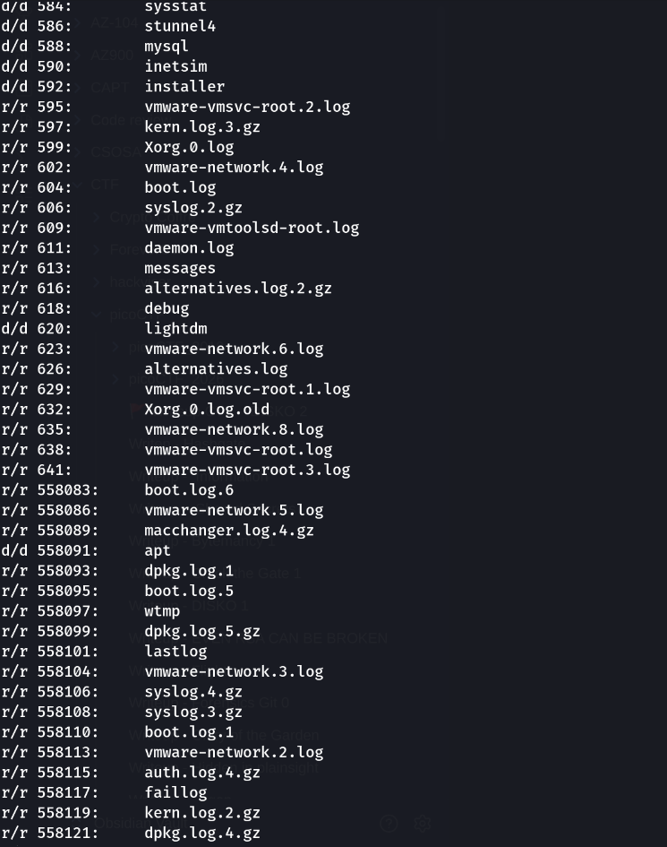
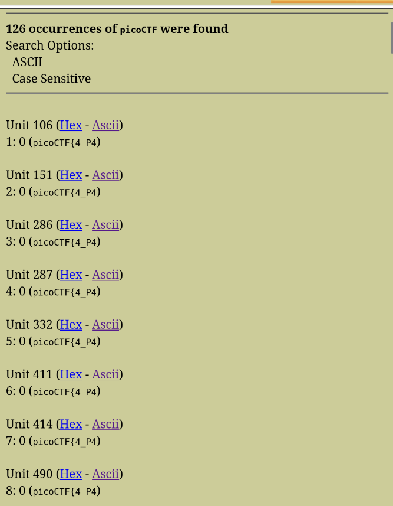
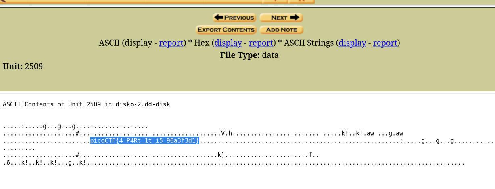

### 📌 Informations

**Challenge :** Disko 2  
**Catégorie :** Forensics  
**Fichier fourni :** `disko-2.dd`

#### Énoncé

> Can you find the flag in this disk image? The right one is Linux! One wrong step and its all gone!

L'objectif est de retrouver le flag présent dans l'image disque `disko-2.dd`.

---

## 1. Identification de l'image disque

Nous allons commencer par utiliser l'outil `file` afin de déterminer le type du fichier fourni.

```bash
file disko-2.dd
```

#### Résultat

```text
disko-2.dd: DOS/MBR boot sector; partition 1 : ID=0x83, start-CHS (0x0,32,33), end-CHS (0x3,80,13), startsector 2048, 51200 sectors; partition 2 : ID=0xb, start-CHS (0x3,80,14), end-CHS (0x7,100,29), startsector 53248, 65536 sectors
```

L'image utilise une table de partitions **DOS/MBR** et contient deux partitions.

On remarque notamment :

- Une partition `0x83`, correspondant à une partition **Linux**.
    
- Une partition `0x0b`, correspondant à une partition **FAT32**.
    

Les secteurs de début sont également indiqués :

- Partition 1 → `2048`
    
- Partition 2 → `53248`
    

Ces offsets seront importants pour l'analyse avec les outils de **Sleuth Kit**.

---

## 2. Analyse de la table de partitions

Nous allons utiliser `fdisk` afin d'obtenir une vue plus claire de la table de partitions.

```bash
fdisk -l disko-2.dd
```

#### Résultat

```text
Disk disko-2.dd: 100 MiB, 104857600 bytes, 204800 sectors
Units: sectors of 1 * 512 = 512 bytes
Sector size (logical/physical): 512 bytes / 512 bytes
I/O size (minimum/optimal): 512 bytes / 512 bytes
Disklabel type: dos
Disk identifier: 0x8ef8eaee

Device      Boot Start    End Sectors  Size Id Type
disko-2.dd1       2048  53247   51200   25M 83 Linux
disko-2.dd2      53248 118783   65536   32M  b W95 FAT32
```

Nous avons donc :

|Partition|Début|Taille|Type|
|---|--|--|---|
|`disko-2.dd1`|`2048`|25 MiB|Linux|
|`disko-2.dd2`|`53248`|32 MiB|FAT32|

Le challenge nous indique explicitement :

> **The right one is Linux!**

Nous allons donc commencer notre analyse par la partition Linux.

---

## 3. Analyse de la partition Linux

Pour analyser le contenu d'une partition avec Sleuth Kit, nous pouvons utiliser `fls`.

L'option `-o` permet de spécifier l'offset de début de la partition, exprimé en secteurs.

Pour la partition Linux, l'offset est `2048`.

```bash
fls -o 2048 disko-2.dd
```

#### Résultat

```text
d/d 11:	lost+found
d/d 13:	bin
V/V 6401:	$OrphanFiles
```

La partition contient principalement :

- `lost+found`
    
- `bin`
    
- `$OrphanFiles`
    

Aucun élément évident permettant de retrouver directement le flag n'apparaît à ce niveau.

Nous allons donc examiner la seconde partition, tout en gardant en tête que l'énoncé nous indique que la bonne partition est Linux.

---

## 4. Analyse de la partition FAT32

La seconde partition commence au secteur `53248`.

Nous utilisons donc :

```bash
fls -o 53248 disko-2.dd
```

#### Résultat

```text
d/d 4:	log
v/v 1046467:	$MBR
v/v 1046468:	$FAT1
v/v 1046469:	$FAT2
V/V 1046470:	$OrphanFiles
```

On découvre notamment un répertoire :

```text
d/d 4: log
```

Nous allons donc examiner son contenu de manière récursive avec l'option `-r`.

```bash
fls -r -o 53248 disko-2.dd 4
```

Cette commande permet d'afficher récursivement les fichiers et répertoires présents dans `log`.

Parmi les nombreux fichiers trouvés, on remarque notamment :

```text
r/r 613:	messages
```

Le fichier `messages`, identifié par l'inode `613`, semble intéressant car il s'agit d'un fichier de logs système.



---

## 5. Première recherche de flag

Nous allons utiliser `icat` pour extraire le contenu du fichier correspondant à l'inode `613`, puis `grep` pour rechercher une éventuelle chaîne `picoCTF`.

```bash
icat -o 53248 disko-2.dd 613 | grep picoCTF
```

#### Résultat

```text
Aug 29 picoCTF{4_P4Rt_1t_i5_31a03fd9}90522] pci 0000:00:17.0: PME# supported from D0 D3hot D3cold
```

On trouve donc :

```text
picoCTF{4_P4Rt_1t_i5_31a03fd9}
```

Cependant, après soumission, ce flag est indiqué comme **incorrect**.

Cela indique que la présence d'une chaîne au format `picoCTF{...}` ne signifie pas nécessairement qu'il s'agit du véritable flag.

Il faut donc poursuivre l'analyse de l'image disque.

---

## 6. Analyse avec Autopsy

Pour effectuer une analyse forensic plus approfondie, nous allons utiliser **Autopsy**.

Autopsy permet notamment d'effectuer des recherches par mots-clés directement dans une image disque.

Nous lançons Autopsy puis ajoutons l'image :

```text
disko-2.dd
```

Une fois l'image chargée, nous accédons à :

**Keyword Search**

Nous recherchons le mot-clé :

```text
picoCTF
```

La recherche révèle de nombreuses occurrences de chaînes correspondant à des flags.



Parmi les résultats, nous identifions une autre occurrence associée à l'inode :

```text
2509
```

Cette occurrence contient :

```text
picoCTF{4_P4Rt_1t_i5_90a3f3d1}
```

Contrairement au premier résultat, ce flag est accepté par la plateforme.



---

## 🚩 Flag

```text
picoCTF{4_P4Rt_1t_i5_90a3f3d1}
```

---
