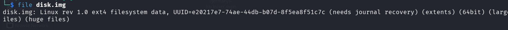
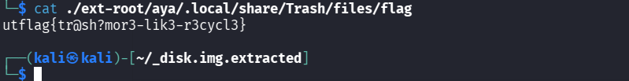

> **Informations sur le défi**
> - **Catégorie :** Forensics / Analyse de système de fichiers
> - **Points :** 500
> - **Auteur :** Aya Abdelgawad
> - **Flag :** `utflag{tr@sh?mor3-lik3-r3cycl3}`

## 📝 Description
L'auteur indique avoir accidentellement supprimé le fichier contenant le flag (nommé initialement `flag`) au lieu de le renommer en `totally_not_the_flag`. Il fournit l'image brute de sa partition `/home`.

---

## 🛠️ Méthodologie & Résolution

### 1. Analyse initiale & Décompression

Le fichier fourni est une archive compressée `.bz2`. La première étape consiste à la décompresser et à vérifier le type de fichier obtenu.

```bash
# Décompression de l'archive
bunzip2 disk.img.bz2

# Identification du type de fichier
file disk.img
````

**Résultat :**

```
disk.img: Linux rev 1.0 ext4 filesystem data...
```



### 2. Exploration du système de fichiers

Deux méthodes sont envisageables pour explorer cette image `ext4`.

#### Méthode A : Extraction automatique via Binwalk

```
binwalk -e disk.img
```

- Binwalk extrait la partition sous un répertoire nommé `_disk.img.extracted`.
    
- Le répertoire racine extrait (`ext-root`) contient l'arborescence `/home/aya/`.
    

#### Méthode B : Montage direct (Recommandée)

> **Pourquoi privilégier le montage direct ?**
> 
> Le montage direct (`mount`) préserve les métadonnées d'origine du système de fichiers (permissions, horodatages) sans doubler l'espace disque utilisé par une extraction complete.

```bash
# Création du point de montage
mkdir /tmp/partage_disk

# Montage de l'image disque
sudo mount -o loop disk.img /tmp/partage_disk

# Navigation vers le répertoire utilisateur
cd /tmp/partage_disk/aya
```

### 3. Localisation du fichier supprimé

Sous les environnements de bureau Linux (GNOME, KDE), lorsqu'un fichier est supprimé sans passer par un nettoyage définitif, il est déplacé dans la corbeille locale :

`~/.local/share/Trash/files/`

Recherche du fichier `flag` à l'aide de la commande `find` :

```bash
# Via l'extraction Binwalk
find . -name "flag"

# Via le point de montage
find /tmp/partage_disk -name "flag"
```

**Emplacement trouvé :**

`.../aya/.local/share/Trash/files/flag`


### 4. Extraction du Flag

Affichage du contenu du fichier trouvé :

```bash
cat /tmp/partage_disk/aya/.local/share/Trash/files/flag
```

```text
utflag{tr@sh?mor3-lik3-r3cycl3}
```

> **Nettoyage**
> 
> Pensez à démonter proprement l'image disque une fois l'analyse terminée :
> 
> Bash
> 
> ```
> sudo umount /tmp/partage_disk
> ```

## Aide-mémoire Technique

|**Commande**|**Rôle & Utilité**|
|---|---|
|`bunzip2`|Décompresse un fichier `.bz2` en remplaçant l'archive d'origine.|
|`file`|Analyse les magic bytes pour déterminer le format réel d'un fichier.|
|`binwalk`|Analyse les images et firmwares pour extraire les fichiers intégrés (`-e`).|
|`mount`|Attache un système de fichiers ou une image (`-o loop`) à l'arborescence système.|
|`find`|Recherche des fichiers/dossiers selon des critères précis (`-name`).|
|`cat`|Affiche le contenu textuel d'un fichier dans le terminal.|
|`umount`|Détache proprement un point de montage du système.|
**_3ch0 training_**
