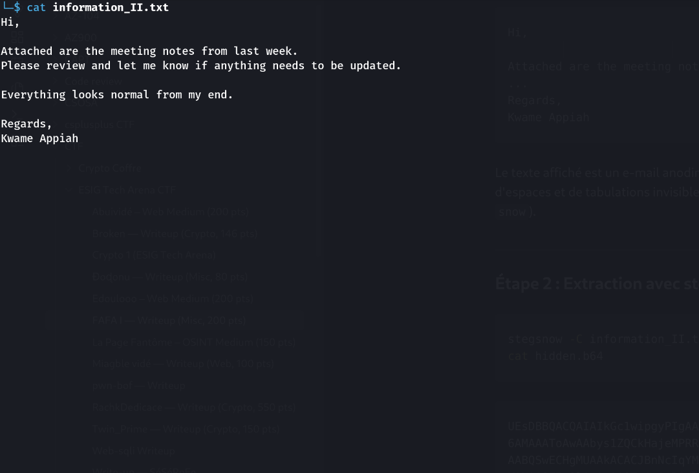
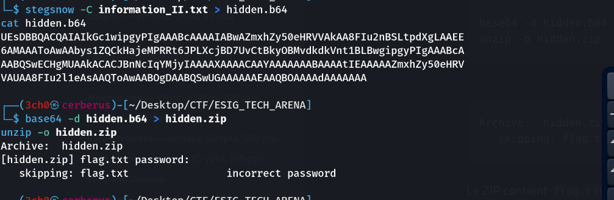

### 📌 Description
> **FAFA I** (Misc · easy). Un fichier `information_II.txt` (3.9 Ko) contenant un faux e-mail. "Trouve le flag. N'oublie pas de préciser le format du flag."
>
> **Author** : hackus_man
**Points** : 200 pts
**Statut** : ✓ Résolu le 25/09 à 11:53 UTC

---
### Étape 1 : Reconnaissance

```bash
cat information_II.txt
```

```
Hi,	     	       	  	 	 	  		  	 
   	   	       	     	     	      	   	   	     	    
Attached are the meeting notes from last week.       		     	    
...
Regards,   	  	   	      	 	    	      	     	 
Kwame Appiah
```

Le texte affiché est un e-mail anodin, mais chaque ligne se termine par une quantité anormale d'espaces et de tabulations invisibles. Classique de la **stéganographie par espaces blancs** (outil `snow`).



---
### Étape 2 : Extraction avec stegsnow

```bash
stegsnow -C information_II.txt > hidden.b64
cat hidden.b64
```

```
UEsDBBQACQAIAIkGc1wipgyPIgAAABcAAAAIABwAZmxhZy50eHRVVAkAA8FIu2nBSLtpdXgLAAEE
6AMAAAToAwAAbys1ZQCkHajeMPRRt6JPLXcjBD7UvCtBkyOBMvdkdkVnt1BLBwgipgyPIgAAABcA
AABQSwECHgMUAAkACACJBnNcIqYMjyIAAAAXAAAACAAYAAAAAAABAAAAtIEAAAAAZmxhZy50eHRV
VAUAA8FIu2l1eAsAAQToAwAABOgDAABQSwUGAAAAAAEAAQBOAAAAdAAAAAAA
```

L'en-tête `UEsDBB...` correspond au magic bytes `PK\x03\x04` en base64 : c'est une archive ZIP.

```bash
base64 -d hidden.b64 > hidden.zip
unzip -o hidden.zip
```

```
Archive:  hidden.zip
   skipping: flag.txt   unable to get password
```

Le ZIP contient `flag.txt` mais est protégé par mot de passe.



---
### Étape 3 : Cassage du mot de passe ZIP

```bash
zip2john hidden.zip > hidden.john
john --wordlist=/usr/share/wordlists/rockyou.txt hidden.john
```

```
stealth123       (hidden.zip/flag.txt)
1g 0:00:00:01 DONE  520815p/s
```

Cassé en moins d'une seconde avec `rockyou.txt`.

```bash
unzip -P stealth123 hidden.zip
cat flag.txt
```

> **Format du flag**
> L'énoncé insistait : "n'oublie pas de préciser le format du flag". Ici le flag **n'est pas** au format `EthACTF{...}` habituel de la CTF, mais au format `flag{...}`.

---
### 🏁 Flag

```
flag{l@y37s_0n_l@y3rs}
```
