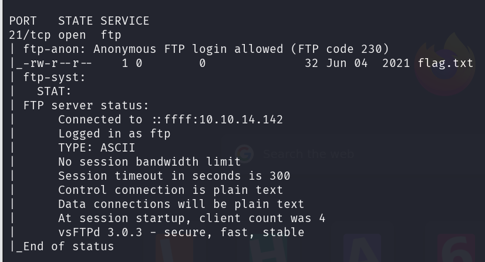
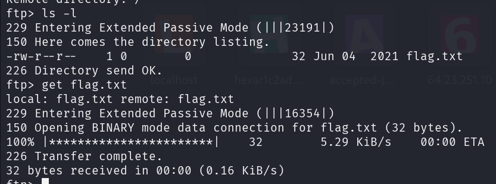

### Description 

Fawn is a very easy Linux machine which explores the File Transfer Protocol (FTP) and its exploitation when misconfigured to allow anonymous access.

## 1. Qu'est-ce que le FTP ? (Port 21)

Le **File Transfer Protocol** est conçu pour envoyer et recevoir des fichiers entre un client et un serveur.

- **Le danger (CTF) :** L'option **"Anonymous Login"**. Si elle est activée, n'importe qui peut se connecter au serveur sans avoir de compte utilisateur réel, simplement en utilisant le nom d'utilisateur `anonymous`.

Pour se connecter à FTP, on utilise la commande ftp

### Résolution

#### Tâche 1: Énumération 

Nous allons enumérer les ports ouverts ainsi que les services et la version de service qui tourne sur ces ports 

Commande : 
```
nmap -sC -sV 10.129.45.58
```



On a le port 21 ouvert avec pour service encoure FTP  avec la version **vsFTPd 3.0.3**

#### Tâche 2: Se connecter à FTP

Vu que le scan nmap nous révèle que le mode anonymous est activé, nous allons nous connecter en mode anonymous

Identifiant :

**anonymous/anonymous**

Commande:
```
ftp 10.129.45.78 21
```



**ls -l** pour lister le contenu et **get** pour  récupérer le fichier 

### Flag
```
035db21c881520061c53e0536e44f815
```
