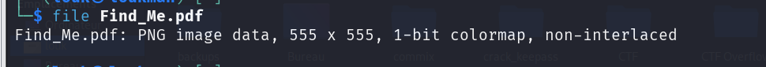
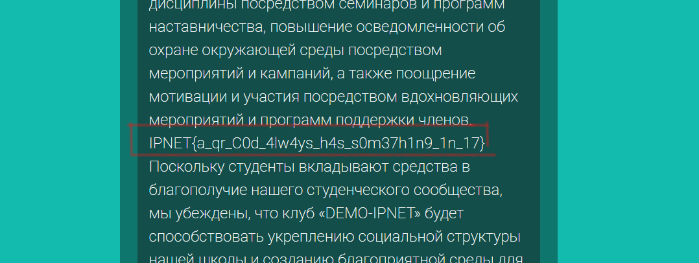

**Catégorie :** Stéganographie | **Difficulté :** Facile

### 🛠️ Outils utilisés

- `file` (Analyse de métadonnées)
    
- `mv` (Renommage de fichier)
    
- `QRScanner` (Lecteur de QR Code en ligne ou CLI). url : google_vignette
    
### 🔍 Résolution

#### Étape 1 : Identification du fichier

Le challenge nous fournit un fichier nommé `Find_Me.pdf`. Avant de tenter de l'ouvrir, il est de bonne pratique de vérifier sa signature réelle (magic bytes) car les extensions sont souvent trompeuses en CTF.

On utilise la commande `file` :

**Résultat :** `Find_Me.pdf: PNG image data, 500 x 500, 8-bit/color RGBA, non-interlaced`


Le verdict est sans appel : ce n'est pas un PDF, mais une image **PNG**.

#### Étape 2 : Extraction et Analyse

On commence par corriger l'extension pour pouvoir manipuler le fichier correctement avec les outils d'image :

commande en ligne de commande pour modifier l'extension 

```
mv Find_Me.pdf Find_Me.png 
```
En ouvrant l'image, on découvre un **QR Code**.

#### Étape 3 : Décodage du QR Code

Pour extraire l'information cachée, on utilise un scanner de QR Code (comme l'outil en ligne `QRScanner` ou `zbarimg` en local) :

1. Uploader l'image `Find_Me.png`.
    
2. Lancer le scan.
    

Le contenu décodé nous révèle le flag final.

### 🚩 Flag

```
IPNET{a_qr_C0d_4lw4ys_h4s_s0m37h1n9_1n_17}
```
