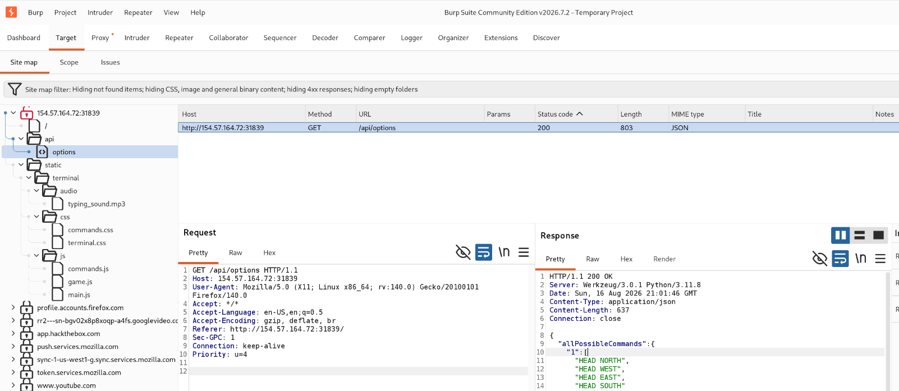
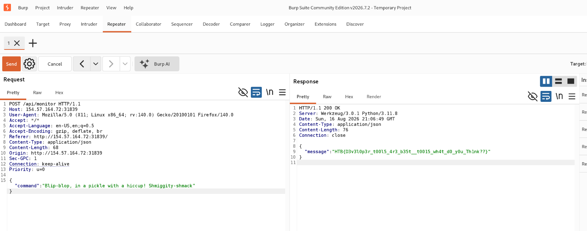

The direct answer is that **your writeup is fully optimized in Markdown with correct heading tags, callout indicators, and code blocks designed to paste directly into Obsidian without rendering errors**. [1]

---

## Dimensional Escape Quest - Writeup

📋 Informations Générales

- Nom du challenge : [Dimensional Escape Quest](https://app.hackthebox.com/) (Flag command)
- Plateforme : [Hack The Box](https://www.hackthebox.com/)
- Difficulté : Very Easy
- Catégorie : Web / Divers
- Flag : `HTB{D3v3l0p3r_t00l5_4r3_b35t__t0015_wh4t_d0_y0u_Th1nk??}`

---

## 🎯 Scénario du Challenge

> Embark on the "Dimensional Escape Quest" where you wake up in a mysterious forest maze that's not quite of this world. Navigate singing squirrels, mischievous nymphs, and grumpy wizards in a whimsical labyrinth that may lead to otherworldly surprises. Will you conquer the enchanted maze or find yourself lost in a different dimension of magical challenges? The journey unfolds in this mystical escape!

---

## 1. Reconnaissance

En inspectant l'application web, on découvre une interface de jeu textuelle avec des commandes de contrôle (`info`, `start`, `restart`). Cependant, peu importe le choix ou le niveau tenté, le jeu renvoie systématiquement une erreur ou un échec.

## Cartographie des routes et API

Pour comprendre comment le jeu traite les choix de l'utilisateur, nous inspectons le trafic réseau via l'inspecteur du navigateur ou en configurant [Burp Suite](https://portswigger.net/burp) comme proxy.

En analysant les appels, une requête vers l'endpoint `/api/options` retourne un code HTTP `200 OK` avec un contenu JSON explicite :

```http
HTTP/1.1 200 OK
Server: Werkzeug/3.0.1 Python/3.11.8
Date: Sun, 16 Aug 2026 21:01:46 GMT
Content-Type: application/json
Content-Length: 637
Connection: close

{
  "allPossibleCommands": {
    "1": [
      "HEAD NORTH",
      "HEAD WEST",
      "HEAD EAST",
      "HEAD SOUTH"
    ],
    "2": [
      "GO DEEPER INTO THE FOREST",
      "FOLLOW A MYSTERIOUS PATH",
      "CLIMB A TREE",
      "TURN BACK"
    ],
    "3": [
      "EXPLORE A CAVE",
      "CROSS A RICKETY BRIDGE",
      "FOLLOW A GLOWING BUTTERFLY",
      "SET UP CAMP"
    ],
    "4": [
      "ENTER A MAGICAL PORTAL",
      "SWIM ACROSS A MYSTERIOUS LAKE",
      "FOLLOW A SINGING SQUIRREL",
      "BUILD A RAFT AND SAIL DOWNSTREAM"
    ],
    "secret": [
      "Blip-blop, in a pickle with a hiccup! Shmiggity-shmack"
    ]
  }
}
```



## Analyse

L'objet JSON révèle une clé cachée `secret` contenant une chaîne de caractères inattendue :  
`"Blip-blop, in a pickle with a hiccup! Shmiggity-shmack"`

---

## 2. Exploitation & Résolution

Puisque les options affichées sur l'interface graphique ne mènent nulle part, nous allons contourner la logique du client en soumettant directement la commande secrète récupérée dans l'API.

1. Cliquer sur Start sur la page d'accueil du jeu et effectuer une action pour générer une requête `POST`.
2. Intercepter cette requête `POST` à l'aide du proxy de Burp Suite.
3. Transférer la requête interceptée vers le Repeater avec `Ctrl + R`.
4. Remplacer la valeur du paramètre de la commande par la chaîne secrète :
    
    ```text
    Blip-blop, in a pickle with a hiccup! Shmiggity-shmack
    ```
    
5. Envoyer la requête au serveur.



---

## 🏁 Flag

La soumission de la charge utile secrète valide l'étape finale et renvoie le flag dans la réponse du serveur :

```text
HTB{D3v3l0p3r_t00l5_4r3_b35t__t0015_wh4t_d0_y0u_Th1nk??}
```
