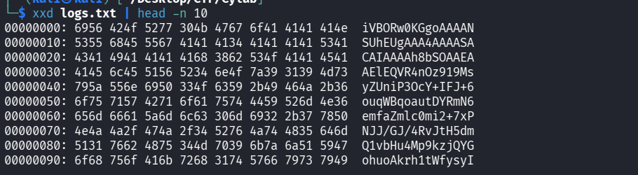
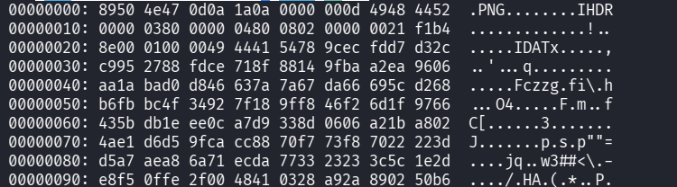
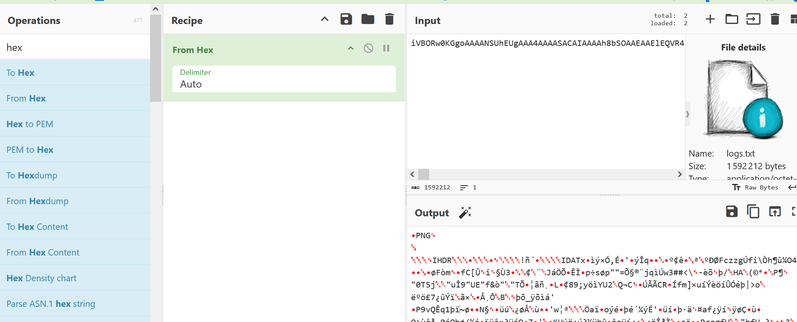

## Métadonnées

- **Catégorie :** Forensics Incident-Response
    
- **Outils :** file xxd base64 Cyberchef
    
- **Flag :** `picoCTF{forensics_analysis_is_amazing_c75dd08e}`
    

---

## 💬 Description du scénario

> _L'équipe SOC a découvert un fichier de log anormalement volumineux après une brèche récente. À l'ouverture, au lieu de logs classiques, ils font face à un bloc énorme de texte encodé. L'objectif est d'inspecter ce fichier afin d'extraire les informations dissimulées._

---

##  Étape 1 : Analyse initiale du faux fichier de log

On commence par analyser la structure du fichier `logs.txt` pour comprendre sa nature.

```bash
file logs.txt
```

### Résultat :

```
logs.txt: ASCII text, with very long lines (65536), with no line terminators
```

On examine ensuite les premières lignes en hexadécimal pour identifier l'encodage sous-jacent :

```
xxd logs.txt | head -n 10
```

### Résultat :



> 📌 **Constat :** Le jeu de caractères utilisé (lettres majuscules/minuscules, chiffres) et la structure globale indiquent clairement un encodage en **Base64**.

---

## 🔓 Étape 2 : Décodage de la charge utile

Puisque le type de fichier final est inconnu à ce stade, on décode le flux Base64 et on redirige la sortie brute vers un fichier générique nommé `decode.bin`.

```bash
base64 -d logs.txt > decode.bin
```

On utilise ensuite à nouveau `file` sur ce nouveau fichier pour identifier ses _Magic Bytes_ :

```bash
file decode.bin
```

### Résultat :

```text
decode.bin: PNG image data, 896 x 1152, 8-bit/color RGB, non-interlaced
```

Le système confirme qu'il s'agit d'une image au format **PNG**. On peut corréler cette information en inspectant l'en-tête du fichier pour y retrouver la signature standard des fichiers PNG (`.PNG` ou `8950 4e47` en hexa) :

```bash
xxd decode.bin | head -n 10
```



---

## 🖼️ Étape 3 : Extraction des données de l'image

On renomme le fichier avec la bonne extension afin de pouvoir l'ouvrir normalement :

```bash
mv decode.bin download.png
```

À l'ouverture de l'image `download.png`, on découvre un message textuel qui y est inscrit. Ce message est une chaîne de caractères encodée en **hexadécimal** :

```text
7069636F4354467B666F72656E736963735F616E616C797369735F69735F616D617A696E675F63373564643038657D
```


---

## ⚙️ Étape 4 : Décodage de la chaîne hexadécimale

Pour obtenir le flag en clair, on convertit cette chaîne hexadécimale en texte ASCII.

### Option 1 : Via le terminal Kali

```bash
echo "7069636F4354467B666F72656E736963735F616E616C797369735F69735F616D617A696E675F63373564643038657D" | xxd -r -p
```

### Option 2 : Via CyberChef (Alternative globale)

Il était également possible de réaliser l'intégralité du challenge dans CyberChef en important le fichier `logs.txt` d'origine et en combinant les recettes :

1. **`From Base64`** (pour obtenir l'image PNG).
    
2. Sauvegarder/Visualiser le PNG, puis copier la chaîne hexadécimale visible.
    
3. Utiliser la recette **`From Hex`** sur cette chaîne.
    



---

## 🏁 Étape 5 : Capture du Flag

**Flag :** `picoCTF{forensics_analysis_is_amazing_c75dd08e}`

---

## Mémo de réponse aux incidents : Exfiltration par les logs

Les attaquants utilisent fréquemment les fichiers de logs ou des répertoires applicatifs standard (comme `/var/log/`) pour y stocker discrètement leurs outils, des scripts malveillants ou des données exfiltrées encodées.

- L'utilisation de **Base64** permet de faire passer n'importe quel fichier binaire complexe (exécutable, image, archive zip) pour du texte brut inoffensif aux yeux de scripts de surveillance textuels basiques.
    
- **Réflexe SOC :** Toujours surveiller les pics de croissance soudains et anormaux de la taille d'un fichier de log textuel.
